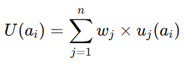
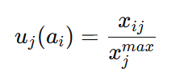

# **Materi: Metode Multi Attribute Utility Theory (MAUT)**

## **KATA PENGANTAR**

Materi ini disusun untuk membantu mahasiswa memahami konsep dan implementasi metode **Multi Attribute Utility Theory (MAUT)** dalam pengambilan keputusan multikriteria. Penyajian dilakukan secara bertahap, mulai dari konsep dasar, persiapan data, analisis, hingga contoh studi kasus sederhana.

Dengan materi ini, diharapkan mahasiswa mampu menguasai keterampilan analisis MAUT serta membedakan metode ini dengan metode SAW yang telah dipelajari sebelumnya.

---

## **TUJUAN PEMBELAJARAN**

Setelah mempelajari materi ini, mahasiswa diharapkan mampu:

1. Menjelaskan konsep dasar metode MAUT.
2. Mengidentifikasi langkah-langkah dalam penerapan MAUT.
3. Menghitung utilitas dan skor akhir dalam MAUT.
4. Menerapkan MAUT pada studi kasus sederhana.
5. Membandingkan metode MAUT dengan metode SAW.

---

## **I. PENDAHULUAN**

Pengambilan keputusan merupakan bagian penting dalam kehidupan sehari-hari maupun dunia akademik. Dalam konteks Sistem Pendukung Keputusan (SPK), terdapat berbagai metode yang dapat digunakan untuk membantu memilih alternatif terbaik.

Salah satu metode yang cukup populer adalah **MAUT (Multi Attribute Utility Theory)**. Metode ini digunakan untuk menilai alternatif berdasarkan beberapa kriteria dengan cara mengkonversi nilai mentah menjadi **utilitas**, yaitu ukuran kepuasan pengambil keputusan terhadap suatu nilai.

---

## **II. URAIAN MATERI**

### **2.1 Konsep Dasar MAUT**

* MAUT adalah metode pengambilan keputusan multikriteria.
* Prinsip utama: setiap nilai alternatif pada suatu kriteria dikonversi ke bentuk **utilitas** (0–1).
* Hasil utilitas tiap kriteria dikalikan dengan bobot, kemudian dijumlahkan.

**Rumus dasar:**


Keterangan:

* ( U(a_i) ) = nilai total alternatif ke-i
* ( w_j ) = bobot kriteria ke-j
* ( u_j(a_i) ) = utilitas alternatif ke-i pada kriteria ke-j

---

### **2.2 Konsep Utilitas**

* **Utilitas** menggambarkan tingkat kepuasan atau preferensi pengambil keputusan.
* Tidak selalu linier: selisih nilai kecil bisa dianggap besar, dan selisih besar bisa dianggap kecil, tergantung konteks.
* Contoh:

  * Kehadiran 90% dan 100% → kepuasannya hampir sama (utilitas mendekati 1).
  * Nilai rapor 50 dan 60 → kepuasannya bisa jauh berbeda (utilitas jauh berbeda).

---

### **2.3 Tahapan Penerapan MAUT**

Tahap penerapan MAUT dapat dibagi menjadi dua:

#### **Tahap 1: Persiapan Data**

1. **Menentukan Alternatif** → objek yang dibandingkan (misalnya: Andi, Budi, Citra).
2. **Menentukan Kriteria** → aspek penilaian (misalnya: nilai rapor, prestasi non-akademik, kehadiran, sikap).
3. **Menentukan Bobot Kriteria** → tingkat kepentingan masing-masing kriteria, total = 1.
4. **Mengumpulkan Data** → nilai asli tiap alternatif.
5. **Menentukan Fungsi Utilitas** → ubah nilai asli ke skala 0–1.

#### **Tahap 2: Analisis Data**

1. Hitung nilai utilitas untuk tiap alternatif.
2. Kalikan utilitas dengan bobot kriteria.
3. Jumlahkan hasil perkalian → diperoleh nilai total.
4. Tentukan alternatif terbaik berdasarkan skor tertinggi.

<div class="page"/>

## **III. STUDI KASUS: Pemilihan Siswa Berprestasi**

## **Tahap 1: Persiapan Data**

### **Langkah 1.1 Menentukan Alternatif**

* **Aktivitas:** Pilih objek yang akan dibandingkan.
* **Studi kasus:** Tiga siswa kandidat siswa berprestasi: Andi (A1), Budi (A2), dan Citra (A3).

### **Langkah 1.2 Menentukan Kriteria**

* **Aktivitas:** Tentukan aspek apa saja yang menjadi dasar penilaian.
* **Contoh kriteria:**

  1. Nilai Rapor (C1) → aspek akademik.
  2. Prestasi Non-akademik (C2) → aspek keterampilan/kegiatan.
  3. Kehadiran (C3) → disiplin.
  4. Sikap/Etika (C4) → karakter.

### **Langkah 1.3 Menentukan Bobot Kriteria**

* **Aktivitas:** Tentukan tingkat kepentingan masing-masing kriteria.
* **Contoh bobot:**

  * C1 = 0.4
  * C2 = 0.3
  * C3 = 0.2
  * C4 = 0.1
* **Catatan:** Jumlah bobot = 1. Ini memastikan bahwa semua kriteria secara proporsional dipertimbangkan.

### **Langkah 1.4 Mengumpulkan Data Alternatif**

* **Aktivitas:** Buat tabel nilai asli untuk tiap alternatif.

| Alternatif | C1 (Nilai Rapor) | C2 (Prestasi Non-akad.) | C3 (Kehadiran) | C4 (Sikap) |
| ---------- | ---------------- | ----------------------- | -------------- | ---------- |
| Andi (A1)  | 90               | 70                      | 95             | 80         |
| Budi (A2)  | 85               | 85                      | 90             | 85         |
| Citra (A3) | 88               | 80                      | 92             | 90         |

<div class="page"/>

### **Langkah 1.5 Menentukan Fungsi Utilitas**

Nah, di sinilah letak perbedaan utama dengan SAW.

* **Aktivitas:** Ubah nilai asli menjadi **nilai utilitas (0–1)** yang mencerminkan tingkat kepuasan.

* **Rumus dasar (linear):**


* **Catatan:** Dalam praktik lanjutan, fungsi utilitas bisa non-linear. Misalnya:

  * Jika kehadiran ≥ 90%, dianggap utilitasnya sangat tinggi (misalnya 0.95–1.00), karena secara praktis tidak berbeda jauh.
  * Jika prestasi non-akademik rendah, penambahan kecil tidak banyak menaikkan kepuasan (fungsi cenderung melandai).

* **Hasil normalisasi utilitas linear (contoh):**

| Alternatif | C1   | C2   | C3   | C4   |
| ---------- | ---- | ---- | ---- | ---- |
| Andi (A1)  | 1.00 | 0.82 | 1.00 | 0.89 |
| Budi (A2)  | 0.94 | 1.00 | 0.95 | 0.94 |
| Citra (A3) | 0.98 | 0.94 | 0.97 | 1.00 |

<!-- <div class="page"/> -->

## **Tahap 2: Analisis Data dengan MAUT**

### **Langkah 2.1 Menghitung Nilai Utilitas Total**

* **Aktivitas:** Hitung skor akhir setiap alternatif dengan rumus:



Artinya, jumlahkan semua hasil kali bobot dengan nilai utilitas untuk tiap kriteria.

<div class="page"/>

### **Langkah 2.2 Perhitungan**

* **Andi (A1):**
```

U(A1)=(0.4×1.00)+(0.3×0.82)+(0.2×1.00)+(0.1×0.89)=0.935
```

* **Budi (A2):**
```

U(A2)=(0.4×0.94)+(0.3×1.00)+(0.2×0.95)+(0.1×0.94)=0.960
```

* **Citra (A3):**
```

U(A3)=(0.4×0.98)+(0.3×0.94)+(0.2×0.97)+(0.1×1.00)=0.968
```

### **Langkah 2.3 Menentukan Alternatif Terbaik**

* **Aktivitas:** Bandingkan skor akhir.
* Hasil:

  * Andi = 0.935
  * Budi = 0.960
  * Citra = 0.968

**Keputusan:** Siswa berprestasi terbaik adalah **Citra (A3)**.

---


<!-- ### **Data Awal**

Alternatif:

* A1 = Andi
* A2 = Budi
* A3 = Citra

Kriteria dan bobot:

* C1 = Nilai Rapor (0.4)
* C2 = Prestasi Non-akademik (0.3)
* C3 = Kehadiran (0.2)
* C4 = Sikap (0.1)

Tabel data nilai:

| Alternatif | C1 | C2 | C3 | C4 |
| ---------- | -- | -- | -- | -- |
| Andi (A1)  | 90 | 70 | 95 | 80 |
| Budi (A2)  | 85 | 85 | 90 | 85 |
| Citra (A3) | 88 | 80 | 92 | 90 |

### **Normalisasi Utilitas (Linear)**


| Alternatif | C1   | C2   | C3   | C4   |
| ---------- | ---- | ---- | ---- | ---- |
| Andi (A1)  | 1.00 | 0.82 | 1.00 | 0.89 |
| Budi (A2)  | 0.94 | 1.00 | 0.95 | 0.94 |
| Citra (A3) | 0.98 | 0.94 | 0.97 | 1.00 |

### **Perhitungan Nilai Total**

* Andi = 0.935
* Budi = 0.960
* Citra = 0.968

**Keputusan:** Alternatif terbaik adalah **Citra (A3)**. -->

<div class="page"/>

## **IV. PERBANDINGAN MAUT DAN SAW**

* **SAW:** normalisasi sederhana, hasil langsung dijumlahkan.
* **MAUT:** memperhitungkan fungsi utilitas, sehingga lebih fleksibel menggambarkan preferensi.
* **Kesimpulan:** SAW cocok untuk kasus sederhana, sedangkan MAUT lebih tepat jika preferensi pengambil keputusan lebih kompleks.

---

## **V. RANGKUMAN**

1. MAUT adalah metode pengambilan keputusan multikriteria berbasis utilitas.
2. Utilitas adalah ukuran kepuasan yang mengubah nilai mentah menjadi standar 0–1.
3. Proses MAUT terdiri dari dua tahap: persiapan data dan analisis data.
4. Studi kasus siswa berprestasi menunjukkan bahwa metode ini mampu memberikan hasil yang lebih adil.
5. Dibanding SAW, MAUT lebih fleksibel karena memperhitungkan fungsi utilitas.

---

## **LATIHAN / TUGAS**

1. Tentukan alternatif siswa berprestasi dari data berikut dengan 5 kriteria (nilai akademik, prestasi non-akademik, sikap, kepemimpinan, dan kehadiran). Tentukan bobot masing-masing kriteria sesuai kesepakatan.
2. Hitung hasilnya dengan metode MAUT.
3. Bandingkan hasilnya dengan metode SAW.

---

## **EVALUASI**

1. Jelaskan perbedaan mendasar antara normalisasi SAW dan fungsi utilitas pada MAUT.
2. Mengapa utilitas dianggap lebih realistis dibandingkan normalisasi linier sederhana?
3. Apa keuntungan dan kekurangan metode MAUT dibanding metode SAW?

---

## **DAFTAR PUSTAKA**

* Dahooei, J. H., Zavadskas, E. K., Abolhasani, M., Turskis, Z., & Varzandeh, M. H. M. (2018). A new evaluation model for corporate financial performance using integrated CCSD and MAUT methods. *Economic Research-Ekonomska Istraživanja, 31*(1), 1716–1741. [https://doi.org/10.1080/1331677X.2018.1498007](https://doi.org/10.1080/1331677X.2018.1498007)
* Wang, Y. M., & Luo, Y. (2009). On rank reversal in decision analysis. *Mathematical and Computer Modelling, 49*(5–6), 1221–1229. [https://doi.org/10.1016/j.mcm.2008.06.015](https://doi.org/10.1016/j.mcm.2008.06.015)
* Velasquez, M., & Hester, P. T. (2013). An analysis of multi-criteria decision making methods. *International Journal of Operations Research, 10*(2), 56–66. [https://www.researchgate.net/publication/273712523_An_Analysis_of_Multi-Criteria_Decision_Making_Methods](https://www.researchgate.net/publication/273712523_An_Analysis_of_Multi-Criteria_Decision_Making_Methods)
* Triantaphyllou, E. (2013). Multi-criteria decision making methods: A comparative study. *Springer Science & Business Media*.
