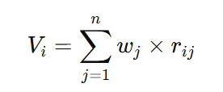
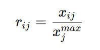
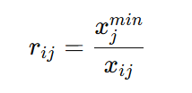
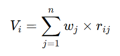

# **Materi: Metode Simple Additive Weighting (SAW)**


## **KATA PENGANTAR**

Materi ini disusun untuk memberikan pemahaman mendalam mengenai metode **Simple Additive Weighting (SAW)**, salah satu metode yang paling sederhana dan banyak digunakan dalam Sistem Pendukung Keputusan (SPK). Penyajian dimulai dari konsep dasar, tahapan penyelesaian, hingga studi kasus nyata, yaitu **pemilihan laptop untuk mahasiswa**.

---

## **TUJUAN PEMBELAJARAN**

Setelah mempelajari materi ini, mahasiswa diharapkan mampu:

1. Menjelaskan konsep dasar metode SAW.
2. Menguraikan langkah-langkah perhitungan metode SAW.
3. Melakukan normalisasi data pada kriteria cost dan benefit.
4. Menghitung nilai akhir alternatif dengan SAW.
5. Menentukan alternatif terbaik berdasarkan hasil perhitungan.

---

## **I. PENDAHULUAN**

Dalam kehidupan nyata, sering kali pengambil keputusan dihadapkan pada banyak pilihan (alternatif) dengan berbagai kriteria. Misalnya, seorang mahasiswa yang ingin membeli laptop mempertimbangkan harga, kapasitas RAM, kapasitas penyimpanan, dan daya tahan baterai.

Metode **Simple Additive Weighting (SAW)** adalah salah satu metode populer yang digunakan untuk menyelesaikan masalah tersebut. Prinsip SAW adalah:

* Menormalisasi nilai alternatif terhadap kriteria.
* Mengalikan nilai normalisasi dengan bobot kriteria.
* Menjumlahkan hasil perkalian untuk menentukan skor akhir.

---

## **II. URAIAN MATERI**

### **2.1 Konsep Dasar SAW**

Metode SAW dikenal juga dengan istilah **weighted sum method**.
Rumus umum:


Keterangan:

* ( V_i ) = nilai akhir alternatif ke-i
* ( w_j ) = bobot kriteria ke-j
* ( r_{ij} ) = nilai normalisasi alternatif ke-i pada kriteria ke-j

---

### **2.2 Normalisasi Nilai**

Normalisasi diperlukan agar semua kriteria dapat dibandingkan pada skala yang sama.

* Untuk **kriteria benefit (semakin besar semakin baik):**


* Untuk **kriteria cost (semakin kecil semakin baik):**


---

### **2.3 Tahapan Metode SAW**

1. Menentukan alternatif.
2. Menentukan kriteria dan jenisnya (benefit/cost).
3. Menentukan bobot kriteria.
4. Menyusun matriks keputusan.
5. Melakukan normalisasi matriks keputusan.
6. Menghitung skor akhir alternatif.
7. Menentukan alternatif terbaik.

---

## **III. STUDI KASUS: Pemilihan Laptop untuk Mahasiswa**

### **Data Awal**

Kriteria dan bobot:

* C1 = Harga (cost) → 0.30
* C2 = RAM (benefit) → 0.25
* C3 = Storage (benefit) → 0.20
* C4 = Baterai (benefit) → 0.25
<div class="page"/>
Alternatif:

* A1 = Laptop X
* A2 = Laptop Y
* A3 = Laptop Z

### **Matriks Keputusan (contoh data)**

Misalkan data spesifikasi laptop:

| Alternatif | Harga (juta) C1 | RAM (GB) C2 | Storage (GB) C3 | Baterai (jam) C4 |
| ---------- | --------------- | ----------- | --------------- | ---------------- |
| Laptop X   | 8               | 8           | 512             | 6                |
| Laptop Y   | 10              | 16          | 1024            | 8                |
| Laptop Z   | 7               | 12          | 512             | 5                |

### **Normalisasi**

* Untuk C1 (cost):

  Nilai minimum harga = 7 (Laptop Z).

  * X = 7/8 = 0.875
  * Y = 7/10 = 0.700
  * Z = 7/7 = 1.000

* Untuk C2 (benefit): max = 16

  * X = 8/16 = 0.500
  * Y = 16/16 = 1.000
  * Z = 12/16 = 0.750

* Untuk C3 (benefit): max = 1024

  * X = 512/1024 = 0.500
  * Y = 1024/1024 = 1.000
  * Z = 512/1024 = 0.500

* Untuk C4 (benefit): max = 8

  * X = 6/8 = 0.750
  * Y = 8/8 = 1.000
  * Z = 5/8 = 0.625
* 
<div class="page"/>

**Matriks Normalisasi:**

| Alternatif | C1    | C2    | C3    | C4    |
| ---------- | ----- | ----- | ----- | ----- |
| Laptop X   | 0.875 | 0.500 | 0.500 | 0.750 |
| Laptop Y   | 0.700 | 1.000 | 1.000 | 1.000 |
| Laptop Z   | 1.000 | 0.750 | 0.500 | 0.625 |

### **Perhitungan Skor Akhir**



* Laptop X:

```

VX​=(0.30×0.875)+(0.25×0.500)+(0.20×0.500)+(0.25×0.750)=0.6875
```

* Laptop Y:

 ```

 VY​=(0.30×0.700)+(0.25×1.000)+(0.20×1.000)+(0.25×1.000)=0.925
 ```

* Laptop Z:

```

VZ​=(0.30×1.000)+(0.25×0.750)+(0.20×0.500)+(0.25×0.625)=0.769
```
### **Hasil Akhir**

* Laptop X = 0.688
* Laptop Y = 0.925
* Laptop Z = 0.769

**Keputusan:** Alternatif terbaik adalah **Laptop Y** dengan skor 0.925.

<div class="page"/>

## **IV. RANGKUMAN**

1. SAW adalah metode pengambilan keputusan multikriteria yang sederhana dan mudah digunakan.
2. SAW menggunakan normalisasi untuk menyetarakan nilai antar kriteria cost dan benefit.
3. Hasil akhir diperoleh dari perkalian bobot dengan nilai normalisasi, lalu dijumlahkan.
4. Studi kasus laptop menunjukkan bahwa Laptop Y adalah pilihan terbaik.

## **LATIHAN / TUGAS**

1. Ubah bobot kriteria (misalnya C1 = 0.25, C2 = 0.30, C3 = 0.20, C4 = 0.25), lalu lakukan perhitungan ulang.
2. Tambahkan 1 alternatif baru (Laptop W) dengan spesifikasi yang berbeda, lalu lakukan perhitungan ulang menggunakan metode SAW.
3. Coba tentukan kriteria tambahan (misalnya kualitas layar atau berat laptop), kemudian lakukan kembali proses SAW.

---

## **EVALUASI**

1. Jelaskan bagaimana cara melakukan normalisasi untuk kriteria *benefit* dan *cost* dalam SAW.
2. Mengapa SAW disebut sebagai metode penjumlahan terbobot sederhana?
3. Apa kelebihan metode SAW dibandingkan metode pemilihan biasa (misalnya hanya melihat harga termurah)?
4. Menurut Anda, apakah hasil akhir SAW selalu objektif? Mengapa bisa demikian?

---


## **DAFTAR PUSTAKA**

* Kusumadewi, S., Hartati, S., Harjoko, A., & Wardoyo, R. (2006). *Fuzzy Multi-Attribute Decision Making (FUZZY MADM)*. Yogyakarta: Graha Ilmu.
* Velasquez, M., & Hester, P. T. (2013). An analysis of multi-criteria decision making methods. *International Journal of Operations Research, 10*(2), 56–66. [https://www.researchgate.net/publication/273712523_An_Analysis_of_Multi-Criteria_Decision_Making_Methods](https://www.researchgate.net/publication/273712523_An_Analysis_of_Multi-Criteria_Decision_Making_Methods)
* Turban, E., Sharda, R., & Delen, D. (2010). *Decision Support and Business Intelligence Systems*. Pearson Education.
