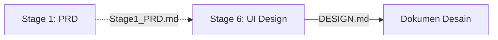

# Master Prompt Framework — Petunjuk Penggunaan

Framework ini terdiri dari 6 stage berantai untuk menyusun dan mengimplementasikan aplikasi berbasis AI. Setiap stage menggunakan output stage sebelumnya sebagai input.

---

## Alur Stage




---

## Cara Penggunaan

**Stage 1 — PRD**
Copy prompt `1. Master Prompt - Menyiapkan Dokumen PRD.md` ke LLM, paste case study di bagian `### Input`, simpan output sebagai `Stage1_PRD.md`

**Stage 2 — Tech Spec**
Copy prompt `2. Master Prompt - Menyiapkan Tech Specification.md`, paste `Stage1_PRD.md` di bagian `### Input`, simpan output sebagai `Stage2_TechSpec.md`

**Stage 3 — Task Breakdown**
Copy prompt `3. Master Prompt - Menyusun Task.md`, paste `Stage2_TechSpec.md`, simpan output sebagai `Stage3_TaskList.md`

**Stage 4 — Implementasi**
Buka OpenCode, gunakan template `4. Master Template - Implementasi Task.md`, kerjakan 1 task per prompt sesuai urutan di Task List

**Stage 5 — Verifikasi**
Copy prompt `5. Master Prompt - Verifikasi.md`, paste kode yang dihasilkan + bagian Tech Spec relevan

**Stage 6 — UI Design**
Copy prompt `6. Master Prompt - Menyiapkan Dokumen Spesifikasi Desain UI.md`, paste PRD atau deskripsi fitur

---

## Aturan

- Kerjakan stage **berurutan**, jangan melompat
- Setiap stage bergantung pada output stage sebelumnya
- Stage 4 berbeda — template untuk OpenCode, bukan prompt untuk chat LLM
- Jika output LLM tidak sesuai, ulangi dengan instruksi lebih spesifik, jangan lanjut ke stage berikutnya

---

## Struktur Folder

```
📁 Master Prompt Framework PARTS/
├── 📄 README.md
├── 📄 1. Master Prompt - Menyiapkan Dokumen PRD.md
├── 📄 2. Master Prompt - Menyiapkan Tech Specification.md
├── 📄 3. Master Prompt - Menyusun Task.md
├── 📄 4. Master Template - Implementasi Task.md
├── 📄 5. Master Prompt - Verifikasi.md
├── 📄 6. Master Prompt - Menyiapkan Dokumen Spesifikasi Desain UI.md
└── 📁 Case_Sistem_Pengaduan/
    └── 📄 Flow_Bisnis_Sistem_Pengaduan.md
```
