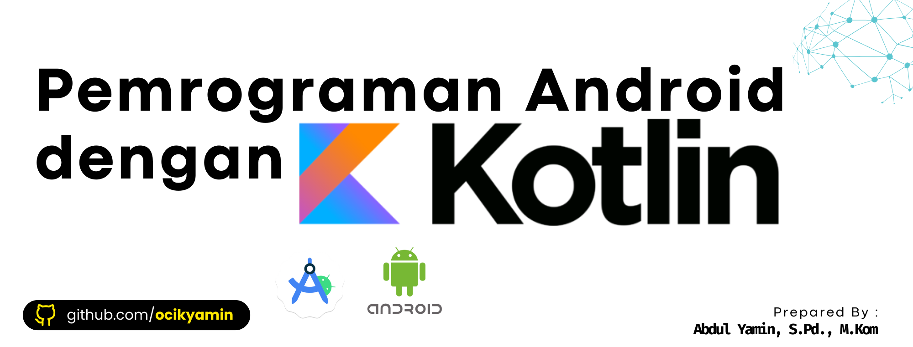

## Pengantar

Bahan ajar ini dirancang khusus untuk mahasiswa  yang ingin mendalami pengembangan aplikasi mobile pada platform Android menggunakan bahasa pemrograman Kotlin. Dalam era digital yang serba cepat ini, aplikasi mobile telah menjadi bagian tak terpisahkan dari kehidupan sehari-hari kita. Dari berkomunikasi, bekerja, belajar, hingga hiburan, semuanya kini dapat diakses melalui genggaman tangan.

Android, sebagai sistem operasi mobile paling populer di dunia, menawarkan ekosistem yang luas dan fleksibel bagi para pengembang. Dengan jutaan perangkat aktif dan miliaran unduhan aplikasi, kemampuan untuk menciptakan aplikasi Android yang inovatif dan fungsional adalah keterampilan yang sangat berharga di pasar kerja saat ini. Kotlin, sebagai bahasa pemrograman modern yang direkomendasikan oleh Google untuk pengembangan Android, membawa banyak keuntungan seperti sintaks yang ringkas, keamanan tipe yang lebih baik, dan interoperabilitas penuh dengan Java.

Bahan ajar ini akan memandu Anda langkah demi langkah, mulai dari konsep dasar pemrograman mobile, struktur proyek Android, hingga topik-topik lanjutan seperti arsitektur aplikasi, database lokal, dan integrasi dengan REST API. Setiap bab dilengkapi dengan tujuan pembelajaran yang jelas, materi pokok yang komprehensif, contoh kode yang relevan, ringkasan bab, serta pertanyaan refleksi untuk menguji pemahaman Anda. Kami berharap bahan ajar ini dapat menjadi panduan yang efektif dan menyenangkan dalam perjalanan Anda menjadi pengembang aplikasi Android yang handal.

Selamat belajar dan berkarya!

<p align="center">
  
  
  
</p>
<div class="page"/>

> # Bab 1: Pengenalan Pemrograman Mobile (Android, Kotlin, Android Studio)

## Tujuan Pembelajaran

Setelah menyelesaikan bab ini, mahasiswa diharapkan mampu:

*   Memahami konsep dasar pemrograman mobile dan perannya dalam kehidupan sehari-hari.
*   Mengenal platform Android sebagai sistem operasi mobile terpopuler.
*   Memahami keunggulan bahasa pemrograman Kotlin untuk pengembangan Android.
*   Mengenal Android Studio sebagai Integrated Development Environment (IDE) utama untuk pengembangan Android.
*   Melakukan instalasi dan konfigurasi dasar Android Studio.

## Materi Pokok

### 1.1 Apa itu Pemrograman Mobile?

Pemrograman mobile adalah proses pembuatan perangkat lunak aplikasi yang berjalan pada perangkat mobile seperti smartphone dan tablet. Aplikasi mobile dirancang untuk memanfaatkan fitur-fitur unik perangkat mobile, seperti layar sentuh, GPS, kamera, akselerometer, dan konektivitas jaringan. Berbeda dengan aplikasi desktop atau web, aplikasi mobile seringkali harus mempertimbangkan keterbatasan sumber daya (baterai, memori, CPU) dan ukuran layar yang bervariasi.

### 1.2 Mengenal Android

Android adalah sistem operasi mobile berbasis Linux yang dikembangkan oleh Google. Android bersifat *open source*, yang berarti kode sumbernya dapat diakses dan dimodifikasi secara bebas oleh siapa saja. Fleksibilitas ini telah menjadikan Android sebagai platform mobile yang paling banyak digunakan di dunia, dengan pangsa pasar yang dominan. Ekosistem Android mencakup:

*   **Sistem Operasi Android**: Versi-versi yang terus berkembang (misalnya Android 12, 13, 14) dengan fitur dan peningkatan keamanan baru.
*   **Google Play Store**: Toko aplikasi resmi Android tempat pengguna dapat mengunduh aplikasi.
*   **Android SDK (Software Development Kit)**: Kumpulan alat pengembangan yang diperlukan untuk membangun aplikasi Android, termasuk *debugger*, *library*, dan *emulator*.
*   **Perangkat Android**: Berbagai macam smartphone dan tablet dari berbagai produsen.

### 1.3 Mengapa Kotlin untuk Android?

Kotlin adalah bahasa pemrograman statis yang berjalan di Java Virtual Machine (JVM) dan dapat dikompilasi ke kode JavaScript atau kode asli. Sejak tahun 2019, Google secara resmi merekomendasikan Kotlin sebagai bahasa pilihan untuk pengembangan aplikasi Android. Beberapa alasan utama mengapa Kotlin menjadi pilihan yang populer adalah:

*   **Sintaks yang Ringkas dan Ekspresif**: Kotlin memungkinkan pengembang menulis kode yang lebih sedikit untuk mencapai fungsionalitas yang sama dibandingkan Java, sehingga meningkatkan produktivitas.
*   **Keamanan Tipe (Null Safety)**: Kotlin dirancang untuk menghilangkan `NullPointerException` (salah satu masalah umum di Java) dengan sistem tipe yang ketat yang membedakan antara tipe yang dapat bernilai null dan yang tidak.
*   **Interoperabilitas Penuh dengan Java**: Kotlin 100% kompatibel dengan Java. Anda dapat menggunakan *library* Java di proyek Kotlin, dan sebaliknya. Ini memudahkan migrasi proyek Java yang sudah ada ke Kotlin secara bertahap.
*   **Fitur Modern**: Kotlin mendukung fitur-fitur pemrograman modern seperti *coroutine* untuk pemrograman asinkron, *extension functions*, *data classes*, dan *lambda expressions*.
*   **Dukungan Komunitas yang Kuat**: Dengan dukungan resmi dari Google, komunitas Kotlin terus berkembang pesat, menyediakan banyak *resource*, *library*, dan *framework*.

### 1.4 Pengenalan Android Studio

Android Studio adalah Integrated Development Environment (IDE) resmi untuk pengembangan aplikasi Android, berdasarkan IntelliJ IDEA. Android Studio menyediakan semua yang Anda butuhkan untuk membangun aplikasi Android, termasuk:

*   **Code Editor**: Editor kode cerdas dengan fitur *code completion*, *refactoring*, dan *syntax highlighting* untuk Kotlin, Java, dan XML.
*   **Visual Layout Editor**: Alat drag-and-drop untuk merancang antarmuka pengguna aplikasi Anda tanpa perlu menulis kode XML secara manual.
*   **Emulator**: Perangkat virtual Android yang memungkinkan Anda menguji aplikasi di berbagai konfigurasi perangkat tanpa perlu perangkat fisik.
*   **Debugger**: Alat untuk melacak dan memperbaiki *bug* dalam kode Anda.
*   **Gradle**: Sistem *build* otomatis yang digunakan untuk mengelola dependensi dan mengkompilasi proyek Anda.
*   **Integrasi dengan Version Control**: Dukungan bawaan untuk sistem kontrol versi seperti Git.

### 1.5 Instalasi dan Konfigurasi Android Studio

Untuk memulai pengembangan aplikasi Android, Anda perlu menginstal Android Studio. Berikut adalah langkah-langkah umumnya:

1.  **Unduh Android Studio**: Kunjungi situs resmi developer.android.com/studio dan unduh versi terbaru Android Studio yang sesuai dengan sistem operasi Anda (Windows, macOS, atau Linux).
2.  **Jalankan Installer**: Ikuti instruksi instalasi. Pastikan Anda memiliki koneksi internet yang stabil karena installer akan mengunduh komponen-komponen tambahan seperti Android SDK.
3.  **Konfigurasi Awal**: Setelah instalasi selesai, jalankan Android Studio. Anda akan diminta untuk mengunduh komponen SDK tambahan dan mengkonfigurasi pengaturan awal. Pilih pengaturan standar jika Anda tidak yakin.
4.  **Verifikasi Instalasi**: Buat proyek baru (File > New > New Project) dan pilih template "Empty Activity". Pastikan proyek dapat di-*build* tanpa error dan Anda dapat menjalankan aplikasi di emulator atau perangkat fisik.


## Ringkasan Bab

*   Pemrograman mobile adalah pengembangan aplikasi untuk perangkat bergerak, memanfaatkan fitur unik perangkat dan mempertimbangkan keterbatasan sumber daya.
*   Android adalah sistem operasi mobile *open source* yang dikembangkan Google, dengan ekosistem luas termasuk OS, Play Store, SDK, dan beragam perangkat.
*   Kotlin adalah bahasa pemrograman modern yang direkomendasikan Google untuk Android, menawarkan sintaks ringkas, *null safety*, interoperabilitas penuh dengan Java, dan fitur-fitur modern.
*   Android Studio adalah IDE resmi untuk pengembangan Android, menyediakan editor kode, visual layout editor, emulator, debugger, dan integrasi Gradle.
*   Instalasi Android Studio melibatkan pengunduhan installer, menjalankan setup, dan mengkonfigurasi SDK awal.

## Pertanyaan Refleksi / Latihan Ringan

1.  Jelaskan perbedaan mendasar antara aplikasi mobile dengan aplikasi desktop atau web dari segi karakteristik dan pertimbangan pengembangannya!
2.  Sebutkan dan jelaskan tiga keunggulan utama Kotlin dibandingkan Java dalam konteks pengembangan aplikasi Android!
3.  Apa saja komponen utama yang disediakan oleh Android Studio yang sangat membantu dalam proses pengembangan aplikasi Android?
<div class="page"/>

> # Bab 2: Struktur Proyek Android (manifest, Gradle, res, src)

## Tujuan Pembelajaran

Setelah menyelesaikan bab ini, mahasiswa diharapkan mampu:

*   Memahami struktur dasar proyek Android yang dibuat di Android Studio.
*   Mengenal fungsi dan isi dari file `AndroidManifest.xml`.
*   Memahami peran sistem *build* Gradle dalam proyek Android.
*   Menjelaskan fungsi direktori `res` (resources) dan sub-direktorinya.
*   Menjelaskan fungsi direktori `src` (source) dan sub-direktorinya.

## Materi Pokok

Setiap proyek Android memiliki struktur direktori standar yang diatur oleh Android Studio. Memahami struktur ini sangat penting untuk navigasi, penambahan fitur, dan *debugging* aplikasi Anda. Berikut adalah komponen-komponen utama dalam struktur proyek Android:

### 2.1 Struktur Proyek Umum

Ketika Anda membuat proyek baru di Android Studio, Anda akan melihat struktur seperti ini (dalam tampilan `Android` di Project Explorer):

```

MyApp/
├── app/
│   ├── build/
│   ├── libs/
│   ├── src/
│   │   ├── androidTest/
│   │   ├── main/
│   │   │   ├── java/ (atau kotlin/)
│   │   │   │   └── com/example/myapp/
│   │   │   │       └── MainActivity.kt
│   │   │   ├── res/
│   │   │   │   ├── drawable/
│   │   │   │   ├── layout/
│   │   │   │   │   └── activity_main.xml
│   │   │   │   ├── mipmap/
│   │   │   │   ├── values/
│   │   │   │   │   ├── colors.xml
│   │   │   │   │   ├── strings.xml
│   │   │   │   │   └── themes.xml
│   │   │   │   └── AndroidManifest.xml
│   │   │   └── assets/
│   │   └── test/
│   ├── build.gradle (Module: app)
│   └── proguard-rules.pro
├── gradle/
├── .gitignore
├── build.gradle (Project: MyApp)
├── gradle.properties
├── gradlew
├── gradlew.bat
├── local.properties
└── settings.gradle
```

Direktori `app/` adalah modul utama aplikasi Anda. Sebagian besar pekerjaan pengembangan akan dilakukan di dalam direktori ini.

### 2.2 `AndroidManifest.xml`

File `AndroidManifest.xml` adalah file konfigurasi penting yang terletak di `app/src/main/`. File ini berfungsi sebagai 


cetak biru aplikasi Anda, memberikan informasi penting kepada sistem Android tentang komponen-komponen aplikasi, izin yang dibutuhkan, fitur hardware yang digunakan, dan banyak lagi. Beberapa elemen kunci dalam `AndroidManifest.xml`:

*   **`<manifest>`**: Elemen root yang mendefinisikan paket aplikasi (`package`).
*   **`<application>`**: Mendefinisikan properti global untuk semua komponen aplikasi, seperti ikon, label, tema, dan apakah aplikasi dapat di-*debug*.
*   **`<activity>`**: Mendeklarasikan setiap *Activity* dalam aplikasi. Setiap *Activity* harus dideklarasikan di sini agar dapat dijalankan oleh sistem Android.
*   **`<service>`**: Mendeklarasikan *Service* yang berjalan di latar belakang.
*   **`<receiver>`**: Mendeklarasikan *BroadcastReceiver* untuk merespons siaran sistem atau aplikasi lain.
*   **`<provider>`**: Mendeklarasikan *ContentProvider* untuk mengelola akses data.
*   **`<uses-permission>`**: Mendeklarasikan izin yang dibutuhkan aplikasi, seperti `android.permission.INTERNET` untuk akses jaringan atau `android.permission.CAMERA` untuk akses kamera.
*   **`<uses-feature>`**: Mendeklarasikan fitur hardware atau software yang dibutuhkan aplikasi, misalnya `android.hardware.camera`.
*   **`<intent-filter>`**: Mendeklarasikan jenis *Intent* yang dapat ditangani oleh komponen aplikasi, memungkinkan komponen tersebut merespons *Intent* implisit dari sistem atau aplikasi lain.

Contoh sederhana `AndroidManifest.xml`:

```xml

<?xml version="1.0" encoding="utf-8"?>
<manifest xmlns:android="http://schemas.android.com/apk/res/android"
    package="com.example.myapp">

    <uses-permission android:name="android.permission.INTERNET" />

    <application
        android:allowBackup="true"
        android:icon="@mipmap/ic_launcher"
        android:label="@string/app_name"
        android:roundIcon="@mipmap/ic_launcher_round"
        android:supportsRtl="true"
        android:theme="@style/Theme.MyApp">

        <activity
            android:name=".MainActivity"
            android:exported="true">
            <intent-filter>
                <action android:name="android.intent.action.MAIN" />
                <category android:name="android.intent.category.LAUNCHER" />
            </intent-filter>
        </activity>

    </application>

</manifest>
```

### 2.3 Sistem Build Gradle

Gradle adalah sistem *build* otomatis yang digunakan oleh Android Studio untuk mengelola dependensi, mengkompilasi kode sumber, dan mengemas aplikasi menjadi file APK (Android Package Kit). Ada dua file Gradle utama dalam proyek Android:

*   **`build.gradle (Project: MyApp)`**: Terletak di root proyek. File ini mendefinisikan konfigurasi *build* untuk seluruh proyek, termasuk versi Gradle dan repositori Maven yang digunakan untuk mengunduh *library*.
*   **`build.gradle (Module: app)`**: Terletak di direktori `app/`. File ini mendefinisikan konfigurasi *build* untuk modul aplikasi spesifik Anda. Ini adalah tempat Anda mendeklarasikan SDK versi target, versi *build tools*, dependensi *library*, dan konfigurasi *signing*.

Contoh `build.gradle (Module: app)`:

```gradle

plugins {
    id 'com.android.application'
    id 'org.jetbrains.kotlin.android'
}

android {
    namespace 'com.example.myapp'
    compileSdk 34

    defaultConfig {
        applicationId "com.example.myapp"
        minSdk 24
        targetSdk 34
        versionCode 1
        versionName "1.0"

        testInstrumentationRunner "androidx.test.runner.AndroidJUnitRunner"
    }

    buildTypes {
        release {
            minifyEnabled false
            proguardFiles getDefaultProguardFile('proguard-android-optimize.txt'), 'proguard-rules.pro'
        }
    }
    compileOptions {
        sourceCompatibility JavaVersion.VERSION_1_8
        targetCompatibility JavaVersion.VERSION_1_8
    }
    kotlinOptions {
        jvmTarget = '1.8'
    }
}

dependencies {
    implementation 'androidx.core:core-ktx:1.9.0'
    implementation 'androidx.appcompat:appcompat:1.6.1'
    implementation 'com.google.android.material:material:1.10.0'
    implementation 'androidx.constraintlayout:constraintlayout:2.1.4'
    testImplementation 'junit:junit:4.13.2'
    androidTestImplementation 'androidx.test.ext:junit:1.1.5'
    androidTestImplementation 'androidx.test.espresso:espresso-core:3.5.1'
}
```

### 2.4 Direktori `res` (Resources)

Direktori `res` (resources) terletak di `app/src/main/res/` dan berisi semua sumber daya non-kode yang digunakan oleh aplikasi Anda. Sumber daya ini dipisahkan dari kode sumber untuk memudahkan lokalisasi, pengelolaan, dan pembaruan UI. Sub-direktori penting dalam `res`:

*   **`drawable/`**: Berisi gambar (PNG, JPG, GIF, WebP), XML *drawable* (bentuk, *selector*, *layer list*), dan *vector assets*. Contoh: `ic_launcher_background.xml`, `my_image.png`.
*   **`layout/`**: Berisi file XML yang mendefinisikan tata letak antarmuka pengguna (UI) untuk *Activity*, *Fragment*, atau komponen UI lainnya. Contoh: `activity_main.xml`.
*   **`mipmap/`**: Berisi ikon peluncur aplikasi (launcher icons) dalam berbagai kepadatan piksel. Sistem Android memilih ikon yang paling sesuai berdasarkan kepadatan layar perangkat. Contoh: `ic_launcher.png`, `ic_launcher_round.png`.
*   **`values/`**: Berisi file XML yang mendefinisikan nilai-nilai sederhana seperti string, warna, dimensi, gaya (styles), dan tema (themes).
    *   `colors.xml`: Mendefinisikan warna yang digunakan dalam aplikasi.
    *   `strings.xml`: Mendefinisikan semua string teks yang digunakan dalam aplikasi. Ini sangat penting untuk lokalisasi.
    *   `themes.xml`: Mendefinisikan tema visual aplikasi, termasuk warna primer, sekunder, dan gaya teks.
    *   `dimens.xml` (opsional): Mendefinisikan dimensi (ukuran) untuk elemen UI.
    *   `styles.xml` (opsional): Mendefinisikan gaya untuk elemen UI.
*   **`menu/`** (opsional): Berisi file XML yang mendefinisikan menu aplikasi.
*   **`raw/`** (opsional): Berisi file media mentah seperti audio atau video.
*   **`xml/`** (opsional): Berisi file XML arbitrer yang dapat dibaca pada waktu *runtime*, seperti konfigurasi *preferences*.

### 2.5 Direktori `src` (Source)

Direktori `src` (source) terletak di `app/src/` dan berisi kode sumber aplikasi Anda serta sumber daya yang terkait dengan *build* tertentu (misalnya, `main`, `debug`, `release`). Sub-direktori penting dalam `src`:

*   **`main/`**: Direktori utama yang berisi kode sumber dan sumber daya yang akan disertakan dalam semua *build* aplikasi Anda.
    *   `java/` (atau `kotlin/`): Berisi semua file kode sumber Kotlin (atau Java) Anda, seperti *Activity*, *Fragment*, *Service*, *class* model, dan *utility class*. Struktur paket (`com.example.myapp`) mencerminkan struktur direktori.
    *   `res/`: Direktori sumber daya yang telah dijelaskan di atas.
    *   `AndroidManifest.xml`: File manifest aplikasi yang telah dijelaskan di atas.
*   **`androidTest/`**: Berisi kode sumber untuk *instrumented tests* yang berjalan di perangkat Android (fisik atau emulator). Tes ini menguji interaksi UI dan fungsionalitas yang membutuhkan lingkungan Android.
*   **`test/`**: Berisi kode sumber untuk *unit tests* lokal yang berjalan di JVM lokal Anda. Tes ini tidak memerlukan perangkat Android dan biasanya digunakan untuk menguji logika bisnis yang tidak bergantung pada framework Android.

Memahami struktur ini akan membantu Anda mengorganisir proyek dengan lebih baik dan menemukan file yang tepat saat Anda mengembangkan aplikasi Android.


## Ringkasan Bab

*   Struktur proyek Android diatur secara standar, dengan `app/` sebagai modul utama yang berisi sebagian besar kode dan sumber daya.
*   `AndroidManifest.xml` adalah file konfigurasi penting yang mendeklarasikan komponen aplikasi, izin, fitur, dan informasi penting lainnya kepada sistem Android.
*   Gradle adalah sistem *build* otomatis yang digunakan untuk mengelola dependensi, mengkompilasi kode, dan mengemas aplikasi menjadi APK, dengan konfigurasi di `build.gradle` (Project) dan `build.gradle` (Module: app).
*   Direktori `res/` (resources) berisi semua sumber daya non-kode seperti *drawable*, *layout*, *mipmap*, dan *values* (warna, string, tema).
*   Direktori `src/` (source) berisi kode sumber aplikasi (`java/` atau `kotlin/`), serta kode untuk *instrumented tests* (`androidTest/`) dan *unit tests* (`test/`).

## Pertanyaan Refleksi / Latihan Ringan

1.  Mengapa `AndroidManifest.xml` disebut sebagai "cetak biru" aplikasi Android? Jelaskan setidaknya tiga jenis informasi penting yang dideklarasikan di dalamnya!
2.  Jelaskan perbedaan fungsi antara `build.gradle (Project)` dan `build.gradle (Module: app)` dalam proyek Android!
3.  Anda ingin menambahkan gambar baru ke aplikasi Anda dan mendefinisikan warna kustom. Di direktori `res` mana Anda akan meletakkan file-file tersebut dan mengapa?
<div class="page"/>

> # Bab 3: Dasar Pemrograman Kotlin (variabel, tipe data, operator, kontrol alur, fungsi)

## Tujuan Pembelajaran

Setelah menyelesaikan bab ini, mahasiswa diharapkan mampu:

*   Memahami konsep dasar variabel dan tipe data dalam Kotlin.
*   Menggunakan berbagai operator dalam ekspresi Kotlin.
*   Mengimplementasikan struktur kontrol alur seperti `if/else`, `when`, `for`, dan `while`.
*   Mendefinisikan dan memanggil fungsi dalam Kotlin.
*   Memahami konsep *null safety* dalam Kotlin.

## Materi Pokok

Kotlin adalah bahasa pemrograman modern yang dirancang agar ringkas, aman, dan interoperabel. Sebelum kita menyelami pengembangan Android, penting untuk menguasai dasar-dasar Kotlin.

### 3.1 Variabel dan Tipe Data

Dalam Kotlin, Anda mendeklarasikan variabel menggunakan kata kunci `val` (untuk variabel *read-only* atau *immutable*) atau `var` (untuk variabel *mutable*). Kotlin memiliki inferensi tipe yang kuat, sehingga Anda tidak selalu perlu secara eksplisit menentukan tipe data.

*   **`val` (Value)**: Untuk variabel yang nilainya tidak dapat diubah setelah diinisialisasi. Mirip dengan `final` di Java.
    ```kotlin

    val namaDepan = "Budi" // Tipe String diinferensikan
    val tahunLahir = 2000 // Tipe Int diinferensikan
    // tahunLahir = 2001 // ERROR: Val cannot be reassigned
    ```
*   **`var` (Variable)**: Untuk variabel yang nilainya dapat diubah setelah diinisialisasi.
    ```kotlin

    var umur = 20 // Tipe Int diinferensikan
    umur = 21 // Nilai dapat diubah
    ```

**Tipe Data Dasar:**

Kotlin memiliki tipe data dasar untuk angka, karakter, boolean, dan string. Semua tipe data ini adalah objek.

| Kategori | Tipe Data | Deskripsi                                      | Contoh Literal |
| :------- | :-------- | :--------------------------------------------- | :------------- |
| Angka    | `Byte`    | 8-bit signed integer                           | `10`           |
|          | `Short`   | 16-bit signed integer                          | `100`          |
|          | `Int`     | 32-bit signed integer                          | `1000`         |
|          | `Long`    | 64-bit signed integer                          | `10000L`       |
|          | `Float`   | 32-bit floating-point number                   | `3.14f`        |
|          | `Double`  | 64-bit floating-point number                   | `3.14`         |
| Karakter | `Char`    | Karakter tunggal, diapit tanda kutip tunggal | `'A'`          |
| Boolean  | `Boolean` | `true` atau `false`                            | `true`         |
| String   | `String`  | Urutan karakter, diapit tanda kutip ganda    | `"Hello"`      |

**Null Safety:**

Salah satu fitur paling kuat di Kotlin adalah *null safety*. Secara default, variabel di Kotlin tidak boleh bernilai `null`. Jika Anda ingin sebuah variabel dapat menampung nilai `null`, Anda harus secara eksplisit menandainya dengan `?` setelah tipe datanya.

```kotlin

var nama: String = "Alice" // Tidak boleh null
// nama = null // ERROR: Null can not be a value of a non-null type String

var alamat: String? = null // Boleh null
alamat = "Jl. Merdeka 123"
alamat = null // Boleh diubah menjadi null
```

Ketika bekerja dengan tipe yang dapat bernilai `null`, Anda harus menangani kemungkinan `null` untuk menghindari `NullPointerException`. Kotlin menyediakan operator *safe call* (`?.`) dan operator *Elvis* (`?:`).

```kotlin

val panjangNama = nama.length // Aman, karena nama tidak null
val panjangAlamat = alamat?.length // Safe call: jika alamat tidak null, ambil panjangnya; jika null, hasilnya null

val kota = "Jakarta"
val alamatLengkap = alamat ?: "Tidak diketahui" // Elvis operator: jika alamat tidak null, gunakan alamat; jika null, gunakan "Tidak diketahui"

println("Panjang nama: $panjangNama")
println("Panjang alamat: $panjangAlamat") // Akan mencetak null jika alamat null
println("Alamat lengkap: $alamatLengkap")
```

### 3.2 Operator

Kotlin mendukung operator aritmatika, perbandingan, logika, dan penugasan yang umum.

*   **Aritmatika**: `+`, `-`, `*`, `/`, `%`
    ```kotlin

    val a = 10
    val b = 3
    println("a + b = ${a + b}") // 13
    println("a / b = ${a / b}") // 3 (integer division)
    println("a % b = ${a % b}") // 1
    ```
*   **Perbandingan**: `==` (sama dengan), `!=` (tidak sama dengan), `<`, `>`, `<=`, `>=`
    ```kotlin

    val x = 5
    val y = 10
    println("x == y: ${x == y}") // false
    println("x < y: ${x < y}")   // true
    ```
*   **Logika**: `&&` (AND), `||` (OR), `!` (NOT)
    ```kotlin

    val isDewasa = true
    val punyaSIM = false
    println("Bisa mengemudi: ${isDewasa && punyaSIM}") // false
    println("Bisa masuk klub: ${isDewasa || punyaSIM}") // true
    ```
*   **Penugasan**: `=`, `+=`, `-=`, `*=`, `/=`, `%=`
    ```kotlin

    var counter = 0
    counter += 5 // counter = 5
    counter *= 2 // counter = 10
    ```

### 3.3 Kontrol Alur

Kontrol alur memungkinkan Anda mengeksekusi blok kode tertentu berdasarkan kondisi atau mengulang eksekusi.

*   **`if`/`else`**: Untuk eksekusi bersyarat.
    ```kotlin

    val nilai = 75
    val grade = if (nilai >= 90) {
        "A"
    } else if (nilai >= 80) {
        "B"
    } else if (nilai >= 70) {
        "C"
    } else {
        "D"
    }
    println("Nilai Anda: $grade")
    ```
    `if` di Kotlin juga bisa digunakan sebagai ekspresi (mengembalikan nilai).

*   **`when`**: Mirip dengan `switch` di Java, tetapi lebih fleksibel dan dapat digunakan sebagai ekspresi.
    ```kotlin

    val hari = 3
    val namaHari = when (hari) {
        1 -> "Minggu"
        2 -> "Senin"
        3 -> "Selasa"
        4 -> "Rabu"
        5 -> "Kamis"
        6 -> "Jumat"
        7 -> "Sabtu"
        else -> "Hari tidak valid"
    }
    println("Hari ini adalah $namaHari")

    // when dengan rentang atau tipe
    val angka = 15
    when (angka) {
        in 1..10 -> println("Angka di antara 1 dan 10")
        is Int -> println("Ini adalah integer")
        else -> println("Angka di luar rentang")
    }
    ```

*   **`for` Loop**: Untuk mengulang melalui rentang, array, atau koleksi.
    ```kotlin

    for (i in 1..5) { // Rentang dari 1 sampai 5 (inklusif)
        println("Iterasi ke-$i")
    }

    val daftarBuah = listOf("Apel", "Jeruk", "Mangga")
    for (buah in daftarBuah) {
        println("Buah: $buah")
    }

    for ((index, buah) in daftarBuah.withIndex()) {
        println("Buah ke-$index: $buah")
    }
    ```

*   **`while` dan `do-while` Loop**: Untuk mengulang selama kondisi tertentu terpenuhi.
    ```kotlin

    var hitung = 0
    while (hitung < 3) {
        println("While loop: $hitung")
        hitung++
    }

    var hitungDo = 0
    do {
        println("Do-while loop: $hitungDo")
        hitungDo++
    } while (hitungDo < 3)
    ```

### 3.4 Fungsi

Fungsi adalah blok kode yang dirancang untuk melakukan tugas tertentu. Fungsi dapat menerima parameter dan mengembalikan nilai. Dalam Kotlin, fungsi dideklarasikan menggunakan kata kunci `fun`.

*   **Fungsi Tanpa Parameter dan Tanpa Nilai Kembali (Unit)**:
    ```kotlin

    fun sapaDunia() {
        println("Halo, Dunia!")
    }

    sapaDunia() // Memanggil fungsi
    ```
    Jika fungsi tidak mengembalikan nilai, secara implisit mengembalikan tipe `Unit` (mirip dengan `void` di Java).

*   **Fungsi dengan Parameter:**
    ```kotlin

    fun sapaNama(nama: String) {
        println("Halo, $nama!")
    }

    sapaNama("Alice")
    sapaNama("Bob")
    ```

*   **Fungsi dengan Nilai Kembali:**
    ```kotlin

    fun tambah(a: Int, b: Int): Int {
        return a + b
    }

    val hasil = tambah(5, 3)
    println("Hasil penjumlahan: $hasil") // 8
    ```

*   **Fungsi Ekspresi Tunggal:**
    Jika fungsi hanya memiliki satu ekspresi, Anda dapat menuliskannya lebih ringkas.
    ```kotlin

    fun kali(a: Int, b: Int): Int = a * b

    val hasilKali = kali(4, 2)
    println("Hasil perkalian: $hasilKali") // 8
    ```

*   **Parameter Default dan Named Arguments:**
    Kotlin memungkinkan Anda memberikan nilai *default* untuk parameter fungsi, dan memanggil fungsi menggunakan *named arguments*.
    ```kotlin

    fun cetakPesan(pesan: String, pengirim: String = "Sistem") {
        println("[$pengirim]: $pesan")
    }

    cetakPesan("Selamat datang!") // Output: [Sistem]: Selamat datang!
    cetakPesan("Halo!", "Admin") // Output: [Admin]: Halo!
    cetakPesan(pengirim = "Pengguna", pesan = "Saya baik-baik saja.") // Named arguments
    ```

### 3.5 Kelas dan Objek (Pengantar)

Meskipun akan dibahas lebih dalam di bab selanjutnya, penting untuk mengetahui bahwa Kotlin adalah bahasa berorientasi objek. Anda dapat mendefinisikan kelas sebagai *blueprint* untuk objek.

```kotlin

class Kucing(val nama: String, var umur: Int) {
    fun meong() {
        println("$nama berkata Meong!")
    }
}

fun main() {
    val kucingSaya = Kucing("Kitty", 2) // Membuat objek dari kelas Kucing
    println("Nama kucing: ${kucingSaya.nama}")
    kucingSaya.meong()

    kucingSaya.umur = 3 // Mengubah properti umur
    println("Umur kucing: ${kucingSaya.umur}")
}
```

Ini adalah dasar-dasar Kotlin yang akan sangat sering Anda gunakan dalam pengembangan aplikasi Android. Memahami konsep-konsep ini dengan baik akan menjadi fondasi yang kuat untuk bab-bab berikutnya.


## Ringkasan Bab

*   Variabel di Kotlin dideklarasikan dengan `val` (immutable) atau `var` (mutable), dengan inferensi tipe yang kuat.
*   Kotlin memiliki tipe data dasar seperti `Int`, `Double`, `Boolean`, `Char`, dan `String`.
*   Fitur *null safety* Kotlin mencegah `NullPointerException` dengan mengharuskan deklarasi eksplisit untuk tipe yang dapat bernilai `null` (`?`) dan menyediakan operator *safe call* (`?.`) serta *Elvis* (`?:`).
*   Operator aritmatika, perbandingan, logika, dan penugasan berfungsi serupa dengan bahasa pemrograman lain.
*   Kontrol alur meliputi `if/else` (juga sebagai ekspresi), `when` (lebih fleksibel dari `switch`), `for` loop untuk iterasi, serta `while` dan `do-while` loop.
*   Fungsi dideklarasikan dengan `fun`, dapat memiliki parameter, mengembalikan nilai (atau `Unit`), dan mendukung *single-expression functions*, *default parameters*, serta *named arguments*.
*   Kotlin adalah bahasa berorientasi objek, memungkinkan definisi kelas sebagai *blueprint* untuk objek.

## Pertanyaan Refleksi / Latihan Ringan

1.  Jelaskan perbedaan antara `val` dan `var` dalam deklarasi variabel Kotlin, dan berikan contoh kapan Anda akan menggunakan masing-masing!
2.  Bagaimana Kotlin menangani masalah `NullPointerException` yang sering terjadi di bahasa lain? Jelaskan peran operator *safe call* (`?.`) dan *Elvis* (`?:`)!
3.  Tuliskan sebuah fungsi Kotlin sederhana yang menerima dua parameter angka (integer) dan mengembalikan hasil perkalian kedua angka tersebut. Kemudian, panggil fungsi tersebut dengan dua angka pilihan Anda!
<div class="page"/>

> # Bab 4: User Interface Dasar (XML Layout, TextView, Button, onClick)

## Tujuan Pembelajaran

Setelah menyelesaikan bab ini, mahasiswa diharapkan mampu:

*   Memahami konsep dasar User Interface (UI) dalam pengembangan aplikasi Android.
*   Menggunakan XML untuk mendefinisikan tata letak (layout) antarmuka pengguna.
*   Mengenal dan menggunakan komponen UI dasar seperti `TextView` dan `Button`.
*   Menambahkan interaktivitas pada komponen UI menggunakan *event listener* `onClick`.
*   Menghubungkan komponen UI dari XML ke kode Kotlin.

## Materi Pokok

Antarmuka pengguna (User Interface atau UI) adalah bagian dari aplikasi yang berinteraksi langsung dengan pengguna. Dalam Android, UI dibangun menggunakan hierarki *View* dan *ViewGroup*. *View* adalah elemen dasar UI seperti tombol atau teks, sedangkan *ViewGroup* adalah wadah yang menampung *View* lain dan mengatur tata letaknya.

### 4.1 XML Layout

Android menggunakan file XML untuk mendefinisikan struktur dan tata letak UI. File-file ini biasanya terletak di direktori `res/layout/`. Keuntungan menggunakan XML untuk layout adalah pemisahan yang jelas antara desain UI dan logika aplikasi (kode Kotlin/Java), sehingga memudahkan pengembangan dan pemeliharaan.

Setiap file layout XML dimulai dengan *root element* yang merupakan *ViewGroup*. Contohnya adalah `LinearLayout`, `RelativeLayout`, atau `ConstraintLayout` (yang akan dibahas lebih lanjut di bab berikutnya).

```xml

<!-- activity_main.xml -->
<LinearLayout xmlns:android="http://schemas.android.com/apk/res/android"
    xmlns:app="http://schemas.android.com/apk/res-auto"
    xmlns:tools="http://schemas.android.com/tools"
    android:layout_width="match_parent"
    android:layout_height="match_parent"
    android:orientation="vertical"
    android:gravity="center"
    tools:context=".MainActivity">

    <!-- Komponen UI akan diletakkan di sini -->

</LinearLayout>
```

Atribut `android:layout_width` dan `android:layout_height` adalah atribut paling penting untuk setiap *View* atau *ViewGroup*. Nilai yang umum digunakan adalah:

*   `match_parent`: Komponen akan mengisi seluruh ruang yang tersedia dari induknya.
*   `wrap_content`: Komponen akan menyesuaikan ukurannya agar cukup untuk menampung kontennya.
*   Ukuran spesifik dalam `dp` (density-independent pixels) atau `sp` (scale-independent pixels untuk teks).

### 4.2 `TextView`

`TextView` adalah komponen UI yang digunakan untuk menampilkan teks. Ini adalah salah satu komponen paling dasar dan sering digunakan.

**Atribut Penting `TextView`:**

*   `android:id`: ID unik untuk mengidentifikasi `TextView` dalam kode Kotlin.
*   `android:text`: Teks yang akan ditampilkan. Sebaiknya referensikan dari `strings.xml` (`@string/nama_string`).
*   `android:textSize`: Ukuran teks (gunakan `sp`).
*   `android:textColor`: Warna teks.
*   `android:textStyle`: Gaya teks (bold, italic).

### 4.3 `Button`

`Button` adalah komponen UI yang memungkinkan pengguna untuk melakukan tindakan dengan mengetuknya. Ketika tombol diketuk, ia dapat memicu suatu *event* atau fungsi dalam aplikasi.

**Atribut Penting `Button`:**

*   `android:id`: ID unik untuk mengidentifikasi `Button` dalam kode Kotlin.
*   `android:text`: Teks yang akan ditampilkan pada tombol.
*   `android:onClick`: (Opsional) Nama metode yang akan dipanggil ketika tombol diklik. Metode ini harus didefinisikan di *Activity* yang terkait dan memiliki tanda tangan `public void namaMetode(View view)`.

### 4.4 Menghubungkan UI ke Kode Kotlin (View Binding)

Untuk berinteraksi dengan komponen UI yang didefinisikan dalam XML dari kode Kotlin Anda, Anda perlu mendapatkan referensi ke komponen tersebut. Cara modern dan direkomendasikan adalah menggunakan *View Binding*.

Untuk mengaktifkan *View Binding*, tambahkan baris berikut di `build.gradle (Module: app)` di dalam blok `android { ... }`:

```gradle

android {
    ...
    buildFeatures {
        viewBinding true
    }
}
```

Setelah disinkronkan, Android Studio akan secara otomatis menghasilkan kelas *binding* untuk setiap file layout XML Anda (misalnya, untuk `activity_main.xml`, akan ada `ActivityMainBinding`).

### 4.5 Menambahkan Interaktivitas (`onClick` Listener)

Ada beberapa cara untuk menangani klik pada tombol atau *View* lainnya:

1.  **Menggunakan atribut `android:onClick` di XML**: Cara sederhana untuk fungsi yang sangat spesifik.
    ```xml

    <Button
        android:id="@+id/myButton"
        android:layout_width="wrap_content"
        android:layout_height="wrap_content"
        android:text="Klik Saya"
        android:onClick="onButtonClicked" />
    ```
    Di `MainActivity.kt`:
    ```kotlin

    import android.os.Bundle
    import android.view.View
    import android.widget.Toast
    import androidx.appcompat.app.AppCompatActivity

    class MainActivity : AppCompatActivity() {
        override fun onCreate(savedInstanceState: Bundle?) {
            super.onCreate(savedInstanceState)
            setContentView(R.layout.activity_main)
        }

        fun onButtonClicked(view: View) {
            Toast.makeText(this, "Tombol diklik dari XML!", Toast.LENGTH_SHORT).show()
        }
    }
    ```
    **Catatan**: Metode ini kurang direkomendasikan untuk aplikasi yang lebih kompleks karena dapat membuat kode sulit diuji dan kurang fleksibel.

2.  **Menggunakan *Listener* dalam Kode Kotlin (Direkomendasikan)**: Ini adalah cara yang lebih fleksibel dan umum digunakan, terutama dengan *View Binding*.
    ```kotlin

    import android.os.Bundle
    import android.widget.Toast
    import androidx.appcompat.app.AppCompatActivity
    import com.example.myapp.databinding.ActivityMainBinding // Sesuaikan dengan nama paket Anda

    class MainActivity : AppCompatActivity() {

        private lateinit var binding: ActivityMainBinding

        override fun onCreate(savedInstanceState: Bundle?) {
            super.onCreate(savedInstanceState)
            binding = ActivityMainBinding.inflate(layoutInflater)
            setContentView(binding.root)

            // Mengakses TextView dan Button melalui binding object
            binding.myTextView.text = "Halo dari Kotlin!"

            binding.myButton.setOnClickListener {
                // Kode yang akan dieksekusi saat tombol diklik
                Toast.makeText(this, "Tombol diklik dari Kode Kotlin!", Toast.LENGTH_SHORT).show()
                binding.myTextView.text = "Teks berubah!"
            }
        }
    }
    ```
    Dalam contoh di atas, `binding.myButton` adalah referensi ke tombol Anda, dan `setOnClickListener` adalah metode yang menerima *lambda expression* (blok kode) yang akan dijalankan saat tombol diklik. Ini adalah cara yang bersih dan kuat untuk menangani interaksi pengguna.


## Contoh Kode

Berikut adalah contoh lengkap `activity_main.xml` dan `MainActivity.kt` yang menunjukkan penggunaan `TextView`, `Button`, dan penanganan `onClick` menggunakan *View Binding*.

**`app/src/main/res/layout/activity_main.xml`**

```xml

<?xml version="1.0" encoding="utf-8"?>
<LinearLayout xmlns:android="http://schemas.android.com/apk/res/android"
    xmlns:app="http://schemas.android.com/apk/res-auto"
    xmlns:tools="http://schemas.android.com/tools"
    android:layout_width="match_parent"
    android:layout_height="match_parent"
    android:orientation="vertical"
    android:gravity="center"
    android:padding="16dp"
    tools:context=".MainActivity">

    <TextView
        android:id="@+id/textViewPesan"
        android:layout_width="wrap_content"
        android:layout_height="wrap_content"
        android:text="Selamat Datang di Aplikasi Android Pertama!"
        android:textSize="24sp"
        android:textColor="#3F51B5"
        android:textStyle="bold"
        android:layout_marginBottom="32dp"/>

    <Button
        android:id="@+id/buttonUbahTeks"
        android:layout_width="wrap_content"
        android:layout_height="wrap_content"
        android:text="Ubah Teks"
        android:padding="12dp"
        android:textSize="18sp"/>

    <Button
        android:id="@+id/buttonTampilkanPesan"
        android:layout_width="wrap_content"
        android:layout_height="wrap_content"
        android:text="Tampilkan Pesan"
        android:padding="12dp"
        android:textSize="18sp"
        android:layout_marginTop="16dp"/>

</LinearLayout>
```

**`app/src/main/java/com/example/myapp/MainActivity.kt`** (Sesuaikan `com.example.myapp` dengan nama paket Anda)

```kotlin

package com.example.myapp

import android.os.Bundle
import android.widget.Toast
import androidx.appcompat.app.AppCompatActivity
import com.example.myapp.databinding.ActivityMainBinding

class MainActivity : AppCompatActivity() {

    private lateinit var binding: ActivityMainBinding

    override fun onCreate(savedInstanceState: Bundle?) {
        super.onCreate(savedInstanceState)
        // Menginisialisasi View Binding
        binding = ActivityMainBinding.inflate(layoutInflater)
        // Mengatur layout dari root View Binding
        setContentView(binding.root)

        // Menangani klik pada buttonUbahTeks
        binding.buttonUbahTeks.setOnClickListener {
            // Mengubah teks pada textViewPesan
            binding.textViewPesan.text = "Teks sudah diubah oleh tombol!"
            Toast.makeText(this, "Teks berhasil diubah!", Toast.LENGTH_SHORT).show()
        }

        // Menangani klik pada buttonTampilkanPesan
        binding.buttonTampilkanPesan.setOnClickListener {
            // Menampilkan pesan Toast
            Toast.makeText(this, "Ini adalah pesan dari tombol kedua!", Toast.LENGTH_LONG).show()
        }
    }
}
```

## Ringkasan Bab

*   UI aplikasi Android dibangun menggunakan hierarki *View* dan *ViewGroup*, yang didefinisikan dalam file XML layout.
*   `TextView` digunakan untuk menampilkan teks, dan `Button` untuk memicu tindakan pengguna.
*   Atribut `android:layout_width` dan `android:layout_height` sangat penting untuk menentukan ukuran komponen UI, dengan nilai umum `match_parent` dan `wrap_content`.
*   *View Binding* adalah cara modern dan direkomendasikan untuk mendapatkan referensi komponen UI dari XML ke kode Kotlin, meningkatkan keamanan tipe dan efisiensi.
*   Interaktivitas pada komponen UI, seperti `Button`, ditangani menggunakan `setOnClickListener` dalam kode Kotlin, yang memungkinkan eksekusi blok kode saat komponen diklik.

## Pertanyaan Refleksi / Latihan Ringan

1.  Jelaskan mengapa Android menggunakan file XML terpisah untuk mendefinisikan layout UI, dan apa keuntungannya dibandingkan mendefinisikan UI langsung di kode Kotlin?
2.  Apa perbedaan utama antara `match_parent` dan `wrap_content` ketika digunakan sebagai nilai untuk `android:layout_width` atau `android:layout_height`?
3.  Anda memiliki sebuah `EditText` (komponen untuk input teks) dan sebuah `Button`. Bagaimana Anda akan mendapatkan teks yang dimasukkan pengguna dari `EditText` ketika `Button` diklik, menggunakan *View Binding*?
<div class="page"/>

> # Bab 5: Layout & Komponen Lanjutan (ConstraintLayout, ScrollView, Toast, SnackBar, AlertDialog, Style & Theme)

## Tujuan Pembelajaran

Setelah menyelesaikan bab ini, mahasiswa diharapkan mampu:

*   Menggunakan `ConstraintLayout` untuk mendesain tata letak UI yang kompleks dan responsif.
*   Memahami dan mengimplementasikan `ScrollView` untuk konten yang melebihi ukuran layar.
*   Menampilkan pesan singkat kepada pengguna menggunakan `Toast` dan `SnackBar`.
*   Membuat dan menampilkan dialog interaktif menggunakan `AlertDialog`.
*   Menerapkan `Style` dan `Theme` untuk konsistensi visual aplikasi.

## Materi Pokok

Setelah memahami dasar-dasar UI, kini saatnya menjelajahi komponen layout dan elemen interaksi yang lebih canggih untuk membangun antarmuka yang kaya dan fungsional.

### 5.1 `ConstraintLayout`

`ConstraintLayout` adalah *ViewGroup* yang sangat fleksibel dan kuat, direkomendasikan oleh Google untuk membangun tata letak UI. Berbeda dengan `LinearLayout` yang mengatur *View* secara linear atau `RelativeLayout` yang mengatur *View* relatif terhadap satu sama lain, `ConstraintLayout` memungkinkan Anda menentukan posisi dan ukuran setiap *View* berdasarkan hubungan (constraints) dengan *View* lain, *parent layout*, atau *guideline*.

**Keunggulan `ConstraintLayout`:**

*   **Fleksibilitas**: Dapat membuat tata letak yang kompleks tanpa perlu *nested ViewGroups* yang berlebihan, yang dapat meningkatkan kinerja UI.
*   **Responsif**: Mudah beradaptasi dengan berbagai ukuran layar dan orientasi.
*   **Desain Visual**: Sangat didukung oleh *Layout Editor* di Android Studio, memungkinkan desain drag-and-drop yang intuitif.

**Konsep Dasar `ConstraintLayout`:**

*   **Constraints**: Setiap *View* di dalam `ConstraintLayout` harus memiliki setidaknya dua *horizontal constraints* dan dua *vertical constraints* untuk menentukan posisinya. Constraints dapat berupa:
    *   **Relative Positioning**: Menghubungkan sisi satu *View* ke sisi *View* lain (misalnya, `button_top` ke `textView_bottom`).
    *   **Parent Positioning**: Menghubungkan sisi *View* ke sisi *parent layout* (misalnya, `button_start` ke `parent_start`).
    *   **Centering Positioning**: Menarik sisi *View* ke arah berlawanan untuk memusatkannya.
*   **Margins**: Jarak antara *View* dan *constraint* yang terhubung.
*   **Bias**: Mengatur posisi *View* ketika ada *constraints* yang berlawanan (misalnya, memusatkan *View* tetapi sedikit menggesernya ke kiri atau kanan).
*   **Guidelines**: Garis bantu yang tidak terlihat yang dapat digunakan sebagai target *constraint*.
*   **Barriers**: Referensi virtual yang dapat digunakan untuk membuat *constraint* berdasarkan posisi beberapa *View*.

Contoh `ConstraintLayout`:

```xml

<androidx.constraintlayout.widget.ConstraintLayout xmlns:android="http://schemas.android.com/apk/res/android"
    xmlns:app="http://schemas.android.com/apk/res-auto"
    xmlns:tools="http://schemas.android.com/tools"
    android:layout_width="match_parent"
    android:layout_height="match_parent"
    tools:context=".MainActivity">

    <TextView
        android:id="@+id/textViewTitle"
        android:layout_width="wrap_content"
        android:layout_height="wrap_content"
        android:text="Selamat Datang di ConstraintLayout!"
        android:textSize="24sp"
        app:layout_constraintTop_toTopOf="parent"
        app:layout_constraintStart_toStartOf="parent"
        app:layout_constraintEnd_toEndOf="parent"
        android:layout_marginTop="32dp"/>

    <Button
        android:id="@+id/buttonAction"
        android:layout_width="wrap_content"
        android:layout_height="wrap_content"
        android:text="Lakukan Sesuatu"
        app:layout_constraintTop_toBottomOf="@id/textViewTitle"
        app:layout_constraintStart_toStartOf="parent"
        app:layout_constraintEnd_toEndOf="parent"
        android:layout_marginTop="24dp"/>

</androidx.constraintlayout.widget.ConstraintLayout>
```

### 5.2 `ScrollView`

`ScrollView` adalah *ViewGroup* yang memungkinkan konten di dalamnya dapat digulir (scroll) jika ukurannya melebihi tinggi layar perangkat. Ini sangat berguna untuk menampilkan daftar panjang teks atau formulir yang kompleks. Penting untuk diingat bahwa `ScrollView` hanya dapat memiliki **satu** *child View* langsung. Jika Anda perlu menggulir beberapa *View*, Anda harus menempatkannya di dalam *ViewGroup* lain (misalnya `LinearLayout` atau `ConstraintLayout`) dan kemudian menempatkan *ViewGroup* tersebut di dalam `ScrollView`.

```xml

<ScrollView xmlns:android="http://schemas.android.com/apk/res/android"
    android:layout_width="match_parent"
    android:layout_height="match_parent">

    <LinearLayout
        android:layout_width="match_parent"
        android:layout_height="wrap_content"
        android:orientation="vertical"
        android:padding="16dp">

        <TextView
            android:layout_width="wrap_content"
            android:layout_height="wrap_content"
            android:text="Judul Artikel Panjang" />

        <TextView
            android:layout_width="match_parent"
            android:layout_height="wrap_content"
            android:text="@string/long_article_text" /> <!-- Teks sangat panjang -->

        <!-- Komponen lain yang mungkin perlu digulir -->

    </LinearLayout>

</ScrollView>
```

### 5.3 `Toast`

`Toast` adalah mekanisme sederhana untuk menampilkan pesan singkat dan sementara kepada pengguna. Pesan `Toast` muncul di atas aplikasi saat ini, tidak dapat diklik, dan menghilang secara otomatis setelah durasi singkat. Ini ideal untuk memberikan umpan balik non-invasif.

```kotlin

import android.widget.Toast

// Dalam Activity atau Fragment
Toast.makeText(context, "Operasi berhasil!", Toast.LENGTH_SHORT).show()
// context bisa berupa 'this' jika di dalam Activity, atau 'requireContext()'/'getContext()' jika di Fragment
// LENGTH_SHORT atau LENGTH_LONG untuk durasi pesan
```

### 5.4 `SnackBar`

`SnackBar` adalah alternatif yang lebih canggih dari `Toast`, diperkenalkan oleh Material Design. `SnackBar` muncul di bagian bawah layar, dapat berisi teks dan opsional sebuah *action button*, dan dapat digeser (swipe) untuk menghilangkannya. `SnackBar` juga dapat berinteraksi dengan elemen UI lain (misalnya, mendorong Floating Action Button ke atas).

Untuk menggunakan `SnackBar`, Anda perlu menambahkan dependensi Material Design di `build.gradle (Module: app)`:

```gradle

dependencies {
    implementation 'com.google.android.material:material:1.10.0' // Pastikan versi terbaru
}
```

Contoh `SnackBar`:

```kotlin

import com.google.android.material.snackbar.Snackbar

// Dalam Activity atau Fragment
// view bisa berupa binding.root atau View apa pun di layout Anda
Snackbar.make(binding.root, "Data berhasil disimpan.", Snackbar.LENGTH_LONG)
    .setAction("Undo") { // Opsional: tambahkan action button
        // Kode yang dijalankan saat tombol 'Undo' diklik
        Toast.makeText(this, "Undo diklik!", Toast.LENGTH_SHORT).show()
    }
    .show()
```

### 5.5 `AlertDialog`

`AlertDialog` adalah dialog yang muncul di atas konten aplikasi dan memerlukan interaksi pengguna untuk menghilangkannya. Ini digunakan untuk menampilkan informasi penting, meminta konfirmasi, atau mengumpulkan input sederhana dari pengguna. `AlertDialog` sangat fleksibel dan dapat dikustomisasi.

**Jenis `AlertDialog`:**

*   **Basic Alert Dialog**: Pesan dengan tombol OK/Cancel.
*   **List Dialog**: Menampilkan daftar pilihan.
*   **Custom Layout Dialog**: Menampilkan layout XML kustom.

Contoh `AlertDialog` dasar:

```kotlin

import androidx.appcompat.app.AlertDialog

// Dalam Activity atau Fragment
AlertDialog.Builder(this) // 'this' adalah context Activity
    .setTitle("Konfirmasi Hapus")
    .setMessage("Apakah Anda yakin ingin menghapus item ini?")
    .setPositiveButton("Ya") { dialog, which ->
        // Kode yang dijalankan jika tombol 'Ya' diklik
        Toast.makeText(this, "Item dihapus!", Toast.LENGTH_SHORT).show()
    }
    .setNegativeButton("Tidak") { dialog, which ->
        // Kode yang dijalankan jika tombol 'Tidak' diklik
        dialog.dismiss() // Menutup dialog
    }
    .setNeutralButton("Nanti") { dialog, which ->
        // Kode yang dijalankan jika tombol 'Nanti' diklik
        Toast.makeText(this, "Aksi ditunda.", Toast.LENGTH_SHORT).show()
    }
    .show()
```

### 5.6 `Style` dan `Theme`

`Style` dan `Theme` adalah konsep penting dalam Android untuk menjaga konsistensi visual dan memudahkan perubahan desain di seluruh aplikasi Anda.

*   **`Style`**: Kumpulan atribut (seperti warna teks, ukuran teks, padding, margin) yang dapat diterapkan ke satu *View* atau *ViewGroup*. Ini mirip dengan CSS *class*.
    Anda mendefinisikan *style* di `res/values/styles.xml` (atau `themes.xml`).

    ```xml

    <!-- res/values/themes.xml atau styles.xml -->
    <style name="TextViewJudul" parent="Widget.AppCompat.TextView">
        <item name="android:textSize">28sp</item>
        <item name="android:textColor">@color/purple_500</item>
        <item name="android:textStyle">bold</item>
        <item name="android:paddingBottom">8dp</item>
    </style>
    ```
    Menerapkan *style* di XML:
    ```xml

    <TextView
        android:layout_width="wrap_content"
        android:layout_height="wrap_content"
        android:text="Judul Aplikasi"
        style="@style/TextViewJudul" />
    ```

*   **`Theme`**: Kumpulan atribut *style* yang diterapkan ke seluruh aplikasi, *Activity*, atau hierarki *View*. Ini mirip dengan CSS *framework* atau *global style*. *Theme* memengaruhi tampilan *background*, warna *primary*, *secondary*, *status bar*, dan lainnya.
    *Theme* didefinisikan di `res/values/themes.xml` dan diterapkan di `AndroidManifest.xml`.

    ```xml

    <!-- res/values/themes.xml -->
    <style name="Theme.MyApp" parent="Theme.MaterialComponents.DayNight.DarkActionBar">
        <!-- Primary brand color. -->
        <item name="colorPrimary">@color/purple_500</item>
        <item name="colorPrimaryVariant">@color/purple_700</item>
        <item name="colorOnPrimary">@color/white</item>
        <!-- Secondary brand color. -->
        <item name="colorSecondary">@color/teal_200</item>
        <item name="colorSecondaryVariant">@color/teal_700</item>
        <item name="colorOnSecondary">@color/black</item>
        <!-- Status bar color. -->
        <item name="android:statusBarColor">?attr/colorPrimaryVariant</item>
        <!-- Customize your theme here. -->
    </style>
    ```
    Menerapkan *theme* di `AndroidManifest.xml`:
    ```xml

    <application
        ...
        android:theme="@style/Theme.MyApp">
        ...
    </application>
    ```

Dengan menguasai `ConstraintLayout` dan komponen interaksi seperti `Toast`, `SnackBar`, `AlertDialog`, serta memanfaatkan `Style` dan `Theme`, Anda dapat membangun antarmuka pengguna yang tidak hanya fungsional tetapi juga menarik dan konsisten secara visual.


## Contoh Kode

Berikut adalah contoh kode yang mengintegrasikan beberapa komponen yang dibahas dalam bab ini. Layout menggunakan `ConstraintLayout` dan kode Kotlin menunjukkan cara memicu `SnackBar` dan `AlertDialog`.

**`app/src/main/res/layout/activity_main.xml`**

```xml

<?xml version="1.0" encoding="utf-8"?>
<androidx.constraintlayout.widget.ConstraintLayout xmlns:android="http://schemas.android.com/apk/res/android"
    xmlns:app="http://schemas.android.com/apk/res-auto"
    xmlns:tools="http://schemas.android.com/tools"
    android:id="@+id/root_layout"
    android:layout_width="match_parent"
    android:layout_height="match_parent"
    android:padding="16dp"
    tools:context=".MainActivity">

    <TextView
        android:id="@+id/textViewInfo"
        android:layout_width="0dp"
        android:layout_height="wrap_content"
        android:text="Gunakan tombol di bawah untuk melihat contoh komponen UI lanjutan."
        android:textAlignment="center"
        android:textSize="18sp"
        app:layout_constraintTop_toTopOf="parent"
        app:layout_constraintStart_toStartOf="parent"
        app:layout_constraintEnd_toEndOf="parent"
        app:layout_constraintBottom_toTopOf="@id/buttonShowSnackBar"/>

    <Button
        android:id="@+id/buttonShowSnackBar"
        android:layout_width="wrap_content"
        android:layout_height="wrap_content"
        android:text="Tampilkan SnackBar"
        app:layout_constraintBottom_toTopOf="@id/buttonShowDialog"
        app:layout_constraintStart_toStartOf="parent"
        app:layout_constraintEnd_toEndOf="parent"
        android:layout_marginBottom="16dp"/>

    <Button
        android:id="@+id/buttonShowDialog"
        android:layout_width="wrap_content"
        android:layout_height="wrap_content"
        android:text="Tampilkan Dialog"
        app:layout_constraintBottom_toBottomOf="parent"
        app:layout_constraintStart_toStartOf="parent"
        app:layout_constraintEnd_toEndOf="parent"
        app:layout_constraintTop_toTopOf="parent"/>

</androidx.constraintlayout.widget.ConstraintLayout>
```

**`app/src/main/java/com/example/myapp/MainActivity.kt`**

```kotlin

package com.example.myapp

import android.os.Bundle
import android.widget.Toast
import androidx.appcompat.app.AlertDialog
import androidx.appcompat.app.AppCompatActivity
import com.example.myapp.databinding.ActivityMainBinding
import com.google.android.material.snackbar.Snackbar

class MainActivity : AppCompatActivity() {

    private lateinit var binding: ActivityMainBinding

    override fun onCreate(savedInstanceState: Bundle?) {
        super.onCreate(savedInstanceState)
        binding = ActivityMainBinding.inflate(layoutInflater)
        setContentView(binding.root)

        // Menangani klik pada tombol untuk menampilkan SnackBar
        binding.buttonShowSnackBar.setOnClickListener {
            Snackbar.make(binding.rootLayout, "Ini adalah contoh SnackBar!", Snackbar.LENGTH_INDEFINITE)
                .setAction("Tutup") { /* Tidak melakukan apa-apa, hanya menutup SnackBar */ }
                .show()
        }

        // Menangani klik pada tombol untuk menampilkan AlertDialog
        binding.buttonShowDialog.setOnClickListener {
            showConfirmationDialog()
        }
    }

    private fun showConfirmationDialog() {
        AlertDialog.Builder(this)
            .setTitle("Konfirmasi")
            .setMessage("Apakah Anda ingin melanjutkan?")
            .setPositiveButton("Ya") { dialog, which ->
                Toast.makeText(this, "Anda memilih 'Ya'", Toast.LENGTH_SHORT).show()
            }
            .setNegativeButton("Tidak") { dialog, which ->
                Toast.makeText(this, "Anda memilih 'Tidak'", Toast.LENGTH_SHORT).show()
                dialog.dismiss()
            }
            .create()
            .show()
    }
}
```

## Ringkasan Bab

*   `ConstraintLayout` adalah *ViewGroup* yang fleksibel untuk membangun tata letak yang kompleks dan responsif dengan mendefinisikan hubungan (constraints) antar komponen.
*   `ScrollView` digunakan untuk membuat konten dapat digulir, tetapi hanya dapat memiliki satu *child View* langsung.
*   `Toast` menampilkan pesan singkat dan sementara yang tidak interaktif, ideal untuk umpan balik cepat.
*   `SnackBar` adalah alternatif `Toast` yang lebih modern, dapat berisi *action button*, dan lebih terintegrasi dengan UI.
*   `AlertDialog` digunakan untuk menampilkan dialog interaktif yang memerlukan perhatian pengguna, seperti konfirmasi atau informasi penting.
*   `Style` dan `Theme` digunakan untuk menjaga konsistensi visual. `Style` diterapkan pada *View* individual, sedangkan `Theme` diterapkan pada seluruh aplikasi atau *Activity*.

## Pertanyaan Refleksi / Latihan Ringan

1.  Apa keuntungan utama menggunakan `ConstraintLayout` dibandingkan dengan `LinearLayout` atau `RelativeLayout` untuk membangun tata letak yang kompleks?
2.  Jelaskan perbedaan fungsional dan visual antara `Toast` dan `SnackBar`. Kapan Anda akan memilih untuk menggunakan satu di atas yang lain?
3.  Bagaimana Anda akan memodifikasi `AlertDialog` pada contoh kode di atas untuk menyertakan tombol ketiga (misalnya, "Tanya Nanti") yang hanya menutup dialog tanpa menampilkan pesan `Toast`?
<div class="page"/>

> # Bab 6: Activity & Intent (konsep, lifecycle, Explicit & Implicit Intent)

## Tujuan Pembelajaran

Setelah menyelesaikan bab ini, mahasiswa diharapkan mampu:

*   Memahami konsep `Activity` sebagai komponen fundamental aplikasi Android.
*   Menjelaskan siklus hidup (`lifecycle`) `Activity` dan metode-metode utamanya.
*   Memahami konsep `Intent` sebagai mekanisme komunikasi antar komponen aplikasi.
*   Menggunakan `Intent` Eksplisit untuk memulai `Activity` lain dalam aplikasi yang sama.
*   Menggunakan `Intent` Implisit untuk berinteraksi dengan aplikasi lain di perangkat.
*   Mengirim dan menerima data antar `Activity` menggunakan `Intent`.

## Materi Pokok

`Activity` dan `Intent` adalah dua konsep inti dalam pengembangan aplikasi Android. `Activity` merepresentasikan satu layar dengan antarmuka pengguna, sementara `Intent` adalah objek pesan yang digunakan untuk meminta tindakan dari komponen aplikasi lain.

### 6.1 Konsep `Activity`

`Activity` adalah komponen aplikasi yang menyediakan layar tempat pengguna dapat berinteraksi untuk melakukan sesuatu, seperti menelepon, mengambil foto, mengirim email, atau melihat peta. Setiap `Activity` diberikan sebuah jendela (*window*) tempat ia dapat menggambar antarmuka penggunanya. Biasanya, sebuah aplikasi terdiri dari beberapa `Activity` yang saling terhubung.

Setiap `Activity` yang Anda buat harus dideklarasikan dalam file `AndroidManifest.xml`. `Activity` utama aplikasi, yang berjalan saat pengguna meluncurkan aplikasi, dideklarasikan dengan `<intent-filter>` yang berisi `action.MAIN` dan `category.LAUNCHER`.

### 6.2 Siklus Hidup `Activity` (Activity Lifecycle)

Setiap `Activity` memiliki siklus hidup yang dikelola oleh sistem Android. Siklus hidup ini terdiri dari serangkaian metode (*callback methods*) yang dipanggil oleh sistem saat `Activity` berpindah antar status. Memahami siklus hidup ini sangat penting untuk mengelola sumber daya, menyimpan dan memulihkan status UI, dan menghindari *crash*.

Berikut adalah diagram sederhana siklus hidup `Activity` dan metode-metode utamanya:


**Metode-metode Utama Siklus Hidup:**

*   **`onCreate()`**: Dipanggil saat `Activity` pertama kali dibuat. Di sinilah Anda harus melakukan semua inisialisasi statis: membuat *View*, mengikat data ke daftar, dan lain-lain. Metode ini menerima `Bundle` yang berisi status `Activity` yang sebelumnya disimpan (jika ada).
*   **`onStart()`**: Dipanggil saat `Activity` menjadi terlihat oleh pengguna. `Activity` sedang dipersiapkan untuk masuk ke latar depan dan menjadi interaktif.
*   **`onResume()`**: Dipanggil saat `Activity` akan mulai berinteraksi dengan pengguna. Pada titik ini, `Activity` berada di puncak tumpukan `Activity` (*Activity stack*) dan menangkap semua input pengguna.
*   **`onPause()`**: Dipanggil saat `Activity` lain datang ke latar depan. `Activity` saat ini tidak lagi menerima input pengguna dan tidak lagi berada di puncak tumpukan. Di sini Anda harus menghentikan animasi atau operasi lain yang memakan CPU, dan menyimpan data yang belum disimpan.
*   **`onStop()`**: Dipanggil saat `Activity` tidak lagi terlihat oleh pengguna. Ini bisa terjadi karena `Activity` baru telah dimulai, `Activity` yang ada dibawa ke depan, atau `Activity` ini sedang dihancurkan.
*   **`onRestart()`**: Dipanggil setelah `Activity` dihentikan, tepat sebelum dimulai lagi.
*   **`onDestroy()`**: Dipanggil sebelum `Activity` dihancurkan. Ini adalah panggilan terakhir yang diterima `Activity`. Ini bisa terjadi karena aplikasi ditutup, atau karena sistem perlu menghemat memori.

### 6.3 Konsep `Intent`

`Intent` adalah objek pesan yang dapat Anda gunakan untuk meminta tindakan dari komponen aplikasi lain. `Intent` memfasilitasi komunikasi antar komponen dengan cara yang fleksibel. Ada tiga kasus penggunaan utama untuk `Intent`:

1.  **Memulai `Activity`**: Anda dapat memulai instance `Activity` baru dengan meneruskan `Intent` ke `startActivity()`.
2.  **Memulai `Service`**: Anda dapat memulai `Service` untuk melakukan operasi latar belakang dengan meneruskan `Intent` ke `startService()`.
3.  **Mengirimkan *Broadcast***: Anda dapat mengirimkan *broadcast* ke komponen lain dengan meneruskan `Intent` ke `sendBroadcast()`.

Ada dua jenis `Intent`:

*   **`Intent` Eksplisit (Explicit Intent)**: Menentukan komponen target secara eksplisit (berdasarkan nama kelasnya). Anda biasanya menggunakan `Intent` eksplisit untuk memulai komponen dalam aplikasi Anda sendiri, karena Anda tahu nama kelas `Activity` atau `Service` yang ingin Anda mulai.
*   **`Intent` Implisit (Implicit Intent)**: Tidak menentukan komponen target secara spesifik. Sebaliknya, `Intent` ini mendeklarasikan tindakan umum yang akan dilakukan, memungkinkan komponen dari aplikasi lain untuk menanganinya. Misalnya, jika Anda ingin menunjukkan lokasi pengguna di peta, Anda dapat menggunakan `Intent` implisit untuk meminta aplikasi lain yang mampu menampilkan lokasi di peta untuk melakukannya.

### 6.4 `Intent` Eksplisit

`Intent` eksplisit digunakan untuk navigasi antar `Activity` di dalam aplikasi Anda. Anda perlu menentukan `Activity` asal (*context*) dan `Activity` tujuan (*class*).

**Mengirim Data dengan `Intent` Eksplisit:**

Anda dapat menambahkan data ke `Intent` menggunakan metode `putExtra()`. Data ini disimpan dalam bentuk pasangan kunci-nilai (*key-value pairs*).

**Contoh:**

Misalkan kita memiliki `MainActivity` dan `DetailActivity`.

**`MainActivity.kt`** (Mengirim data)

```kotlin

import android.content.Intent
import android.os.Bundle
import androidx.appcompat.app.AppCompatActivity
import com.example.myapp.databinding.ActivityMainBinding

class MainActivity : AppCompatActivity() {

    private lateinit var binding: ActivityMainBinding

    override fun onCreate(savedInstanceState: Bundle?) {
        super.onCreate(savedInstanceState)
        binding = ActivityMainBinding.inflate(layoutInflater)
        setContentView(binding.root)

        binding.buttonToDetail.setOnClickListener {
            // Membuat Intent eksplisit ke DetailActivity
            val intent = Intent(this, DetailActivity::class.java)

            // Menambahkan data ke Intent
            intent.putExtra("EXTRA_NAMA", "Budi Santoso")
            intent.putExtra("EXTRA_UMUR", 21)

            // Memulai DetailActivity
            startActivity(intent)
        }
    }
}
```

**`DetailActivity.kt`** (Menerima data)

```kotlin

import android.os.Bundle
import androidx.appcompat.app.AppCompatActivity
import com.example.myapp.databinding.ActivityDetailBinding

class DetailActivity : AppCompatActivity() {

    private lateinit var binding: ActivityDetailBinding

    override fun onCreate(savedInstanceState: Bundle?) {
        super.onCreate(savedInstanceState)
        binding = ActivityDetailBinding.inflate(layoutInflater)
        setContentView(binding.root)

        // Menerima data dari Intent
        val nama = intent.getStringExtra("EXTRA_NAMA")
        val umur = intent.getIntExtra("EXTRA_UMUR", 0) // 0 adalah nilai default jika tidak ada data

        // Menampilkan data ke TextView
        binding.textViewNama.text = "Nama: $nama"
        binding.textViewUmur.text = "Umur: $umur tahun"
    }
}
```

### 6.5 `Intent` Implisit

`Intent` implisit digunakan untuk meminta tindakan dari aplikasi lain tanpa mengetahui aplikasi mana yang akan menanganinya. Sistem Android akan mencari aplikasi yang terinstal yang dapat menangani `Intent` tersebut dan menampilkan pilihan kepada pengguna jika ada lebih dari satu.

`Intent` implisit terdiri dari tiga bagian utama:

*   **Action**: String yang menentukan tindakan generik yang akan dilakukan (misalnya, `Intent.ACTION_VIEW`, `Intent.ACTION_SEND`).
*   **Data**: URI (Uniform Resource Identifier) yang merepresentasikan data yang akan ditindaklanjuti (misalnya, nomor telepon, URL web, lokasi geografis).
*   **Category**: String yang memberikan informasi tambahan tentang jenis komponen yang harus menangani `Intent` (misalnya, `Intent.CATEGORY_BROWSABLE` untuk `Intent` yang dapat ditangani oleh browser web).

**Contoh `Intent` Implisit:**

*   **Membuka Browser Web:**
    ```kotlin

    val url = "https://www.google.com"
    val intent = Intent(Intent.ACTION_VIEW, Uri.parse(url))
    startActivity(intent)
    ```
*   **Melakukan Panggilan Telepon:**
    ```kotlin

    val phoneNumber = "tel:081234567890"
    val intent = Intent(Intent.ACTION_DIAL, Uri.parse(phoneNumber))
    startActivity(intent)
    ```
*   **Berbagi Teks:**
    ```kotlin

    val intent = Intent(Intent.ACTION_SEND)
    intent.type = "text/plain"
    intent.putExtra(Intent.EXTRA_TEXT, "Halo, ini adalah teks yang ingin saya bagikan!")
    startActivity(Intent.createChooser(intent, "Bagikan melalui..."))
    ```
    Menggunakan `Intent.createChooser()` akan selalu menampilkan dialog pilihan kepada pengguna, bahkan jika hanya ada satu aplikasi yang dapat menangani `Intent` tersebut. Ini adalah praktik yang baik untuk `Intent` berbagi.

Dengan memahami `Activity` dan `Intent`, Anda dapat membangun aplikasi yang terdiri dari beberapa layar, bernavigasi di antara layar-layar tersebut, dan berinteraksi dengan aplikasi lain di ekosistem Android, menciptakan pengalaman pengguna yang kaya dan terintegrasi.


## Contoh Kode

Berikut adalah contoh lengkap yang menunjukkan penggunaan `Intent` Eksplisit dan Implisit.

**`app/src/main/res/layout/activity_main.xml`**

```xml

<?xml version="1.0" encoding="utf-8"?>
<LinearLayout xmlns:android="http://schemas.android.com/apk/res/android"
    xmlns:app="http://schemas.android.com/apk/res-auto"
    xmlns:tools="http://schemas.android.com/tools"
    android:layout_width="match_parent"
    android:layout_height="match_parent"
    android:orientation="vertical"
    android:gravity="center"
    android:padding="16dp"
    tools:context=".MainActivity">

    <Button
        android:id="@+id/buttonExplicitIntent"
        android:layout_width="wrap_content"
        android:layout_height="wrap_content"
        android:text="Buka Detail Activity"
        android:layout_marginBottom="16dp"/>

    <Button
        android:id="@+id/buttonImplicitIntent"
        android:layout_width="wrap_content"
        android:layout_height="wrap_content"
        android:text="Buka Google.com"
        android:layout_marginBottom="16dp"/>

    <Button
        android:id="@+id/buttonShareText"
        android:layout_width="wrap_content"
        android:layout_height="wrap_content"
        android:text="Bagikan Teks"
        android:layout_marginBottom="16dp"/>

</LinearLayout>
```

**`app/src/main/res/layout/activity_detail.xml`**

```xml

<?xml version="1.0" encoding="utf-8"?>
<LinearLayout xmlns:android="http://schemas.android.com/apk/res/android"
    xmlns:tools="http://schemas.android.com/tools"
    android:layout_width="match_parent"
    android:layout_height="match_parent"
    android:orientation="vertical"
    android:gravity="center"
    android:padding="16dp"
    tools:context=".DetailActivity">

    <TextView
        android:id="@+id/textViewReceivedData"
        android:layout_width="wrap_content"
        android:layout_height="wrap_content"
        android:text="Data Diterima: "
        android:textSize="22sp"
        android:textStyle="bold"/>

</LinearLayout>
```

**`app/src/main/java/com/example/myapp/MainActivity.kt`**

```kotlin

package com.example.myapp

import android.content.Intent
import android.net.Uri
import android.os.Bundle
import androidx.appcompat.app.AppCompatActivity
import com.example.myapp.databinding.ActivityMainBinding

class MainActivity : AppCompatActivity() {

    private lateinit var binding: ActivityMainBinding

    override fun onCreate(savedInstanceState: Bundle?) {
        super.onCreate(savedInstanceState)
        binding = ActivityMainBinding.inflate(layoutInflater)
        setContentView(binding.root)

        // Intent Eksplisit
        binding.buttonExplicitIntent.setOnClickListener {
            val intent = Intent(this, DetailActivity::class.java)
            intent.putExtra("PESAN_DARI_MAIN", "Halo dari MainActivity!")
            startActivity(intent)
        }

        // Intent Implisit: Buka Web Browser
        binding.buttonImplicitIntent.setOnClickListener {
            val url = "https://www.google.com"
            val intent = Intent(Intent.ACTION_VIEW, Uri.parse(url))
            startActivity(intent)
        }

        // Intent Implisit: Bagikan Teks
        binding.buttonShareText.setOnClickListener {
            val shareIntent = Intent(Intent.ACTION_SEND)
            shareIntent.type = "text/plain"
            shareIntent.putExtra(Intent.EXTRA_TEXT, "Ini adalah teks yang akan saya bagikan dari aplikasi Android saya.")
            startActivity(Intent.createChooser(shareIntent, "Bagikan teks ini melalui..."))
        }
    }
}
```

**`app/src/main/java/com/example/myapp/DetailActivity.kt`**

```kotlin

package com.example.myapp

import android.os.Bundle
import androidx.appcompat.app.AppCompatActivity
import com.example.myapp.databinding.ActivityDetailBinding

class DetailActivity : AppCompatActivity() {

    private lateinit var binding: ActivityDetailBinding

    override fun onCreate(savedInstanceState: Bundle?) {
        super.onCreate(savedInstanceState)
        binding = ActivityDetailBinding.inflate(layoutInflater)
        setContentView(binding.root)

        // Menerima data dari Intent
        val receivedMessage = intent.getStringExtra("PESAN_DARI_MAIN")
        binding.textViewReceivedData.text = "Data Diterima: $receivedMessage"
    }
}
```

## Ringkasan Bab

*   `Activity` adalah komponen fundamental yang merepresentasikan satu layar antarmuka pengguna dalam aplikasi Android.
*   Siklus hidup `Activity` dikelola oleh sistem Android melalui serangkaian metode *callback* seperti `onCreate()`, `onStart()`, `onResume()`, `onPause()`, `onStop()`, dan `onDestroy()`.
*   `Intent` adalah objek pesan yang digunakan untuk mengaktifkan komponen aplikasi lain (Activity, Service, BroadcastReceiver).
*   `Intent` Eksplisit digunakan untuk memulai komponen yang diketahui secara spesifik dalam aplikasi yang sama, seringkali untuk navigasi antar layar.
*   `Intent` Implisit digunakan untuk meminta tindakan umum yang dapat ditangani oleh berbagai aplikasi di perangkat, memungkinkan interaksi dengan ekosistem Android yang lebih luas.
*   Data dapat dikirim antar `Activity` menggunakan `putExtra()` pada objek `Intent` dan diambil menggunakan metode `getExtra()` yang sesuai.

## Pertanyaan Refleksi / Latihan Ringan

1.  Jelaskan mengapa penting bagi seorang pengembang Android untuk memahami siklus hidup `Activity`. Berikan contoh skenario di mana pemahaman ini akan sangat krusial!
2.  Apa perbedaan mendasar antara `Intent` Eksplisit dan `Intent` Implisit? Kapan Anda akan memilih untuk menggunakan masing-masing jenis `Intent`?
3.  Anda ingin membuat tombol di aplikasi Anda yang ketika diklik akan membuka aplikasi email default di perangkat dan mengisi subjek serta isi email secara otomatis. Jenis `Intent` apa yang akan Anda gunakan dan bagaimana Anda akan mengkonfigurasinya?
<div class="page"/>

> # Bab 7: Fragment & Data Sederhana (Fragment lifecycle, komunikasi data, SharedPreferences CRUD sederhana)

## Tujuan Pembelajaran

Setelah menyelesaikan bab ini, mahasiswa diharapkan mampu:

*   Memahami konsep `Fragment` dan perannya dalam membangun UI yang modular dan fleksibel.
*   Menjelaskan siklus hidup (`lifecycle`) `Fragment` dan metode-metode utamanya.
*   Melakukan komunikasi data antar `Fragment` dan `Activity`.
*   Menyimpan dan mengambil data sederhana menggunakan `SharedPreferences`.
*   Melakukan operasi CRUD (Create, Read, Update, Delete) sederhana pada `SharedPreferences`.

## Materi Pokok

`Fragment` diperkenalkan di Android untuk mengatasi kompleksitas UI pada perangkat dengan ukuran layar yang bervariasi (misalnya, tablet vs. smartphone) dan untuk mempromosikan modularitas dan penggunaan kembali komponen UI. `SharedPreferences` adalah cara sederhana untuk menyimpan data privat dalam bentuk pasangan kunci-nilai.

### 7.1 Konsep `Fragment`

`Fragment` merepresentasikan bagian dari antarmuka pengguna atau perilaku dalam sebuah `Activity`. Anda dapat mengkombinasikan beberapa `Fragment` dalam satu `Activity` untuk membangun UI multi-pane, atau menggunakan kembali `Fragment` yang sama di beberapa `Activity`. `Fragment` memiliki siklus hidupnya sendiri, tetapi siklus hidup ini sangat bergantung pada siklus hidup `Activity` tempat ia di-host.

**Keunggulan `Fragment`:**

*   **Modularitas**: Memecah UI `Activity` yang kompleks menjadi komponen-komponen yang lebih kecil dan dapat dikelola.
*   **Reusabilitas**: Sebuah `Fragment` dapat digunakan kembali di berbagai `Activity` atau bahkan di berbagai aplikasi.
*   **Fleksibilitas UI**: Memungkinkan desain UI yang adaptif untuk berbagai ukuran layar, seperti menampilkan dua `Fragment` secara berdampingan di tablet, tetapi secara terpisah di smartphone.
*   **Manajemen Siklus Hidup**: Memiliki siklus hidup sendiri yang memungkinkan pengelolaan sumber daya yang lebih baik.

### 7.2 Siklus Hidup `Fragment` (Fragment Lifecycle)

Siklus hidup `Fragment` mirip dengan `Activity`, tetapi ada beberapa metode tambahan yang terkait dengan interaksinya dengan `Activity` host. Penting untuk memahami kapan setiap metode dipanggil untuk mengelola sumber daya dan status `Fragment` dengan benar.

Berikut adalah metode-metode utama siklus hidup `Fragment`:

*   **`onAttach()`**: Dipanggil saat `Fragment` telah dikaitkan dengan `Activity` host.
*   **`onCreate()`**: Dipanggil saat `Fragment` pertama kali dibuat. Lakukan inisialisasi non-UI di sini.
*   **`onCreateView()`**: Dipanggil untuk membuat dan mengembalikan hierarki *View* yang terkait dengan `Fragment`. Di sinilah Anda meng-*inflate* layout XML `Fragment`.
*   **`onViewCreated()`**: Dipanggil setelah `onCreateView()` mengembalikan *View*. Di sinilah Anda dapat menginisialisasi *View* dan menambahkan *listener*.
*   **`onStart()`**: Dipanggil saat `Fragment` menjadi terlihat oleh pengguna.
*   **`onResume()`**: Dipanggil saat `Fragment` menjadi interaktif dan berada di latar depan.
*   **`onPause()`**: Dipanggil saat `Fragment` tidak lagi interaktif, biasanya karena `Activity` host-nya akan di-*pause*.
*   **`onStop()`**: Dipanggil saat `Fragment` tidak lagi terlihat oleh pengguna.
*   **`onDestroyView()`**: Dipanggil saat *View* yang terkait dengan `Fragment` sedang dihapus dari hierarki *View*. Bersihkan semua referensi *View* di sini.
*   **`onDestroy()`**: Dipanggil saat `Fragment` tidak lagi digunakan. Lakukan pembersihan akhir di sini.
*   **`onDetach()`**: Dipanggil saat `Fragment` telah dilepaskan dari `Activity` host.

### 7.3 Komunikasi Data Antar `Fragment` dan `Activity`

Komunikasi antar `Fragment` dan `Activity` harus dilakukan dengan hati-hati untuk menjaga modularitas dan menghindari *coupling* yang erat. Beberapa metode yang direkomendasikan:

*   **`Fragment` ke `Activity`**: Gunakan *interface callback*. `Fragment` mendefinisikan *interface*, dan `Activity` host mengimplementasikannya. `Fragment` kemudian memanggil metode pada *interface* tersebut.
*   **`Activity` ke `Fragment`**: Gunakan metode publik pada `Fragment` atau `Bundle` untuk argumen saat membuat `Fragment`.
*   **Antar `Fragment`**: Sebaiknya melalui `Activity` host (menggunakan *interface callback* dari `Fragment` pengirim ke `Activity`, lalu `Activity` memanggil metode pada `Fragment` penerima), atau menggunakan `ViewModel` bersama (akan dibahas di Bab 8).

**Contoh Komunikasi `Fragment` ke `Activity` (menggunakan Interface Callback):**

Misalkan kita punya `FragmentA` yang ingin mengirim pesan ke `MainActivity`.

**`FragmentA.kt`**

```kotlin

import android.content.Context
import android.os.Bundle
import androidx.fragment.app.Fragment
import android.view.LayoutInflater
import android.view.View
import android.view.ViewGroup
import com.example.myapp.databinding.FragmentABinding

class FragmentA : Fragment() {

    private var _binding: FragmentABinding? = null
    private val binding get() = _binding!!

    private var listener: OnMessageSendListener? = null

    // Interface untuk komunikasi ke Activity
    interface OnMessageSendListener {
        fun onMessageSend(message: String)
    }

    override fun onAttach(context: Context) {
        super.onAttach(context)
        if (context is OnMessageSendListener) {
            listener = context
        } else {
            throw RuntimeException("$context must implement OnMessageSendListener")
        }
    }

    override fun onCreateView(
        inflater: LayoutInflater,
        container: ViewGroup?,
        savedInstanceState: Bundle?
    ): View {
        _binding = FragmentABinding.inflate(inflater, container, false)
        return binding.root
    }

    override fun onViewCreated(view: View, savedInstanceState: Bundle?) {
        super.onViewCreated(view, savedInstanceState)

        binding.buttonSendMessage.setOnClickListener {
            val message = binding.editTextMessage.text.toString()
            if (message.isNotEmpty()) {
                listener?.onMessageSend(message)
            }
        }
    }

    override fun onDestroyView() {
        super.onDestroyView()
        _binding = null
    }

    override fun onDetach() {
        super.onDetach()
        listener = null
    }
}
```

**`MainActivity.kt`**

```kotlin

import android.os.Bundle
import android.widget.Toast
import androidx.appcompat.app.AppCompatActivity
import com.example.myapp.databinding.ActivityMainBinding

class MainActivity : AppCompatActivity(), FragmentA.OnMessageSendListener {

    private lateinit var binding: ActivityMainBinding

    override fun onCreate(savedInstanceState: Bundle?) {
        super.onCreate(savedInstanceState)
        binding = ActivityMainBinding.inflate(layoutInflater)
        setContentView(binding.root)

        // Menambahkan FragmentA ke Activity
        if (savedInstanceState == null) {
            supportFragmentManager.beginTransaction()
                .replace(R.id.fragment_container, FragmentA())
                .commit()
        }
    }

    // Implementasi metode dari interface OnMessageSendListener
    override fun onMessageSend(message: String) {
        Toast.makeText(this, "Pesan dari Fragment: $message", Toast.LENGTH_LONG).show()
        // Anda bisa meneruskan pesan ini ke Fragment lain jika perlu
    }
}
```

### 7.4 `SharedPreferences`

`SharedPreferences` adalah API Android untuk menyimpan data privat dalam bentuk pasangan kunci-nilai. Ini cocok untuk menyimpan data sederhana seperti pengaturan pengguna, status aplikasi (misalnya, apakah pengguna sudah login), atau data kecil lainnya yang tidak memerlukan database relasional. Data disimpan dalam file XML di direktori privat aplikasi, sehingga tidak dapat diakses oleh aplikasi lain.

**Operasi CRUD Sederhana dengan `SharedPreferences`:**

*   **Create/Update (Menulis Data)**:
    Untuk menulis data, Anda perlu mendapatkan instance `SharedPreferences.Editor`, melakukan perubahan, lalu menerapkan perubahan tersebut.
    *   `apply()`: Menerapkan perubahan secara asinkron ke disk. Ini adalah metode yang direkomendasikan karena tidak memblokir *main thread*.
    *   `commit()`: Menerapkan perubahan secara sinkron ke disk. Mengembalikan `true` jika berhasil, `false` jika gagal. Hindari penggunaan ini di *main thread* karena dapat menyebabkan *ANR* (Application Not Responding).

*   **Read (Membaca Data)**:
    Untuk membaca data, Anda cukup memanggil metode `get` yang sesuai (misalnya, `getString()`, `getInt()`, `getBoolean()`) pada instance `SharedPreferences`, dengan menyediakan kunci dan nilai *default*.

*   **Delete (Menghapus Data)**:
    Untuk menghapus data, gunakan `remove()` untuk menghapus pasangan kunci-nilai tertentu, atau `clear()` untuk menghapus semua data dari `SharedPreferences`.

**Contoh Penggunaan `SharedPreferences`:**

```kotlin

import android.content.Context
import android.content.SharedPreferences

class AppPreferences(context: Context) {

    private val PREFS_NAME = "MyAwesomeAppPrefs"
    private val KEY_USERNAME = "username"
    private val KEY_IS_LOGGED_IN = "is_logged_in"

    private val sharedPrefs: SharedPreferences = context.getSharedPreferences(PREFS_NAME, Context.MODE_PRIVATE)

    // CREATE / UPDATE
    fun saveUserData(username: String, isLoggedIn: Boolean) {
        sharedPrefs.edit().apply {
            putString(KEY_USERNAME, username)
            putBoolean(KEY_IS_LOGGED_IN, isLoggedIn)
            apply() // Asynchronous save
        }
    }

    // READ
    fun getUsername(): String? {
        return sharedPrefs.getString(KEY_USERNAME, null) // null sebagai nilai default
    }

    fun isLoggedIn(): Boolean {
        return sharedPrefs.getBoolean(KEY_IS_LOGGED_IN, false) // false sebagai nilai default
    }

    // DELETE
    fun clearUserData() {
        sharedPrefs.edit().apply {
            remove(KEY_USERNAME)
            remove(KEY_IS_LOGGED_IN)
            apply()
        }
    }

    fun clearAllPrefs() {
        sharedPrefs.edit().apply {
            clear()
            apply()
        }
    }
}

// Cara menggunakan di Activity atau Fragment:
// val appPrefs = AppPreferences(applicationContext) // atau requireContext() di Fragment

// appPrefs.saveUserData("JohnDoe", true)
// val username = appPrefs.getUsername()
// val loggedIn = appPrefs.isLoggedIn()
// appPrefs.clearUserData()
```

`Fragment` dan `SharedPreferences` adalah alat yang sangat berguna untuk membangun aplikasi Android yang modular dan dapat mengelola data sederhana secara efisien. Memahami bagaimana keduanya bekerja dan berinteraksi akan menjadi fondasi yang kuat untuk topik-topik yang lebih kompleks seperti arsitektur aplikasi dan database.


## Contoh Kode

Berikut adalah contoh lengkap yang menunjukkan penggunaan `Fragment` dan `SharedPreferences`.

**`app/src/main/res/layout/activity_main.xml`**

```xml

<?xml version="1.0" encoding="utf-8"?>
<LinearLayout xmlns:android="http://schemas.android.com/apk/res/android"
    xmlns:app="http://schemas.android.com/apk/res-auto"
    xmlns:tools="http://schemas.android.com/tools"
    android:layout_width="match_parent"
    android:layout_height="match_parent"
    android:orientation="vertical"
    android:padding="16dp"
    tools:context=".MainActivity">

    <FrameLayout
        android:id="@+id/fragment_container"
        android:layout_width="match_parent"
        android:layout_height="0dp"
        android:layout_weight="1" />

    <LinearLayout
        android:layout_width="match_parent"
        android:layout_height="wrap_content"
        android:orientation="vertical"
        android:layout_marginTop="16dp">

        <TextView
            android:id="@+id/textViewSavedData"
            android:layout_width="wrap_content"
            android:layout_height="wrap_content"
            android:text="Data Tersimpan: Belum ada"
            android:textSize="18sp"
            android:textStyle="bold"/>

        <Button
            android:id="@+id/buttonLoadData"
            android:layout_width="wrap_content"
            android:layout_height="wrap_content"
            android:text="Muat Data SharedPreferences"
            android:layout_marginTop="8dp"/>

        <Button
            android:id="@+id/buttonClearData"
            android:layout_width="wrap_content"
            android:layout_height="wrap_content"
            android:text="Hapus Data SharedPreferences"
            android:layout_marginTop="8dp"/>

    </LinearLayout>

</LinearLayout>
```

**`app/src/main/res/layout/fragment_a.xml`**

```xml

<?xml version="1.0" encoding="utf-8"?>
<LinearLayout xmlns:android="http://schemas.android.com/apk/res/android"
    xmlns:tools="http://schemas.android.com/tools"
    android:layout_width="match_parent"
    android:layout_height="match_parent"
    android:orientation="vertical"
    android:gravity="center"
    android:padding="16dp"
    tools:context=".FragmentA">

    <EditText
        android:id="@+id/editTextMessage"
        android:layout_width="match_parent"
        android:layout_height="wrap_content"
        android:hint="Masukkan pesan untuk Activity"
        android:inputType="text"
        android:minHeight="48dp" />

    <Button
        android:id="@+id/buttonSendMessage"
        android:layout_width="wrap_content"
        android:layout_height="wrap_content"
        android:text="Kirim Pesan ke Activity"
        android:layout_marginTop="16dp"/>

    <EditText
        android:id="@+id/editTextPrefData"
        android:layout_width="match_parent"
        android:layout_height="wrap_content"
        android:hint="Data untuk SharedPreferences"
        android:inputType="text"
        android:layout_marginTop="32dp"
        android:minHeight="48dp" />

    <Button
        android:id="@+id/buttonSavePrefData"
        android:layout_width="wrap_content"
        android:layout_height="wrap_content"
        android:text="Simpan ke SharedPreferences"
        android:layout_marginTop="16dp"/>

</LinearLayout>
```

**`app/src/main/java/com/example/myapp/MainActivity.kt`**

```kotlin

package com.example.myapp

import android.os.Bundle
import android.widget.Toast
import androidx.appcompat.app.AppCompatActivity
import com.example.myapp.databinding.ActivityMainBinding

class MainActivity : AppCompatActivity(), FragmentA.OnMessageSendListener {

    private lateinit var binding: ActivityMainBinding
    private lateinit var appPreferences: AppPreferences

    override fun onCreate(savedInstanceState: Bundle?) {
        super.onCreate(savedInstanceState)
        binding = ActivityMainBinding.inflate(layoutInflater)
        setContentView(binding.root)

        appPreferences = AppPreferences(applicationContext)

        // Menambahkan FragmentA ke Activity
        if (savedInstanceState == null) {
            supportFragmentManager.beginTransaction()
                .replace(R.id.fragment_container, FragmentA())
                .commit()
        }

        binding.buttonLoadData.setOnClickListener {
            loadSharedPreferencesData()
        }

        binding.buttonClearData.setOnClickListener {
            appPreferences.clearAllPrefs()
            Toast.makeText(this, "Data SharedPreferences dihapus!", Toast.LENGTH_SHORT).show()
            loadSharedPreferencesData() // Perbarui tampilan setelah dihapus
        }

        loadSharedPreferencesData()
    }

    override fun onMessageSend(message: String) {
        Toast.makeText(this, "Pesan dari Fragment: \"$message\"", Toast.LENGTH_LONG).show()
    }

    private fun loadSharedPreferencesData() {
        val savedText = appPreferences.getSavedText()
        binding.textViewSavedData.text = "Data Tersimpan: ${savedText ?: "Belum ada"}"
    }
}
```

**`app/src/main/java/com/example/myapp/FragmentA.kt`**

```kotlin

package com.example.myapp

import android.content.Context
import android.os.Bundle
import androidx.fragment.app.Fragment
import android.view.LayoutInflater
import android.view.View
import android.view.ViewGroup
import android.widget.Toast
import com.example.myapp.databinding.FragmentABinding

class FragmentA : Fragment() {

    private var _binding: FragmentABinding? = null
    private val binding get() = _binding!!

    private var listener: OnMessageSendListener? = null
    private lateinit var appPreferences: AppPreferences

    interface OnMessageSendListener {
        fun onMessageSend(message: String)
    }

    override fun onAttach(context: Context) {
        super.onAttach(context)
        if (context is OnMessageSendListener) {
            listener = context
        } else {
            throw RuntimeException("$context must implement OnMessageSendListener")
        }
        appPreferences = AppPreferences(context.applicationContext)
    }

    override fun onCreateView(
        inflater: LayoutInflater,
        container: ViewGroup?,
        savedInstanceState: Bundle?
    ): View {
        _binding = FragmentABinding.inflate(inflater, container, false)
        return binding.root
    }

    override fun onViewCreated(view: View, savedInstanceState: Bundle?) {
        super.onViewCreated(view, savedInstanceState)

        binding.buttonSendMessage.setOnClickListener {
            val message = binding.editTextMessage.text.toString()
            if (message.isNotEmpty()) {
                listener?.onMessageSend(message)
                binding.editTextMessage.text.clear()
            } else {
                Toast.makeText(requireContext(), "Pesan tidak boleh kosong!", Toast.LENGTH_SHORT).show()
            }
        }

        binding.buttonSavePrefData.setOnClickListener {
            val dataToSave = binding.editTextPrefData.text.toString()
            if (dataToSave.isNotEmpty()) {
                appPreferences.saveSavedText(dataToSave)
                Toast.makeText(requireContext(), "Data \"$dataToSave\" disimpan ke SharedPreferences!", Toast.LENGTH_SHORT).show()
                binding.editTextPrefData.text.clear()
            } else {
                Toast.makeText(requireContext(), "Data tidak boleh kosong!", Toast.LENGTH_SHORT).show()
            }
        }
    }

    override fun onDestroyView() {
        super.onDestroyView()
        _binding = null
    }

    override fun onDetach() {
        super.onDetach()
        listener = null
    }
}
```

**`app/src/main/java/com/example/myapp/AppPreferences.kt`**

```kotlin

package com.example.myapp

import android.content.Context
import android.content.SharedPreferences

class AppPreferences(context: Context) {

    private val PREFS_NAME = "MyAppDataPrefs"
    private val KEY_SAVED_TEXT = "saved_text"

    private val sharedPrefs: SharedPreferences = context.getSharedPreferences(PREFS_NAME, Context.MODE_PRIVATE)

    fun saveSavedText(text: String) {
        sharedPrefs.edit().apply {
            putString(KEY_SAVED_TEXT, text)
            apply()
        }
    }

    fun getSavedText(): String? {
        return sharedPrefs.getString(KEY_SAVED_TEXT, null)
    }

    fun clearAllPrefs() {
        sharedPrefs.edit().apply {
            clear()
            apply()
        }
    }
}
```

## Ringkasan Bab

*   `Fragment` adalah komponen UI modular yang dapat digunakan kembali, memiliki siklus hidup sendiri yang terikat pada `Activity` host-nya.
*   `Fragment` memungkinkan pembangunan UI yang fleksibel dan adaptif untuk berbagai ukuran layar.
*   Komunikasi data antar `Fragment` dan `Activity` sebaiknya dilakukan melalui *interface callback* untuk menjaga modularitas.
*   `SharedPreferences` adalah mekanisme penyimpanan data sederhana berbasis pasangan kunci-nilai, cocok untuk data kecil seperti pengaturan pengguna.
*   Operasi CRUD pada `SharedPreferences` dilakukan dengan mendapatkan editor, memodifikasi data, dan menerapkan perubahan menggunakan `apply()` (asinkron) atau `commit()` (sinkron).

## Pertanyaan Refleksi / Latihan Ringan

1.  Jelaskan mengapa `Fragment` dianggap lebih modular dan fleksibel dibandingkan hanya menggunakan `Activity` untuk setiap layar aplikasi.
2.  Anda memiliki dua `Fragment`, `FragmentA` dan `FragmentB`, yang berada dalam satu `Activity`. `FragmentA` perlu mengirimkan data ke `FragmentB`. Jelaskan dua cara yang mungkin untuk melakukan komunikasi ini.
3.  Kapan Anda akan memilih untuk menggunakan `SharedPreferences` untuk menyimpan data, dan kapan Anda akan mempertimbangkan metode penyimpanan data lain (misalnya, database)? Berikan contoh kasus penggunaan untuk `SharedPreferences`.
<div class="page"/>

> # Bab 8: Arsitektur MVVM (konsep, binding data, studi kasus kalkulator)

## Tujuan Pembelajaran

Setelah menyelesaikan bab ini, mahasiswa diharapkan mampu:

*   Memahami konsep dasar arsitektur MVVM (Model-View-ViewModel) dalam pengembangan Android.
*   Menjelaskan peran masing-masing komponen (Model, View, ViewModel) dalam MVVM.
*   Mengimplementasikan *Data Binding* untuk menghubungkan UI dengan data secara deklaratif.
*   Menggunakan `ViewModel` untuk mengelola data terkait UI dan *lifecycle*.
*   Menggunakan `LiveData` untuk mengamati perubahan data secara reaktif.
*   Menerapkan arsitektur MVVM dalam studi kasus sederhana (misalnya, aplikasi kalkulator).

## Materi Pokok

Seiring dengan pertumbuhan kompleksitas aplikasi Android, penting untuk mengadopsi arsitektur yang baik untuk menjaga kode tetap terorganisir, mudah diuji, dan mudah dipelihara. MVVM (Model-View-ViewModel) adalah salah satu pola arsitektur yang direkomendasikan oleh Google untuk pengembangan Android.

### 8.1 Apa itu Arsitektur MVVM?

MVVM adalah pola arsitektur yang memisahkan pengembangan antarmuka pengguna (UI) dari logika bisnis aplikasi. Pemisahan ini membantu dalam menjaga kode tetap bersih, mudah diuji, dan dapat diskalakan. MVVM terdiri dari tiga komponen utama:

*   **Model**: Merepresentasikan data dan logika bisnis aplikasi. Model bertanggung jawab untuk mengambil, menyimpan, dan memanipulasi data. Ini bisa berupa database lokal (seperti Room), API jaringan, atau repositori data lainnya. Model tidak memiliki pengetahuan tentang View atau ViewModel.
*   **View**: Merepresentasikan antarmuka pengguna. Ini adalah `Activity`, `Fragment`, atau elemen UI lainnya yang menampilkan data kepada pengguna dan menerima input pengguna. View tidak memiliki logika bisnis; ia hanya menampilkan apa yang diberikan oleh ViewModel dan meneruskan *event* pengguna ke ViewModel.
*   **ViewModel**: Bertindak sebagai jembatan antara Model dan View. ViewModel bertanggung jawab untuk menyediakan data dari Model ke View dalam format yang mudah dikonsumsi oleh View, dan juga menangani logika terkait UI (misalnya, memvalidasi input pengguna sebelum meneruskannya ke Model). ViewModel dirancang untuk bertahan dari perubahan konfigurasi (seperti rotasi layar), sehingga data tidak hilang saat View dihancurkan dan dibuat ulang.

**Hubungan Antar Komponen:**

*   **View** mengamati (observes) data dari **ViewModel**.
*   **View** mengirimkan *event* pengguna ke **ViewModel**.
*   **ViewModel** berinterinteraksi dengan **Model** untuk mendapatkan atau memanipulasi data.
*   **Model** memberi tahu **ViewModel** tentang perubahan data.

### 8.2 `Data Binding`

`Data Binding` adalah *library* yang memungkinkan Anda mengikat komponen UI dalam layout Anda ke sumber data di aplikasi Anda menggunakan format deklaratif. Ini mengurangi kebutuhan untuk menulis kode boilerplate untuk memperbarui UI dan membuat kode lebih bersih dan mudah dibaca. Dengan `Data Binding`, Anda dapat menghubungkan *View* langsung ke `ViewModel`.

Untuk mengaktifkan `Data Binding`, tambahkan baris berikut di `build.gradle (Module: app)` di dalam blok `android { ... }`:

```gradle

android {
    ...
    buildFeatures {
        dataBinding true
    }
}
```

Setelah diaktifkan, layout XML Anda harus dibungkus dalam tag `<layout>`.

```xml

<!-- activity_main.xml -->
<layout xmlns:android="http://schemas.android.com/apk/res/android"
    xmlns:app="http://schemas.android.com/apk/res-auto"
    xmlns:tools="http://schemas.android.com/tools">

    <data>
        <variable
            name="myViewModel"
            type="com.example.myapp.MyViewModel" />
    </data>

    <ConstraintLayout
        android:layout_width="match_parent"
        android:layout_height="match_parent"
        tools:context=".MainActivity">

        <TextView
            android:layout_width="wrap_content"
            android:layout_height="wrap_content"
            android:text="@{myViewModel.someText}" />

    </ConstraintLayout>
</layout>
```

Dalam kode Kotlin, Anda akan menginisialisasi *binding* sebagai berikut:

```kotlin

import androidx.databinding.DataBindingUtil
import com.example.myapp.databinding.ActivityMainBinding

class MainActivity : AppCompatActivity() {

    private lateinit var binding: ActivityMainBinding
    private lateinit var viewModel: MyViewModel

    override fun onCreate(savedInstanceState: Bundle?) {
        super.onCreate(savedInstanceState)
        binding = DataBindingUtil.setContentView(this, R.layout.activity_main)
        viewModel = ViewModelProvider(this).get(MyViewModel::class.java)

        binding.myViewModel = viewModel // Menghubungkan ViewModel ke layout
        binding.lifecycleOwner = this // Penting untuk LiveData
    }
}
```

### 8.3 `ViewModel`

`ViewModel` adalah kelas yang menyimpan dan mengelola data terkait UI dengan cara yang sadar *lifecycle*. Ini berarti data yang disimpan dalam `ViewModel` akan bertahan dari perubahan konfigurasi (seperti rotasi layar) dan tidak akan hilang saat `Activity` atau `Fragment` dibuat ulang. `ViewModel` tidak boleh memiliki referensi ke *View*, `Activity`, atau `Fragment` untuk menghindari *memory leaks*.

Untuk menggunakan `ViewModel`, Anda perlu menambahkan dependensi:

```gradle

dependencies {
    implementation "androidx.lifecycle:lifecycle-viewmodel-ktx:2.6.2"
    implementation "androidx.lifecycle:lifecycle-livedata-ktx:2.6.2"
}
```

Contoh `ViewModel` sederhana:

```kotlin

import androidx.lifecycle.MutableLiveData
import androidx.lifecycle.ViewModel

class MyViewModel : ViewModel() {
    val currentNumber: MutableLiveData<Int> by lazy {
        MutableLiveData<Int>()
    }

    init {
        currentNumber.value = 0
    }

    fun incrementNumber() {
        currentNumber.value = (currentNumber.value ?: 0) + 1
    }
}
```

### 8.4 `LiveData`

`LiveData` adalah kelas *data holder* yang dapat diamati dan sadar *lifecycle*. Ini berarti `LiveData` hanya akan memperbarui pengamat (`Observer`) yang berada dalam status *lifecycle* aktif (misalnya, `onResume()`). Jika pengamat berada dalam status tidak aktif (misalnya, `onPause()`), ia tidak akan menerima pembaruan. Ini mencegah *memory leaks* dan *crash* karena pembaruan UI ke komponen yang sudah dihancurkan.

*   **`MutableLiveData`**: Versi `LiveData` yang nilainya dapat diubah.
*   **`LiveData`**: Versi *read-only* dari `LiveData`.

Ketika nilai `LiveData` berubah, semua pengamat aktif akan diberitahu, dan UI dapat diperbarui secara otomatis (terutama dengan `Data Binding`).

### 8.5 Studi Kasus: Kalkulator Sederhana dengan MVVM

Mari kita terapkan MVVM untuk membuat aplikasi kalkulator sederhana yang dapat melakukan operasi penjumlahan, pengurangan, perkalian, dan pembagian.

**Komponen:**

*   **Model**: Tidak ada model kompleks di sini, operasi matematika akan dilakukan langsung di ViewModel untuk kesederhanaan. Untuk aplikasi yang lebih besar, Model akan berinteraksi dengan database atau API.
*   **View**: `MainActivity` (atau `Fragment`) dengan `EditText` untuk input, `TextView` untuk menampilkan hasil, dan `Button` untuk operasi.
*   **ViewModel**: `CalculatorViewModel` yang akan menyimpan angka input, hasil, dan melakukan operasi matematika.

**Langkah-langkah Implementasi:**

1.  **Aktifkan `Data Binding`** di `build.gradle (Module: app)`.
2.  **Buat Layout XML** (`activity_main.xml`) dengan `EditText`, `TextView`, dan `Button`. Bungkus dengan tag `<layout>` dan deklarasikan `myViewModel` sebagai variabel.
3.  **Buat `CalculatorViewModel.kt`** yang mewarisi dari `ViewModel`. Deklarasikan `MutableLiveData` untuk input dan hasil.
4.  **Implementasikan Logika Operasi** di `CalculatorViewModel`.
5.  **Hubungkan View dan ViewModel** di `MainActivity.kt` menggunakan `Data Binding`.

**`app/src/main/res/layout/activity_main.xml`**

```xml

<?xml version="1.0" encoding="utf-8"?>
<layout xmlns:android="http://schemas.android.com/apk/res/android"
    xmlns:app="http://schemas.android.com/apk/res-auto"
    xmlns:tools="http://schemas.android.com/tools">

    <data>
        <variable
            name="calculatorViewModel"
            type="com.example.myapp.CalculatorViewModel" />
    </data>

    <androidx.constraintlayout.widget.ConstraintLayout
        android:layout_width="match_parent"
        android:layout_height="match_parent"
        android:padding="16dp"
        tools:context=".MainActivity">

        <EditText
            android:id="@+id/editTextNumber1"
            android:layout_width="0dp"
            android:layout_height="wrap_content"
            android:hint="Angka Pertama"
            android:inputType="numberDecimal"
            android:text="@{String.valueOf(calculatorViewModel.number1.doubleValue())}"
            app:layout_constraintEnd_toEndOf="parent"
            app:layout_constraintStart_toStartOf="parent"
            app:layout_constraintTop_toTopOf="parent"
            android:minHeight="48dp" />

        <EditText
            android:id="@+id/editTextNumber2"
            android:layout_width="0dp"
            android:layout_height="wrap_content"
            android:hint="Angka Kedua"
            android:inputType="numberDecimal"
            android:text="@{String.valueOf(calculatorViewModel.number2.doubleValue())}"
            app:layout_constraintEnd_toEndOf="parent"
            app:layout_constraintStart_toStartOf="parent"
            app:layout_constraintTop_toBottomOf="@id/editTextNumber1"
            android:minHeight="48dp" />

        <LinearLayout
            android:id="@+id/linearLayoutButtons"
            android:layout_width="0dp"
            android:layout_height="wrap_content"
            android:orientation="horizontal"
            android:gravity="center"
            app:layout_constraintEnd_toEndOf="parent"
            app:layout_constraintStart_toStartOf="parent"
            app:layout_constraintTop_toBottomOf="@id/editTextNumber2">

            <Button
                android:id="@+id/buttonAdd"
                android:layout_width="wrap_content"
                android:layout_height="wrap_content"
                android:text="+"
                android:onClick="@{() -> calculatorViewModel.add()}" />

            <Button
                android:id="@+id/buttonSubtract"
                android:layout_width="wrap_content"
                android:layout_height="wrap_content"
                android:text="-"
                android:onClick="@{() -> calculatorViewModel.subtract()}" />

            <Button
                android:id="@+id/buttonMultiply"
                android:layout_width="wrap_content"
                android:layout_height="wrap_content"
                android:text="*"
                android:onClick="@{() -> calculatorViewModel.multiply()}" />

            <Button
                android:id="@+id/buttonDivide"
                android:layout_width="wrap_content"
                android:layout_height="wrap_content"
                android:text="/"
                android:onClick="@{() -> calculatorViewModel.divide()}" />

        </LinearLayout>

        <TextView
            android:id="@+id/textViewResult"
            android:layout_width="0dp"
            android:layout_height="wrap_content"
            android:layout_marginTop="16dp"
            android:text="@{String.format("Hasil: %.2f", calculatorViewModel.result)}"
            android:textSize="24sp"
            android:textStyle="bold"
            android:textAlignment="center"
            app:layout_constraintEnd_toEndOf="parent"
            app:layout_constraintStart_toStartOf="parent"
            app:layout_constraintTop_toBottomOf="@id/linearLayoutButtons" />

    </androidx.constraintlayout.widget.ConstraintLayout>
</layout>
```

**`app/src/main/java/com/example/myapp/CalculatorViewModel.kt`**

```kotlin

package com.example.myapp

import androidx.lifecycle.MutableLiveData
import androidx.lifecycle.ViewModel

class CalculatorViewModel : ViewModel() {

    val number1 = MutableLiveData<Double>()
    val number2 = MutableLiveData<Double>()
    val result = MutableLiveData<Double>()

    init {
        number1.value = 0.0
        number2.value = 0.0
        result.value = 0.0
    }

    private fun getNum1(): Double = number1.value ?: 0.0
    private fun getNum2(): Double = number2.value ?: 0.0

    fun add() {
        result.value = getNum1() + getNum2()
    }

    fun subtract() {
        result.value = getNum1() - getNum2()
    }

    fun multiply() {
        result.value = getNum1() * getNum2()
    }

    fun divide() {
        if (getNum2() != 0.0) {
            result.value = getNum1() / getNum2()
        } else {
            // Handle division by zero, perhaps set result to NaN or show an error
            result.value = Double.NaN // Not a Number
        }
    }
}
```

**`app/src/main/java/com/example/myapp/MainActivity.kt`**

```kotlin

package com.example.myapp

import android.os.Bundle
import androidx.appcompat.app.AppCompatActivity
import androidx.databinding.DataBindingUtil
import androidx.lifecycle.ViewModelProvider
import com.example.myapp.databinding.ActivityMainBinding

class MainActivity : AppCompatActivity() {

    private lateinit var binding: ActivityMainBinding
    private lateinit var calculatorViewModel: CalculatorViewModel

    override fun onCreate(savedInstanceState: Bundle?) {
        super.onCreate(savedInstanceState)

        // Inisialisasi Data Binding
        binding = DataBindingUtil.setContentView(this, R.layout.activity_main)

        // Inisialisasi ViewModel
        calculatorViewModel = ViewModelProvider(this).get(CalculatorViewModel::class.java)

        // Menghubungkan ViewModel ke layout
        binding.calculatorViewModel = calculatorViewModel

        // Penting: Mengatur lifecycleOwner agar LiveData dapat diamati
        binding.lifecycleOwner = this

        // Listener untuk EditText agar ViewModel terupdate saat input berubah
        binding.editTextNumber1.setOnFocusChangeListener { v, hasFocus ->
            if (!hasFocus) {
                calculatorViewModel.number1.value = binding.editTextNumber1.text.toString().toDoubleOrNull() ?: 0.0
            }
        }

        binding.editTextNumber2.setOnFocusChangeListener { v, hasFocus ->
            if (!hasFocus) {
                calculatorViewModel.number2.value = binding.editTextNumber2.text.toString().toDoubleOrNull() ?: 0.0
            }
        }
    }
}
```

Dalam contoh ini, `EditText` menggunakan *two-way data binding* untuk memperbarui `number1` dan `number2` di `ViewModel` saat fokus hilang. `TextView` untuk hasil secara otomatis diperbarui setiap kali `result` di `ViewModel` berubah karena `LiveData` dan `Data Binding`.

MVVM, bersama dengan `Data Binding` dan `LiveData`, menyediakan fondasi yang kuat untuk membangun aplikasi Android yang terstruktur, responsif, dan mudah dipelihara. Ini adalah pola yang sangat direkomendasikan untuk proyek-proyek modern.


## Ringkasan Bab

*   Arsitektur MVVM (Model-View-ViewModel) adalah pola desain yang direkomendasikan Google untuk memisahkan UI dari logika bisnis, meningkatkan keterujian dan pemeliharaan kode.
*   **Model** menangani data dan logika bisnis; **View** menampilkan UI dan meneruskan *event* pengguna; **ViewModel** bertindak sebagai jembatan, menyediakan data ke View dan menangani logika terkait UI, serta bertahan dari perubahan konfigurasi.
*   `Data Binding` adalah *library* yang memungkinkan pengikatan deklaratif antara UI dan data, mengurangi kode boilerplate.
*   `ViewModel` mengelola data terkait UI dengan cara yang sadar *lifecycle*, memastikan data tidak hilang saat perubahan konfigurasi.
*   `LiveData` adalah *data holder* yang dapat diamati dan sadar *lifecycle*, secara otomatis memperbarui UI saat data berubah dan mencegah *memory leaks*.
*   Penerapan MVVM, `Data Binding`, dan `LiveData` menghasilkan aplikasi yang lebih terstruktur, responsif, dan mudah dipelihara.

## Pertanyaan Refleksi / Latihan Ringan

1.  Jelaskan peran masing-masing komponen (Model, View, ViewModel) dalam arsitektur MVVM dan bagaimana mereka berinteraksi satu sama lain.
2.  Mengapa `ViewModel` tidak boleh memiliki referensi langsung ke `View` (seperti `Activity` atau `Fragment`)? Apa konsekuensi jika aturan ini dilanggar?
3.  Bagaimana `LiveData` membantu mencegah *memory leaks* dan *crash* yang sering terjadi saat memperbarui UI di Android? Jelaskan konsep *lifecycle-awareness* pada `LiveData`.

<div class="page"/>

> # Bab 9: Room Database (Entity, DAO, CRUD lengkap dengan RecyclerView)

## Tujuan Pembelajaran

Setelah menyelesaikan bab ini, mahasiswa diharapkan mampu:

*   Memahami konsep database lokal di Android dan peran Room Persistence Library.
*   Mendefinisikan `Entity` sebagai representasi tabel dalam database Room.
*   Membuat `DAO` (Data Access Object) untuk mendefinisikan metode interaksi dengan database.
*   Mengimplementasikan operasi CRUD (Create, Read, Update, Delete) menggunakan Room.
*   Menampilkan data dari Room Database menggunakan `RecyclerView`.
*   Mengintegrasikan Room dengan `ViewModel` dan `LiveData` untuk arsitektur yang bersih.

## Materi Pokok

Untuk aplikasi yang membutuhkan penyimpanan data yang lebih terstruktur dan persisten daripada `SharedPreferences`, database lokal adalah solusinya. Room Persistence Library adalah lapisan abstraksi di atas SQLite yang direkomendasikan oleh Google, menyediakan cara yang lebih mudah dan aman untuk berinteraksi dengan database.

### 9.1 Pengenalan Room Persistence Library

Room adalah bagian dari Android Architecture Components yang menyediakan lapisan abstraksi di atas SQLite. Ini menghilangkan banyak boilerplate code yang terkait dengan penggunaan SQLite secara langsung dan memungkinkan Anda untuk berinteraksi dengan database menggunakan objek Java/Kotlin yang kuat. Room menyediakan:

*   **Verifikasi waktu kompilasi** dari kueri SQL Anda, yang berarti kesalahan kueri akan terdeteksi lebih awal.
*   **Integrasi dengan `LiveData` dan RxJava** untuk pengamatan data reaktif.
*   **Abstraksi yang lebih tinggi** dari detail implementasi database.

Untuk menggunakan Room, Anda perlu menambahkan dependensi di `build.gradle (Module: app)`:
```gradle

dependencies {
    implementation "androidx.room:room-runtime:2.6.1"
    kapt "androidx.room:room-compiler:2.6.1" // Gunakan kapt untuk Kotlin
    implementation "androidx.room:room-ktx:2.6.1" // Untuk Coroutines dan LiveData
}
```
### 9.2 `Entity`

`Entity` adalah kelas yang merepresentasikan tabel dalam database Room. Setiap instance dari `Entity` merepresentasikan sebuah baris dalam tabel. Anda menandai kelas sebagai `Entity` dengan anotasi `@Entity`.

**Atribut Penting `Entity`:**

*   `@Entity(tableName = "nama_tabel")`: Mendefinisikan kelas sebagai entitas Room. `tableName` opsional jika nama kelas sama dengan nama tabel.
*   `@PrimaryKey(autoGenerate = true)`: Menandai properti sebagai kunci utama tabel. `autoGenerate = true` akan membuat Room secara otomatis menghasilkan ID unik.
*   `@ColumnInfo(name = "nama_kolom")`: Opsional, untuk menentukan nama kolom yang berbeda dari nama properti.
*   `@Ignore`: Mengabaikan properti agar tidak disimpan di database.

Contoh `Entity`:

```kotlin

import androidx.room.ColumnInfo
import androidx.room.Entity
import androidx.room.PrimaryKey

@Entity(tableName = "catatan_table")
data class Catatan(
    @PrimaryKey(autoGenerate = true) val id: Int = 0,
    @ColumnInfo(name = "judul_catatan") val judul: String,
    val deskripsi: String
)
```
### 9.3 `DAO` (Data Access Object)

`DAO` adalah *interface* atau kelas abstrak yang Anda gunakan untuk mendefinisikan metode-metode untuk berinteraksi dengan database (misalnya, menyisipkan, membaca, memperbarui, menghapus data). Room akan secara otomatis menghasilkan implementasi dari `DAO` ini pada waktu kompilasi.

**Anotasi Penting `DAO`:**

*   `@Dao`: Menandai *interface* atau kelas abstrak sebagai DAO.
*   `@Insert`: Untuk menyisipkan satu atau lebih objek ke database.
*   `@Update`: Untuk memperbarui satu atau lebih objek yang sudah ada.
*   `@Delete`: Untuk menghapus satu atau lebih objek.
*   `@Query("SQL_QUERY")`: Untuk kueri kustom menggunakan SQL. Anda dapat menulis kueri SQL standar di sini.

Contoh `DAO`:

```kotlin

import androidx.room.Dao
import androidx.room.Delete
import androidx.room.Insert
import androidx.room.OnConflictStrategy
import androidx.room.Query
import androidx.room.Update
import kotlinx.coroutines.flow.Flow

@Dao
interface CatatanDao {
    @Insert(onConflict = OnConflictStrategy.IGNORE)
    suspend fun insert(catatan: Catatan)

    @Update
    suspend fun update(catatan: Catatan)

    @Delete
    suspend fun delete(catatan: Catatan)

    @Query("SELECT * FROM catatan_table ORDER BY id ASC")
    fun getAllCatatan(): Flow<List<Catatan>> // Menggunakan Flow untuk data reaktif

    @Query("SELECT * FROM catatan_table WHERE id = :id")
    suspend fun getCatatanById(id: Int): Catatan?
}
```

### 9.4 `RoomDatabase`

`RoomDatabase` adalah kelas abstrak yang berfungsi sebagai titik akses utama ke database persisten aplikasi Anda. Kelas ini harus mewarisi dari `RoomDatabase` dan dianotasi dengan `@Database`.

**Anotasi Penting `RoomDatabase`:**

*   `@Database(entities = [Catatan::class], version = 1, exportSchema = false)`:
    *   `entities`: Daftar kelas `Entity` yang termasuk dalam database ini.
    *   `version`: Versi database. Tingkatkan versi ini setiap kali Anda mengubah skema database.
    *   `exportSchema`: Jika `true`, Room akan mengekspor skema database ke folder yang dapat dibaca manusia (untuk tujuan debugging dan version control).

Contoh `RoomDatabase`:

```kotlin

import android.content.Context
import androidx.room.Database
import androidx.room.Room
import androidx.room.RoomDatabase

@Database(entities = [Catatan::class], version = 1, exportSchema = false)
abstract class CatatanDatabase : RoomDatabase() {

    abstract fun catatanDao(): CatatanDao

    companion object {
        @Volatile
        private var INSTANCE: CatatanDatabase? = null

        fun getDatabase(context: Context): CatatanDatabase {
            return INSTANCE ?: synchronized(this) {
                val instance = Room.databaseBuilder(
                    context.applicationContext,
                    CatatanDatabase::class.java,
                    "catatan_database"
                ).build()
                INSTANCE = instance
                instance
            }
        }
    }
}
```
<div class="page"/>

### 9.5 Operasi CRUD (Create, Read, Update, Delete)

Setelah mendefinisikan `Entity`, `DAO`, dan `RoomDatabase`, kita dapat melakukan operasi CRUD. Biasanya, operasi database dilakukan di *background thread* (menggunakan *Coroutines* atau *RxJava*) untuk menghindari pemblokiran *main thread*.

**Create (Insert):**
```kotlin

// Di ViewModel atau Repository
suspend fun insertCatatan(catatan: Catatan) {
    catatanDao.insert(catatan)
}
```
**Read (Query):**
```kotlin

// Di ViewModel atau Repository
val allCatatan: Flow<List<Catatan>> = catatanDao.getAllCatatan()
```
**Update:**
```kotlin

// Di ViewModel atau Repository
suspend fun updateCatatan(catatan: Catatan) {
    catatanDao.update(catatan)
}
```
**Delete:**
```kotlin

// Di ViewModel atau Repository
suspend fun deleteCatatan(catatan: Catatan) {
    catatanDao.delete(catatan)
}
```
<div class="page"/>

### 9.6 Menampilkan Data dengan `RecyclerView`

`RecyclerView` adalah komponen UI yang efisien untuk menampilkan daftar item yang besar dan dapat digulir. Untuk menampilkan data dari Room Database di `RecyclerView`, Anda memerlukan:

1.  **`RecyclerView`** di layout XML Anda.
2.  **`Adapter`** kustom untuk `RecyclerView` yang mengikat data ke *View* individual.
3.  **`ViewHolder`** kustom di dalam `Adapter` yang menampung *View* untuk setiap item daftar.
4.  **`LayoutManager`** untuk mengatur bagaimana item ditampilkan (misalnya, `LinearLayoutManager` untuk daftar vertikal).

**Integrasi dengan MVVM dan `LiveData`/`Flow`:**

Data dari Room (melalui `DAO`) biasanya diekspos sebagai `LiveData` atau `Flow` ke `ViewModel`. `Activity`/`Fragment` kemudian mengamati `LiveData`/`Flow` ini dan memperbarui `Adapter` `RecyclerView` setiap kali data berubah.

**Langkah-langkah:**

1.  **Tambahkan `RecyclerView`** di `activity_main.xml`.
2.  **Buat Item Layout** (`item_catatan.xml`) untuk setiap baris di `RecyclerView`.
3.  **Buat `CatatanAdapter.kt`** yang mewarisi dari `RecyclerView.Adapter`.
4.  **Buat `CatatanViewModel.kt`** yang akan berinteraksi dengan `CatatanRepository` (opsional, tetapi direkomendasikan untuk memisahkan logika data) dan mengekspos data sebagai `LiveData`/`Flow`.
5.  **Inisialisasi `RecyclerView`** di `MainActivity.kt` dan amati `LiveData`/`Flow` dari `ViewModel` untuk memperbarui `Adapter`.

Room Database, dikombinasikan dengan `RecyclerView` dan arsitektur MVVM, menyediakan solusi yang kuat dan terstruktur untuk mengelola data persisten dalam aplikasi Android Anda. Ini adalah fondasi penting untuk aplikasi yang berorientasi data.

## Contoh Kode

Berikut adalah contoh lengkap implementasi Room Database dengan `RecyclerView` dan integrasi MVVM.

**`app/src/main/java/com/example/myapp/Catatan.kt`**

```kotlin

package com.example.myapp

import androidx.room.ColumnInfo
import androidx.room.Entity
import androidx.room.PrimaryKey

@Entity(tableName = "catatan_table")
data class Catatan(
    @PrimaryKey(autoGenerate = true) val id: Int = 0,
    @ColumnInfo(name = "judul_catatan") val judul: String,
    val deskripsi: String
)
```

**`app/src/main/java/com/example/myapp/CatatanDao.kt`**

```kotlin

package com.example.myapp

import androidx.room.Dao
import androidx.room.Delete
import androidx.room.Insert
import androidx.room.OnConflictStrategy
import androidx.room.Query
import androidx.room.Update
import kotlinx.coroutines.flow.Flow

@Dao
interface CatatanDao {
    @Insert(onConflict = OnConflictStrategy.IGNORE)
    suspend fun insert(catatan: Catatan)

    @Update
    suspend fun update(catatan: Catatan)

    @Delete
    suspend fun delete(catatan: Catatan)

    @Query("SELECT * FROM catatan_table ORDER BY id ASC")
    fun getAllCatatan(): Flow<List<Catatan>>

    @Query("SELECT * FROM catatan_table WHERE id = :id")
    suspend fun getCatatanById(id: Int): Catatan?
}
```

**`app/src/main/java/com/example/myapp/CatatanDatabase.kt`**

```kotlin

package com.example.myapp

import android.content.Context
import androidx.room.Database
import androidx.room.Room
import androidx.room.RoomDatabase

@Database(entities = [Catatan::class], version = 1, exportSchema = false)
abstract class CatatanDatabase : RoomDatabase() {

    abstract fun catatanDao(): CatatanDao

    companion object {
        @Volatile
        private var INSTANCE: CatatanDatabase? = null

        fun getDatabase(context: Context): CatatanDatabase {
            return INSTANCE ?: synchronized(this) {
                val instance = Room.databaseBuilder(
                    context.applicationContext,
                    CatatanDatabase::class.java,
                    "catatan_database"
                ).build()
                INSTANCE = instance
                instance
            }
        }
    }
}
```

**`app/src/main/java/com/example/myapp/CatatanRepository.kt`**

```kotlin

package com.example.myapp

import kotlinx.coroutines.flow.Flow

class CatatanRepository(private val catatanDao: CatatanDao) {

    val allCatatan: Flow<List<Catatan>> = catatanDao.getAllCatatan()

    suspend fun insert(catatan: Catatan) {
        catatanDao.insert(catatan)
    }

    suspend fun update(catatan: Catatan) {
        catatanDao.update(catatan)
    }

    suspend fun delete(catatan: Catatan) {
        catatanDao.delete(catatan)
    }

    suspend fun getCatatanById(id: Int): Catatan? {
        return catatanDao.getCatatanById(id)
    }
}
```

**`app/src/main/java/com/example/myapp/CatatanViewModel.kt`**

```kotlin

package com.example.myapp

import androidx.lifecycle.ViewModel
import androidx.lifecycle.ViewModelProvider
import androidx.lifecycle.asLiveData
import androidx.lifecycle.viewModelScope
import kotlinx.coroutines.launch

class CatatanViewModel(private val repository: CatatanRepository) : ViewModel() {

    val allCatatan = repository.allCatatan.asLiveData()

    fun insert(catatan: Catatan) = viewModelScope.launch {
        repository.insert(catatan)
    }

    fun update(catatan: Catatan) = viewModelScope.launch {
        repository.update(catatan)
    }

    fun delete(catatan: Catatan) = viewModelScope.launch {
        repository.delete(catatan)
    }
}

class CatatanViewModelFactory(private val repository: CatatanRepository) : ViewModelProvider.Factory {
    override fun <T : ViewModel> create(modelClass: Class<T>): T {
        if (modelClass.isAssignableFrom(CatatanViewModel::class.java)) {
            @Suppress("UNCHECKED_CAST")
            return CatatanViewModel(repository) as T
        }
        throw IllegalArgumentException("Unknown ViewModel class")
    }
}
```

**`app/src/main/res/layout/item_catatan.xml`**

```xml

<?xml version="1.0" encoding="utf-8"?>
<androidx.cardview.widget.CardView xmlns:android="http://schemas.android.com/apk/res/android"
    xmlns:app="http://schemas.android.com/apk/res-auto"
    android:layout_width="match_parent"
    android:layout_height="wrap_content"
    android:layout_margin="8dp"
    app:cardCornerRadius="8dp"
    app:cardElevation="4dp">

    <LinearLayout
        android:layout_width="match_parent"
        android:layout_height="wrap_content"
        android:orientation="vertical"
        android:padding="16dp">

        <TextView
            android:id="@+id/textViewJudul"
            android:layout_width="match_parent"
            android:layout_height="wrap_content"
            android:textStyle="bold"
            android:textSize="18sp"
            android:text="Judul Catatan" />

        <TextView
            android:id="@+id/textViewDeskripsi"
            android:layout_width="match_parent"
            android:layout_height="wrap_content"
            android:layout_marginTop="4dp"
            android:textSize="14sp"
            android:text="Deskripsi singkat catatan ini." />

    </LinearLayout>

</androidx.cardview.widget.CardView>
```

**`app/src/main/java/com/example/myapp/CatatanAdapter.kt`**

```kotlin

package com.example.myapp

import android.view.LayoutInflater
import android.view.View
import android.view.ViewGroup
import android.widget.TextView
import androidx.recyclerview.widget.DiffUtil
import androidx.recyclerview.widget.ListAdapter
import androidx.recyclerview.widget.RecyclerView

class CatatanAdapter : ListAdapter<Catatan, CatatanAdapter.CatatanViewHolder>(CatatanComparator()) {

    override fun onCreateViewHolder(parent: ViewGroup, viewType: Int): CatatanViewHolder {
        return CatatanViewHolder.create(parent)
    }

    override fun onBindViewHolder(holder: CatatanViewHolder, position: Int) {
        val current = getItem(position)
        holder.bind(current.judul, current.deskripsi)
    }

    class CatatanViewHolder(itemView: View) : RecyclerView.ViewHolder(itemView) {
        private val textViewJudul: TextView = itemView.findViewById(R.id.textViewJudul)
        private val textViewDeskripsi: TextView = itemView.findViewById(R.id.textViewDeskripsi)

        fun bind(judul: String?, deskripsi: String?) {
            textViewJudul.text = judul
            textViewDeskripsi.text = deskripsi
        }

        companion object {
            fun create(parent: ViewGroup): CatatanViewHolder {
                val view: View = LayoutInflater.from(parent.context)
                    .inflate(R.layout.item_catatan, parent, false)
                return CatatanViewHolder(view)
            }
        }
    }

    class CatatanComparator : DiffUtil.ItemCallback<Catatan>() {
        override fun areItemsTheSame(oldItem: Catatan, newItem: Catatan): Boolean {
            return oldItem === newItem
        }

        override fun areContentsTheSame(oldItem: Catatan, newItem: Catatan): Boolean {
            return oldItem == newItem
        }
    }
}
```

**`app/src/main/res/layout/activity_main.xml`** (Revisi untuk `RecyclerView`)

```xml

<?xml version="1.0" encoding="utf-8"?>
<LinearLayout xmlns:android="http://schemas.android.com/apk/res/android"
    xmlns:app="http://schemas.android.com/apk/res-auto"
    xmlns:tools="http://schemas.android.com/tools"
    android:layout_width="match_parent"
    android:layout_height="match_parent"
    android:orientation="vertical"
    android:padding="16dp"
    tools:context=".MainActivity">

    <EditText
        android:id="@+id/editTextJudul"
        android:layout_width="match_parent"
        android:layout_height="wrap_content"
        android:hint="Judul Catatan"
        android:inputType="text"
        android:minHeight="48dp" />

    <EditText
        android:id="@+id/editTextDeskripsi"
        android:layout_width="match_parent"
        android:layout_height="wrap_content"
        android:hint="Deskripsi Catatan"
        android:inputType="textMultiLine"
        android:minHeight="48dp" />

    <Button
        android:id="@+id/buttonAddCatatan"
        android:layout_width="wrap_content"
        android:layout_height="wrap_content"
        android:text="Tambah Catatan"
        android:layout_gravity="center_horizontal"
        android:layout_marginTop="16dp"/>

    <androidx.recyclerview.widget.RecyclerView
        android:id="@+id/recyclerViewCatatan"
        android:layout_width="match_parent"
        android:layout_height="0dp"
        android:layout_weight="1"
        android:layout_marginTop="16dp"
        tools:listitem="@layout/item_catatan"/>

</LinearLayout>
```

**`app/src/main/java/com/example/myapp/MainActivity.kt`** (Revisi untuk Room dan RecyclerView)

```kotlin

package com.example.myapp

import android.os.Bundle
import android.widget.Toast
import androidx.appcompat.app.AppCompatActivity
import androidx.lifecycle.ViewModelProvider
import androidx.recyclerview.widget.LinearLayoutManager
import com.example.myapp.databinding.ActivityMainBinding

class MainActivity : AppCompatActivity() {

    private lateinit var binding: ActivityMainBinding
    private lateinit var catatanViewModel: CatatanViewModel

    override fun onCreate(savedInstanceState: Bundle?) {
        super.onCreate(savedInstanceState)
        binding = ActivityMainBinding.inflate(layoutInflater)
        setContentView(binding.root)

        val dao = CatatanDatabase.getDatabase(applicationContext).catatanDao()
        val repository = CatatanRepository(dao)
        val factory = CatatanViewModelFactory(repository)
        catatanViewModel = ViewModelProvider(this, factory).get(CatatanViewModel::class.java)

        val adapter = CatatanAdapter()
        binding.recyclerViewCatatan.adapter = adapter
        binding.recyclerViewCatatan.layoutManager = LinearLayoutManager(this)

        catatanViewModel.allCatatan.observe(this) { catatanList ->
            catatanList?.let { adapter.submitList(it) }
        }

        binding.buttonAddCatatan.setOnClickListener {
            val judul = binding.editTextJudul.text.toString()
            val deskripsi = binding.editTextDeskripsi.text.toString()

            if (judul.isNotEmpty() && deskripsi.isNotEmpty()) {
                val newCatatan = Catatan(judul = judul, deskripsi = deskripsi)
                catatanViewModel.insert(newCatatan)
                binding.editTextJudul.text.clear()
                binding.editTextDeskripsi.text.clear()
                Toast.makeText(this, "Catatan berhasil ditambahkan!", Toast.LENGTH_SHORT).show()
            } else {
                Toast.makeText(this, "Judul dan Deskripsi tidak boleh kosong!", Toast.LENGTH_SHORT).show()
            }
        }
    }
}
```
<div class="page">

## Ringkasan Bab

*   Room Persistence Library adalah lapisan abstraksi di atas SQLite yang direkomendasikan Google untuk manajemen database lokal di Android, menawarkan verifikasi waktu kompilasi dan integrasi dengan komponen arsitektur lainnya.
*   `Entity` adalah kelas data yang merepresentasikan tabel dalam database Room, dengan anotasi `@Entity` dan `@PrimaryKey`.
*   `DAO` (Data Access Object) adalah *interface* atau kelas abstrak yang mendefinisikan metode interaksi database (CRUD) menggunakan anotasi seperti `@Insert`, `@Update`, `@Delete`, dan `@Query`.
*   `RoomDatabase` adalah kelas abstrak yang menjadi titik akses utama ke database, mengelola instance database dan menyediakan akses ke DAO.
*   Operasi CRUD (Create, Read, Update, Delete) pada Room sebaiknya dilakukan di *background thread* menggunakan *Coroutines*.
*   `RecyclerView` adalah komponen UI yang efisien untuk menampilkan daftar data yang besar, dan dapat diintegrasikan dengan Room melalui `ViewModel` dan `LiveData`/`Flow` untuk pembaruan UI yang reaktif.

## Pertanyaan Refleksi / Latihan Ringan

1.  Apa keuntungan utama menggunakan Room Persistence Library dibandingkan dengan langsung menggunakan SQLiteOpenHelper untuk manajemen database di Android?
2.  Jelaskan peran `Entity`, `DAO`, dan `RoomDatabase` dalam ekosistem Room. Bagaimana ketiganya saling berhubungan untuk memungkinkan penyimpanan data?
3.  Anda memiliki daftar item yang ditampilkan di `RecyclerView` yang datanya berasal dari Room Database. Bagaimana Anda akan memastikan bahwa `RecyclerView` secara otomatis memperbarui tampilannya setiap kali ada perubahan (penambahan, penghapusan, atau pembaruan) pada data di database?
<div class="page"/>

> # Bab 10: REST API (konsep, JSON, Retrofit, CRUD API, studi kasus aplikasi sederhana)

## Tujuan Pembelajaran

Setelah menyelesaikan bab ini, mahasiswa diharapkan mampu:

*   Memahami konsep dasar RESTful API dan perannya dalam pengembangan aplikasi modern.
*   Mengenal format data JSON untuk pertukaran data.
*   Menggunakan Retrofit sebagai *library* HTTP client untuk berinteraksi dengan REST API.
*   Melakukan operasi CRUD (Create, Read, Update, Delete) melalui REST API.
*   Mengintegrasikan REST API ke dalam aplikasi Android sederhana menggunakan Retrofit dan Coroutines.

## Materi Pokok

Sebagian besar aplikasi mobile modern tidak berdiri sendiri; mereka berinteraksi dengan *backend server* untuk mengambil atau menyimpan data. Interaksi ini seringkali dilakukan melalui RESTful API (Application Programming Interface).

### 10.1 Konsep RESTful API

REST (Representational State Transfer) adalah gaya arsitektur untuk sistem terdistribusi *hypermedia*. RESTful API adalah API yang mengikuti prinsip-prinsip desain REST. Prinsip-prinsip utama REST meliputi:

*   **Client-Server**: Pemisahan kekhawatiran antara *client* (aplikasi Android Anda) dan *server* (penyedia API).
*   **Stateless**: Setiap permintaan dari *client* ke *server* harus berisi semua informasi yang diperlukan untuk memahami permintaan tersebut. *Server* tidak menyimpan *state* *client* di antara permintaan.
*   **Cacheable**: Respons dari *server* dapat di-*cache* untuk meningkatkan kinerja.
*   **Layered System**: *Client* tidak dapat mengetahui apakah ia terhubung langsung ke *server* akhir atau ke *intermediary*.
*   **Uniform Interface**: Antarmuka yang seragam untuk berinteraksi dengan sumber daya, menggunakan metode HTTP standar (GET, POST, PUT, DELETE) dan URI (Uniform Resource Identifier) untuk mengidentifikasi sumber daya.

**Metode HTTP dan Operasi CRUD:**

| Metode HTTP | Operasi CRUD | Deskripsi                                        |
| :---------- | :----------- | :----------------------------------------------- |
| `GET`       | Read         | Mengambil data dari *server*.                    |
| `POST`      | Create       | Mengirim data baru ke *server* untuk dibuat.     |
| `PUT`       | Update       | Memperbarui data yang sudah ada di *server*.     |
| `DELETE`    | Delete       | Menghapus data dari *server*.                    |

### 10.2 JSON (JavaScript Object Notation)

JSON adalah format pertukaran data yang ringan, mudah dibaca manusia, dan mudah diurai oleh mesin. Ini adalah format yang paling umum digunakan untuk pertukaran data dalam RESTful API. JSON dibangun di atas dua struktur:

*   **Kumpulan pasangan nama/nilai (objects)**: Mirip dengan objek di JavaScript, kamus di Python, atau peta di Java/Kotlin. Dimulai dengan `{` dan diakhiri dengan `}`.
*   **Daftar nilai yang terurut (arrays)**: Mirip dengan array di banyak bahasa pemrograman. Dimulai dengan `[` dan diakhiri dengan `]`.

**Contoh JSON:**

```json

{
  "id": 1,
  "nama": "Budi Santoso",
  "email": "budi.santoso@example.com",
  "hobi": [
    "membaca",
    "berenang",
    "coding"
  ],
  "alamat": {
    "jalan": "Jl. Merdeka No. 10",
    "kota": "Jakarta"
  }
}
```

Untuk mengurai (parse) JSON di Kotlin, Anda akan menggunakan *library* seperti Gson atau Moshi. Retrofit dapat diintegrasikan dengan *converter* ini.

### 10.3 Retrofit

Retrofit adalah *type-safe HTTP client* untuk Android dan Java yang dikembangkan oleh Square. Ini sangat memudahkan proses interaksi dengan REST API dengan mengubah API HTTP menjadi *interface* Kotlin yang kuat. Retrofit menangani *networking* di *background thread* dan mengurai respons JSON (atau XML) menjadi objek Kotlin.

Untuk menggunakan Retrofit, Anda perlu menambahkan dependensi di `build.gradle (Module: app)`:

```gradle

dependencies {
    implementation "com.squareup.retrofit2:retrofit:2.9.0"
    implementation "com.squareup.retrofit2:converter-gson:2.9.0" // Untuk mengkonversi JSON ke objek Kotlin
    implementation "com.squareup.okhttp3:logging-interceptor:4.11.0" // Untuk logging request/response (opsional)
    implementation "org.jetbrains.kotlinx:kotlinx-coroutines-android:1.7.1" // Untuk Coroutines
    implementation "org.jetbrains.kotlinx:kotlinx-coroutines-core:1.7.1"
}
```

**Langkah-langkah Penggunaan Retrofit:**

1.  **Buat Data Class**: Definisikan *data class* Kotlin yang merepresentasikan struktur data JSON dari API.
2.  **Buat *Interface* API**: Definisikan *interface* Kotlin dengan anotasi Retrofit untuk setiap *endpoint* API (GET, POST, PUT, DELETE).
3.  **Buat Instance Retrofit**: Konfigurasi `Retrofit.Builder` dengan *base URL* dan *converter factory*.
4.  **Lakukan Panggilan API**: Panggil metode dari *interface* API yang telah dibuat.

### 10.4 Operasi CRUD API dengan Retrofit

Mari kita asumsikan kita memiliki API sederhana untuk mengelola daftar `Post` (misalnya, postingan blog) dengan struktur JSON seperti ini:

```json

{
  "userId": 1,
  "id": 1,
  "title": "Judul Postingan",
  "body": "Isi dari postingan ini."
}
```

**1. Data Class (`Post.kt`)**

```kotlin

package com.example.myapp

data class Post(
    val userId: Int,
    val id: Int? = null, // ID bisa null saat membuat post baru
    val title: String,
    val body: String
)
```

**2. Interface API (`ApiService.kt`)**

```kotlin

package com.example.myapp

import retrofit2.Response
import retrofit2.http.Body
import retrofit2.http.DELETE
import retrofit2.http.GET
import retrofit2.http.POST
import retrofit2.http.PUT
import retrofit2.http.Path

interface ApiService {

    @GET("posts")
    suspend fun getPosts(): Response<List<Post>>

    @GET("posts/{id}")
    suspend fun getPostById(@Path("id") postId: Int): Response<Post>

    @POST("posts")
    suspend fun createPost(@Body post: Post): Response<Post>

    @PUT("posts/{id}")
    suspend fun updatePost(@Path("id") postId: Int, @Body post: Post): Response<Post>

    @DELETE("posts/{id}")
    suspend fun deletePost(@Path("id") postId: Int): Response<Unit> // Response<Unit> karena tidak ada body
}
```

**3. Konfigurasi Retrofit (`RetrofitClient.kt`)**

```kotlin

package com.example.myapp

import okhttp3.OkHttpClient
import okhttp3.logging.HttpLoggingInterceptor
import retrofit2.Retrofit
import retrofit2.converter.gson.GsonConverterFactory

object RetrofitClient {

    private const val BASE_URL = "https://jsonplaceholder.typicode.com/" // Contoh API publik

    private val loggingInterceptor = HttpLoggingInterceptor().apply {
        setLevel(HttpLoggingInterceptor.Level.BODY)
    }

    private val okHttpClient = OkHttpClient.Builder()
        .addInterceptor(loggingInterceptor)
        .build()

    val apiService: ApiService by lazy {
        Retrofit.Builder()
            .baseUrl(BASE_URL)
            .client(okHttpClient)
            .addConverterFactory(GsonConverterFactory.create())
            .build()
            .create(ApiService::class.java)
    }
}
```

**4. Melakukan Panggilan API (di `ViewModel` atau `Repository`)**

```kotlin

package com.example.myapp

import androidx.lifecycle.LiveData
import androidx.lifecycle.MutableLiveData
import androidx.lifecycle.ViewModel
import androidx.lifecycle.viewModelScope
import kotlinx.coroutines.launch

class PostViewModel : ViewModel() {

    private val _posts = MutableLiveData<List<Post>>()
    val posts: LiveData<List<Post>> = _posts

    private val _message = MutableLiveData<String>()
    val message: LiveData<String> = _message

    fun fetchPosts() {
        viewModelScope.launch {
            try {
                val response = RetrofitClient.apiService.getPosts()
                if (response.isSuccessful) {
                    _posts.value = response.body()
                } else {
                    _message.value = "Gagal mengambil posts: ${response.code()}"
                }
            } catch (e: Exception) {
                _message.value = "Error: ${e.message}"
            }
        }
    }

    fun createPost(post: Post) {
        viewModelScope.launch {
            try {
                val response = RetrofitClient.apiService.createPost(post)
                if (response.isSuccessful) {
                    _message.value = "Post berhasil dibuat: ${response.body()?.title}"
                    fetchPosts() // Refresh daftar posts
                } else {
                    _message.value = "Gagal membuat post: ${response.code()}"
                }
            } catch (e: Exception) {
                _message.value = "Error: ${e.message}"
            }
        }
    }

    // Implementasi updatePost dan deletePost serupa
}
```
<div class="page"/>

### 10.5 Studi Kasus: Aplikasi Sederhana Daftar Postingan

Kita akan membuat aplikasi sederhana yang menampilkan daftar postingan dari API, memungkinkan penambahan postingan baru, dan menampilkan pesan status.

**Langkah-langkah:**

1.  **Tambahkan Izin Internet** di `AndroidManifest.xml`:
    ```xml

    <uses-permission android:name="android.permission.INTERNET" />
    ```
2.  **Aktifkan `View Binding`** di `build.gradle (Module: app)`.
3.  **Buat Layout XML** (`activity_main.xml`) dengan `RecyclerView` untuk daftar, `EditText` dan `Button` untuk menambah post baru, dan `TextView` untuk pesan status.
4.  **Buat `PostAdapter.kt`** untuk `RecyclerView`.
5.  **Integrasikan `PostViewModel`** ke `MainActivity` dan amati `LiveData` untuk memperbarui UI.

Dengan menguasai konsep REST API dan penggunaan Retrofit, Anda akan dapat membangun aplikasi Android yang terhubung ke layanan *backend* dan mengelola data secara dinamis, membuka pintu untuk pengembangan aplikasi yang jauh lebih kompleks dan fungsional.


## Ringkasan Bab

*   RESTful API adalah gaya arsitektur untuk sistem terdistribusi yang memungkinkan aplikasi mobile berinteraksi dengan *backend server* menggunakan prinsip-prinsip seperti *client-server*, *stateless*, dan *uniform interface*.
*   Metode HTTP (`GET`, `POST`, `PUT`, `DELETE`) digunakan untuk melakukan operasi CRUD (Create, Read, Update, Delete) pada sumber daya di *server*.
*   JSON (JavaScript Object Notation) adalah format pertukaran data yang ringan dan umum digunakan untuk komunikasi antara aplikasi mobile dan REST API.
*   Retrofit adalah *type-safe HTTP client* untuk Android yang menyederhanakan interaksi dengan REST API dengan mengubah *endpoint* API menjadi *interface* Kotlin yang kuat.
*   Penggunaan Retrofit melibatkan pembuatan *data class* untuk merepresentasikan JSON, *interface* API dengan anotasi HTTP, konfigurasi `Retrofit.Builder`, dan melakukan panggilan API, seringkali diintegrasikan dengan *Coroutines* untuk operasi asinkron.
*   Integrasi REST API ke dalam aplikasi Android memungkinkan pengambilan dan manipulasi data secara dinamis, membuka kemampuan untuk membangun aplikasi yang lebih kompleks dan fungsional.
<div class="page"/>

## Pertanyaan Refleksi / Latihan Ringan

1.  Jelaskan mengapa prinsip *stateless* penting dalam arsitektur RESTful API. Apa implikasinya bagi *client* dan *server*?
2.  Anda menerima data dari API dalam format JSON. Jelaskan bagaimana Anda akan mengubah data JSON tersebut menjadi objek Kotlin yang dapat Anda gunakan dalam aplikasi Anda.
3.  Anda ingin mengambil daftar produk dari sebuah API menggunakan Retrofit. Metode HTTP apa yang akan Anda gunakan, dan bagaimana Anda akan mendeklarasikannya dalam *interface* Retrofit Anda?
<div class="page"/>

> # Bab 11: Project Akhir (Integrasi MVVM + Room + REST API, Build APK, Review)

## Tujuan Pembelajaran

Setelah menyelesaikan bab ini, mahasiswa diharapkan mampu:

*   Mengintegrasikan konsep-konsep yang telah dipelajari (MVVM, Room Database, REST API) ke dalam satu proyek aplikasi Android yang komprehensif.
*   Membangun aplikasi Android yang mampu mengambil data dari API, menyimpannya secara lokal di Room, dan menampilkannya kepada pengguna.
*   Memahami proses *build* aplikasi Android menjadi file APK yang siap didistribusikan.
*   Melakukan review dan evaluasi terhadap proyek akhir.

## Materi Pokok

Bab ini adalah puncak dari semua yang telah Anda pelajari. Kita akan menggabungkan arsitektur MVVM, penyimpanan data lokal dengan Room, dan interaksi dengan REST API untuk membangun aplikasi yang lebih realistis dan fungsional. Setelah itu, kita akan membahas bagaimana mengemas aplikasi Anda menjadi file APK yang dapat diinstal di perangkat Android.

### 11.1 Integrasi MVVM + Room + REST API

Dalam aplikasi dunia nyata, seringkali Anda perlu mengambil data dari sumber eksternal (seperti REST API), menyimpannya secara lokal untuk akses *offline* atau *caching*, dan menampilkannya kepada pengguna dengan UI yang responsif. Arsitektur MVVM adalah pola yang ideal untuk mengelola kompleksitas ini.

**Alur Data dalam Aplikasi Terintegrasi:**

1.  **View (Activity/Fragment)**: Memicu permintaan data melalui `ViewModel` (misalnya, saat aplikasi pertama kali dibuka atau tombol refresh diklik).
2.  **ViewModel**: Menerima permintaan dari View. Ia tidak langsung berinteraksi dengan API atau database. Sebaliknya, ia memanggil `Repository`.
3.  **Repository**: Ini adalah komponen kunci yang mengabstraksi sumber data. `Repository` memutuskan apakah akan mengambil data dari API (jika data belum ada, kadaluarsa, atau diminta secara eksplisit) atau dari database lokal (Room). Setelah mendapatkan data, `Repository` akan menyimpannya di Room jika berasal dari API, lalu mengembalikan data tersebut ke `ViewModel`.
4.  **Model (Data Class/Entity)**: Merepresentasikan struktur data yang sama untuk API dan Room. Misalnya, `Post` bisa menjadi `Entity` Room dan juga *data class* untuk respons API.
5.  **Room Database**: Menyimpan data secara persisten di perangkat. Ketika `Repository` menyimpan data dari API ke Room, Room akan memberi tahu `ViewModel` (melalui `LiveData` atau `Flow`) tentang perubahan data.
6.  **ViewModel**: Menerima data dari `Repository` (baik dari API maupun Room) dan memperbarui `LiveData` yang diamati oleh View.
7.  **View**: Mengamati `LiveData` dari `ViewModel` dan memperbarui UI (`RecyclerView`, `TextView`, dll.) secara otomatis ketika data berubah.

**Manfaat Integrasi Ini:**

*   **Offline Support**: Pengguna dapat melihat data yang di-*cache* bahkan tanpa koneksi internet.
*   **Kinerja Lebih Baik**: Mengurangi jumlah panggilan API yang tidak perlu, karena data dapat diambil dari cache lokal.
*   **Pemisahan Kekhawatiran**: Setiap komponen memiliki tanggung jawab yang jelas, membuat kode lebih mudah dipahami, diuji, dan dipelihara.
*   **Skalabilitas**: Aplikasi dapat tumbuh lebih besar tanpa menjadi kacau karena setiap bagian dapat dikembangkan secara independen.

**Struktur Proyek yang Direkomendasikan:**

```

com.example.myapp/
├── data/
│   ├── local/ (Room related: Entity, DAO, Database)
│   └── remote/ (Retrofit related: ApiService, RetrofitClient, data classes for API)
├── di/ (Dependency Injection, opsional tapi direkomendasikan untuk proyek besar)
├── ui/
│   ├── main/ (Activity, Fragment, Adapter, Layout XML)
│   └── common/ (Reusable UI components)
├── util/ (Utility classes)
├── repository/ (Repository class)
└── viewmodel/ (ViewModel classes)
```

### 11.2 Proses Build APK (Android Package Kit)

Setelah aplikasi Anda selesai dikembangkan dan diuji, langkah selanjutnya adalah mengemasnya menjadi file APK (Android Package Kit) yang dapat diinstal di perangkat Android. Ada dua jenis APK yang umum:

*   **Debug APK**: Digunakan selama pengembangan. APK ini tidak ditandatangani dengan kunci rilis dan biasanya memiliki fitur *debugging* yang diaktifkan. Anda dapat menginstalnya langsung ke perangkat atau emulator dari Android Studio.
*   **Release APK**: Digunakan untuk distribusi ke pengguna akhir (misalnya, melalui Google Play Store). APK ini harus ditandatangani dengan kunci rilis (*signing key*) dan di-*obfuscate* serta di-*optimize* untuk ukuran dan kinerja. Proses penandatanganan ini memastikan bahwa aplikasi Anda aman dan dapat diverifikasi keasliannya.
<div class="page"/>

**Langkah-langkah Membuat Release APK (Signed APK/App Bundle):**

1.  **Generate Signing Key (KeyStore)**: Jika Anda belum memilikinya, Anda perlu membuat *keyStore* baru. Ini adalah file `.jks` yang berisi kunci privat Anda. Simpan file ini dengan aman dan jangan pernah kehilangannya, karena Anda akan membutuhkannya untuk memperbarui aplikasi di masa mendatang.
    *   Di Android Studio: `Build > Generate Signed Bundle / APK...`
    *   Pilih `Android App Bundle` atau `APK`.
    *   Pilih `Create new...` untuk membuat *keyStore* baru. Isi semua informasi yang diperlukan (path, password, alias, password alias, nama, organisasi, dll.).
2.  **Konfigurasi Build Type**: Pastikan konfigurasi `release` di `build.gradle (Module: app)` sudah benar, termasuk `minifyEnabled` dan `proguardFiles` untuk *code shrinking* dan *obfuscation*.
3.  **Generate Signed APK/App Bundle**: Ikuti wizard di Android Studio. Anda akan diminta untuk memilih *keyStore* yang sudah ada atau yang baru dibuat, dan memasukkan *password*.
4.  **Lokasi Output**: Setelah proses *build* selesai, Android Studio akan menampilkan lokasi file APK atau App Bundle yang dihasilkan (biasanya di `app/release/`).

**Penting:** Untuk distribusi ke Google Play Store, Google merekomendasikan penggunaan **Android App Bundle (.aab)** daripada APK. App Bundle memungkinkan Google Play untuk menghasilkan dan menyajikan APK yang dioptimalkan untuk setiap konfigurasi perangkat pengguna, sehingga ukuran unduhan aplikasi menjadi lebih kecil.

### 11.3 Review Proyek Akhir

Setelah Anda menyelesaikan proyek akhir dan berhasil membuat APK, penting untuk melakukan review menyeluruh. Beberapa aspek yang perlu diperhatikan:

*   **Fungsionalitas**: Pastikan semua fitur bekerja sesuai spesifikasi. Lakukan pengujian di berbagai perangkat dan versi Android.
*   **Kinerja**: Periksa apakah aplikasi berjalan lancar, responsif, dan tidak mengonsumsi terlalu banyak memori atau baterai. Gunakan Android Profiler di Android Studio.
*   **UI/UX**: Evaluasi antarmuka pengguna dan pengalaman pengguna. Apakah mudah digunakan? Apakah desainnya konsisten dan menarik?
*   **Penanganan Error**: Pastikan aplikasi menangani *error* dengan baik (misalnya, tidak ada koneksi internet, data tidak valid dari API). Tampilkan pesan yang informatif kepada pengguna.
*   **Keamanan**: Pastikan tidak ada kebocoran data sensitif, dan komunikasi dengan API dilakukan melalui HTTPS.
*   **Kualitas Kode**: Periksa kebersihan kode, komentar, penamaan variabel yang jelas, dan kepatuhan terhadap praktik terbaik Kotlin dan Android.
*   **Dokumentasi**: Buat dokumentasi singkat tentang cara kerja aplikasi, dependensi, dan langkah-langkah *build*.

Proyek akhir ini adalah kesempatan Anda untuk menunjukkan pemahaman komprehensif tentang pengembangan aplikasi Android menggunakan Kotlin. Dengan integrasi yang tepat dari MVVM, Room, dan REST API, Anda dapat membangun aplikasi yang kuat, efisien, dan siap untuk digunakan di dunia nyata.
<div class="page"/>

## Contoh Kode

Karena Bab 11 berfokus pada integrasi konsep-konsep yang lebih besar dan proses *build* APK, contoh kode di sini akan lebih bersifat konseptual dan menunjukkan bagaimana berbagai komponen saling terhubung, daripada menyediakan kode lengkap untuk seluruh aplikasi. Implementasi detail dari setiap komponen (MVVM, Room, Retrofit) telah dibahas di bab-bab sebelumnya.

**Struktur Umum Proyek Terintegrasi:**

```

com.example.myapp/
├── data/
│   ├── local/
│   │   ├── AppDatabase.kt (RoomDatabase)
│   │   ├── MyEntity.kt (Entity)
│   │   └── MyDao.kt (DAO)
│   └── remote/
│       ├── ApiService.kt (Retrofit Interface)
│       ├── RetrofitClient.kt (Retrofit Instance)
│       └── MyApiResponse.kt (Data Class for API Response)
├── repository/
│   └── MyRepository.kt (Mengkoordinasikan data dari Local dan Remote)
├── ui/
│   ├── main/
│   │   ├── MainActivity.kt
│   │   ├── MainFragment.kt (jika menggunakan Fragment)
│   │   ├── MyAdapter.kt (untuk RecyclerView)
│   │   └── activity_main.xml / fragment_main.xml
│   └── common/ (misal: Utility classes, Base classes)
├── viewmodel/
│   └── MyViewModel.kt
└── MyApplication.kt (Optional: untuk inisialisasi global)
```

**Contoh `MyRepository.kt` (Konseptual):**

```kotlin

package com.example.myapp.repository

import com.example.myapp.data.local.MyDao
import com.example.myapp.data.local.MyEntity
import com.example.myapp.data.remote.ApiService
import kotlinx.coroutines.flow.Flow
import kotlinx.coroutines.flow.map

class MyRepository(private val apiService: ApiService, private val myDao: MyDao) {

    // Mengambil data dari API dan menyimpannya ke Room
    suspend fun refreshData() {
        try {
            val response = apiService.getRemoteData() // Panggil API
            if (response.isSuccessful) {
                val remoteData = response.body() // Dapatkan data dari API
                remoteData?.let { list ->
                    val entities = list.map { apiResponse ->
                        // Konversi dari API Response Data Class ke Room Entity
                        MyEntity(id = apiResponse.id, name = apiResponse.name, description = apiResponse.description)
                    }
                    myDao.insertAll(entities) // Simpan ke Room
                }
            }
        } catch (e: Exception) {
            // Tangani error jaringan atau API
            e.printStackTrace()
        }
    }

    // Mendapatkan data dari Room (sumber kebenaran utama untuk UI)
    fun getLocalData(): Flow<List<MyEntity>> {
        return myDao.getAllData()
    }

    // Contoh operasi CRUD lainnya
    suspend fun insertLocalData(entity: MyEntity) {
        myDao.insert(entity)
    }

    // ... update, delete, dll.
}
```

**Contoh `MyViewModel.kt` (Konseptual):**

```kotlin

package com.example.myapp.viewmodel

import androidx.lifecycle.ViewModel
import androidx.lifecycle.ViewModelProvider
import androidx.lifecycle.asLiveData
import androidx.lifecycle.viewModelScope
import com.example.myapp.repository.MyRepository
import kotlinx.coroutines.launch

class MyViewModel(private val repository: MyRepository) : ViewModel() {

    val dataList = repository.getLocalData().asLiveData() // Data dari Room, diamati oleh UI

    fun loadData() {
        viewModelScope.launch {
            repository.refreshData() // Meminta Repository untuk refresh data dari API
        }
    }

    // Fungsi lain untuk interaksi UI, misal: menambahkan item baru
    fun addNewItem(name: String, description: String) {
        viewModelScope.launch {
            val newItem = MyEntity(name = name, description = description)
            repository.insertLocalData(newItem)
        }
    }
}

// Factory untuk ViewModel (jika ViewModel memiliki parameter)
class MyViewModelFactory(private val repository: MyRepository) : ViewModelProvider.Factory {
    override fun <T : ViewModel> create(modelClass: Class<T>): T {
        if (modelClass.isAssignableFrom(MyViewModel::class.java)) {
            @Suppress("UNCHECKED_CAST")
            return MyViewModel(repository) as T
        }
        throw IllegalArgumentException("Unknown ViewModel class")
    }
}
```
<div class="page"/>

## Ringkasan Bab

*   Integrasi MVVM, Room Database, dan REST API adalah pola arsitektur yang kuat untuk membangun aplikasi Android modern yang responsif, mendukung *offline*, dan mudah dipelihara.
*   Dalam arsitektur terintegrasi, `Repository` bertindak sebagai sumber kebenaran data, mengkoordinasikan pengambilan data dari REST API dan penyimpanan/pengambilan dari Room Database.
*   `ViewModel` mengekspos data dari `Repository` ke `View` melalui `LiveData` atau `Flow`, memastikan pembaruan UI yang reaktif dan sadar *lifecycle*.
*   Proses *build* aplikasi Android menghasilkan file APK (Android Package Kit) yang dapat diinstal. Ada *Debug APK* untuk pengembangan dan *Release APK* (atau *Android App Bundle*) untuk distribusi.
*   *Release APK* harus ditandatangani dengan *signing key* dan di-*optimize* untuk kinerja dan ukuran, dengan *Android App Bundle* menjadi format yang direkomendasikan untuk Google Play Store.
*   Review proyek akhir mencakup pengujian fungsionalitas, kinerja, UI/UX, penanganan *error*, keamanan, kualitas kode, dan dokumentasi.

## Pertanyaan Refleksi / Latihan Ringan

1.  Jelaskan peran `Repository` dalam arsitektur yang mengintegrasikan REST API dan Room Database. Mengapa `Repository` penting untuk memisahkan kekhawatiran?
2.  Bagaimana data mengalir dari REST API, melalui Room Database, hingga akhirnya ditampilkan di UI dalam aplikasi yang mengimplementasikan MVVM, Room, dan Retrofit?
3.  Apa perbedaan utama antara *Debug APK* dan *Release APK*? Mengapa penting untuk menggunakan *Release APK* (atau *Android App Bundle*) saat mendistribusikan aplikasi ke pengguna akhir?
