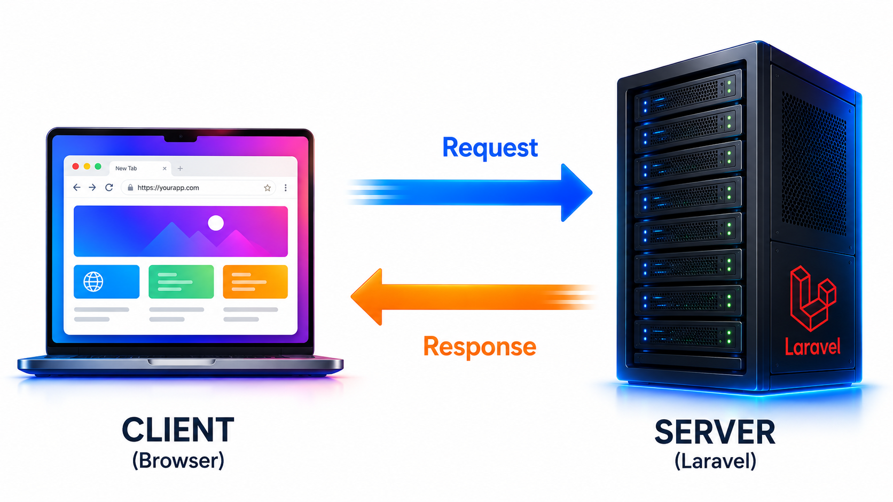

# BAB 1 — HTTP Dasar

---

## 1.1 Tujuan Pembelajaran

Setelah menyelesaikan BAB 1 ini, teman-teman diharapkan mampu:

- Menjelaskan konsep client-server dan cara kerja HTTP
- Memahami method HTTP: GET, POST, PUT, PATCH, DELETE
- Mengenal status code HTTP dan artinya
- Memahami struktur request dan response
- Menggunakan Postman atau Thunder Client untuk menguji API
- Menerapkan pengetahuan HTTP saat membuat route Laravel

---

## 1.2 Pendahuluan

Setiap kali teman-teman membuka browser dan mengetik alamat website, sebenarnya sedang terjadi komunikasi antara **client** (browser) dan **server** (komputer tempat website disimpan). Komunikasi ini diatur oleh sebuah protokol bernama **HTTP (Hypertext Transfer Protocol)**.

HTTP adalah "bahasa" yang digunakan client dan server untuk saling bertukar data. Ketika kita mengetik `https://google.com`, browser mengirim **request** ke server Google, lalu server mengirim **response** berupa halaman HTML yang kita lihat.

Sebagai developer web, memahami HTTP sangat penting karena setiap fitur yang kita buat — dari routing, form, hingga API — semuanya bekerja di atas HTTP.

---

## 1.3 Client & Server

### 1.3.1 Arsitektur Client-Server



*Gambar 1.1: Arsitektur Client-Server*

- **Client** — perangkat atau aplikasi yang meminta data. Contoh: browser, mobile app, Postman
- **Server** — komputer yang menyimpan data dan logika aplikasi. Contoh: Laravel, Apache, Nginx

### 1.3.1 Contoh Sederhana

Ketika teman-teman mengakses `http://localhost:8000/about`:

1. **Browser** (client) mengirim request ke server
2. **Server Laravel** menerima request, mencocokkan URL dengan route
3. Server memproses dan mengembalikan **response** (halaman HTML)
4. **Browser** menampilkan halaman tersebut

---

## 1.4 HTTP Methods

HTTP methods (atau HTTP verbs) memberi tahu server **aksi apa** yang ingin dilakukan client terhadap data.

| Method | Fungsi | Analogi |
|--------|--------|---------|
| **GET** | Mengambil data | Melihat daftar produk di toko |
| **POST** | Mengirim data baru | Menambahkan produk baru ke etalase |
| **PUT** | Memperbarui data (seluruhnya) | Mengganti semua informasi produk |
| **PATCH** | Memperbarui data (sebagian) | Mengubah harga produk saja |
| **DELETE** | Menghapus data | Mengeluarkan produk dari etalase |

### 1.4.1 GET

Method **GET** digunakan untuk **mengambil data** dari server. GET tidak mengubah data di server.

Contoh di Laravel:

```php
Route::get('/produk', function () {
    return 'Daftar Produk';
});

Route::get('/produk/1', function () {
    return 'Detail Produk ID 1';
});
```

**Karakteristik GET:**
- Data dikirim melalui URL (query string)
- Bisa di-bookmark
- Bisa di-cache
- Tidak boleh digunakan untuk mengirim data sensitif (password)
- Terbatas panjangnya (~2048 karakter)

### 1.4.2 POST

Method **POST** digunakan untuk **mengirim data baru** ke server. POST mengubah data di server.

Contoh di Laravel:

```php
Route::post('/produk', function () {
    return 'Produk baru berhasil ditambahkan';
});
```

**Karakteristik POST:**
- Data dikirim melalui **body** (tidak terlihat di URL)
- Tidak bisa di-bookmark
- Tidak di-cache
- Digunakan untuk form login, register, tambah data
- Tidak ada batasan panjang data

### 1.4.3 PUT

Method **PUT** digunakan untuk **memperbarui seluruh data** yang sudah ada.

Contoh di Laravel:

```php
Route::put('/produk/1', function () {
    return 'Produk berhasil diperbarui';
});
```

### 1.4.4 PATCH

Method **PATCH** digunakan untuk **memperbarui sebagian data**.

Contoh di Laravel:

```php
Route::patch('/produk/1/harga', function () {
    return 'Harga produk berhasil diubah';
});
```

**PUT vs PATCH:**
- PUT → mengganti seluruh data (name, price, stock, category sekaligus)
- PATCH → mengganti sebagian saja (misal hanya harga)

### 1.4.5 DELETE

Method **DELETE** digunakan untuk **menghapus data**.

Contoh di Laravel:

```php
Route::delete('/produk/1', function () {
    return 'Produk berhasil dihapus';
});
```

### 1.4.6 Kapan Menggunakan Method Apa?

| Aksi | Method HTTP | Route Laravel |
|------|-------------|---------------|
| Lihat daftar produk | `GET /produk` | `Route::get('/produk', ...)` |
| Lihat detail produk | `GET /produk/{id}` | `Route::get('/produk/{id}', ...)` |
| Tambah produk baru | `POST /produk` | `Route::post('/produk', ...)` |
| Update seluruh produk | `PUT /produk/{id}` | `Route::put('/produk/{id}', ...)` |
| Update harga saja | `PATCH /produk/{id}` | `Route::patch('/produk/{id}', ...)` |
| Hapus produk | `DELETE /produk/{id}` | `Route::delete('/produk/{id}', ...)` |

---

## 1.5 Status Code HTTP

Status code adalah angka tiga digit yang memberi tahu client **hasil** dari request yang dikirim.

### 1.5.1 Kelompok Status Code

| Kode | Kelompok | Arti |
|------|----------|------|
| **1xx** | Informational | Permintaan diterima, diproses |
| **2xx** | Success | Permintaan berhasil |
| **3xx** | Redirection | Perlu tindakan tambahan (redirect) |
| **4xx** | Client Error | Kesalahan dari client |
| **5xx** | Server Error | Kesalahan dari server |

### 1.5.2 Status Code yang Paling Sering Ditemui

| Kode | Nama | Arti |
|------|------|------|
| **200** | OK | Request berhasil |
| **201** | Created | Data berhasil dibuat (biasanya setelah POST) |
| **301** | Moved Permanently | URL sudah pindah permanen |
| **302** | Found | Redirect sementara |
| **400** | Bad Request | Request tidak valid (salah format) |
| **401** | Unauthorized | Belum login |
| **403** | Forbidden | Tidak punya akses |
| **404** | Not Found | Halaman/data tidak ditemukan |
| **405** | Method Not Allowed | Method HTTP tidak diizinkan |
| **422** | Unprocessable Content | Validasi gagal |
| **500** | Internal Server Error | Error di server |
| **502** | Bad Gateway | Server gateway error |
| **503** | Service Unavailable | Server sedang sibuk/maintenance |

### 1.5.3 Contoh Status Code di Laravel

```php
// 200 OK
return response()->json(['data' => $produk]);

// 201 Created
return response()->json(['message' => 'Created'], 201);

// 404 Not Found
abort(404);

// 403 Forbidden
abort(403, 'Akses ditolak');

// 500 Error (otomatis ketika ada exception)
```

---

## 1.6 Struktur Request

Sebuah HTTP request terdiri dari beberapa bagian:

```
─── METHOD ───   ────────── URL ──────────  ──── HTTP Version ────
  GET            /produk?kategori=elektronik  HTTP/1.1
  ── Headers ──
  Host: localhost:8000
  User-Agent: Mozilla/5.0
  Accept: application/json
  Authorization: Bearer token123

  ── Body (untuk POST/PUT/PATCH) ──
  name=Laptop&price=12000000
```

### 1.6.1 URL

URL (Uniform Resource Locator) terdiri dari:

```
https://localhost:8000/produk?kategori=elektronik&page=1
└─┬──┘ └───┬────┘ └─┬─┘ └──┬──┘ └─────────┬─────────┘
protocol   host    port   path     query string
```

- **Protocol** — `http://` atau `https://`
- **Host** — alamat server (localhost, domain.com)
- **Port** — nomor port (default HTTP: 80, default Laravel dev: 8000)
- **Path** — alamat halaman (/produk, /about)
- **Query string** — data tambahan yang dikirim (`?key=value&key2=value2`)

### 1.6.2 Headers

Headers adalah metadata yang dikirim bersama request:

| Header | Fungsi |
|--------|--------|
| `Host` | Server tujuan |
| `User-Agent` | Identitas client (browser, Postman) |
| `Content-Type` | Tipe data body (`application/json`, `multipart/form-data`) |
| `Accept` | Tipe response yang diinginkan client |
| `Authorization` | Token autentikasi |

### 1.6.3 Body

Body berisi data yang dikirim client ke server (hanya untuk POST, PUT, PATCH). Format body bisa:

- **JSON** — `{"name": "Laptop", "price": 12000000}`
- **Form-data** — `name=Laptop&price=12000000`
- **Multipart** — untuk upload file

---

## 1.7 Struktur Response

Response dari server juga memiliki struktur:

```
─── Status Code ───  ─── Status Text ───  ─── HTTP Version ───
  200                OK                    HTTP/1.1
  ── Headers ──
  Content-Type: text/html; charset=UTF-8
  Set-Cookie: session=abc123

  ── Body ──
  <html>
    <body>
      <h1>Halo Dunia!</h1>
    </body>
  </html>
```

### 1.7.1 Response Body

Body response bisa berupa:

- **HTML** — untuk halaman web (Blade)
- **JSON** — untuk API (`response()->json(...)`)
- **File** — gambar, PDF, download
- **Plain text** — teks biasa

---

## 1.8 Stateless & Session

HTTP bersifat **stateless** — artinya server tidak mengingat siapa client dari satu request ke request berikutnya. Setiap request dianggap baru.

Bayangkan seperti ini: setiap kali teman-teman pergi ke kasir, kasir lupa siapa teman-teman dan harus bertanya lagi dari awal.

Untuk mengatasi keterbatasan ini, web menggunakan **session**:

1. Setelah login, server memberikan **cookie** berisi session ID ke browser
2. Browser menyimpan cookie dan mengirimkannya kembali di setiap request
3. Server membaca cookie untuk mengenali pengguna

Di Laravel, session ditangani secara otomatis. Kita tidak perlu mengelola cookie secara manual.

---

## 1.9 Praktikum: Mengenal HTTP Method dengan Postman

Pada praktikum ini, kita akan menggunakan Postman (atau Thunder Client di VS Code) untuk mengirim berbagai jenis HTTP request.

### 1.9.1 Persiapan

1. Buat project Laravel baru:

```bash
composer create-project laravel/laravel belajar-http
cd belajar-http
php artisan serve
```

2. Buka Postman atau jika menggunakan VS Code, install ekstensi **Thunder Client**

3. Buka file `routes/web.php` dan tambahkan route berikut:

```php
<?php

use Illuminate\Support\Facades\Route;

Route::get('/produk', function () {
    return 'GET: Daftar Produk';
});

Route::get('/produk/{id}', function ($id) {
    return "GET: Detail Produk ID $id";
});

Route::post('/produk', function () {
    return 'POST: Produk Baru Ditambahkan';
});

Route::put('/produk/{id}', function ($id) {
    return "PUT: Produk ID $id Diperbarui";
});

Route::patch('/produk/{id}', function ($id) {
    return "PATCH: Produk ID $id Diubah Sebagian";
});

Route::delete('/produk/{id}', function ($id) {
    return "DELETE: Produk ID $id Dihapus";
});
```

### 1.9.2 Menguji dengan Browser

| URL | Method (bawaan browser) | Hasil |
|-----|------------------------|-------|
| `http://localhost:8000/produk` | GET | "GET: Daftar Produk" |
| `http://localhost:8000/produk/5` | GET | "GET: Detail Produk ID 5" |

Browser hanya bisa mengirim GET secara default. Untuk method lain, kita perlu Postman.

### 1.9.3 Menguji dengan Postman / Thunder Client

Buka Postman dan buat request baru untuk setiap method:

| Method | URL | Hasil yang Diharapkan |
|--------|-----|----------------------|
| **GET** | `http://localhost:8000/produk` | "GET: Daftar Produk" |
| **GET** | `http://localhost:8000/produk/3` | "GET: Detail Produk ID 3" |
| **POST** | `http://localhost:8000/produk` | "POST: Produk Baru Ditambahkan" |
| **PUT** | `http://localhost:8000/produk/1` | "PUT: Produk ID 1 Diperbarui" |
| **PATCH** | `http://localhost:8000/produk/2` | "PATCH: Produk ID 2 Diubah Sebagian" |
| **DELETE** | `http://localhost:8000/produk/5` | "DELETE: Produk ID 5 Dihapus" |

### 1.9.4 Melihat Status Code

Di Postman, perhatikan **Status Code** yang muncul:

| Request | Status Code |
|---------|-------------|
| GET `/produk` | 200 OK |
| POST `/produk` | 200 OK |
| GET `/produk/abc` | 404 Not Found (karena route hanya terima angka) |

### 1.9.5 Menguji Method Spoofing

HTML form hanya mendukung GET dan POST. Laravel menyediakan **method spoofing** untuk mengirim PUT/PATCH/DELETE dari form. Coba buat file `test-form.html`:

```html
<form method="POST" action="http://localhost:8000/produk/1">
    <input type="hidden" name="_method" value="PUT">
    <input type="hidden" name="_token" value="token">
    <button type="submit">Kirim PUT</button>
</form>
```

Ini adalah teknik yang akan sering digunakan di Laravel untuk form edit dan hapus.

---

## 1.10 Rangkuman

| Konsep | Intinya |
|--------|---------|
| **HTTP** | Protokol komunikasi client-server |
| **GET** | Mengambil data |
| **POST** | Mengirim data baru |
| **PUT/PATCH** | Memperbarui data |
| **DELETE** | Menghapus data |
| **200 OK** | Request berhasil |
| **404** | Halaman tidak ditemukan |
| **500** | Error server |
| **Stateless** | Server tidak mengingat request sebelumnya |
| **Session** | Cookie untuk mengenali pengguna |

---

## 1.11 Referensi

- [MDN: HTTP Methods](https://developer.mozilla.org/en-US/docs/Web/HTTP/Methods)
- [MDN: HTTP Status Codes](https://developer.mozilla.org/en-US/docs/Web/HTTP/Status)
- [Postman Learning Center](https://learning.postman.com/)
- [Laravel Routing](https://laravel.com/docs/13.x/routing)

---

**Lanjut ke:** [BAB 2 — Pengantar Laravel & MVC](../BAB-02-Pengantar-Laravel-dan-MVC/README.md)
