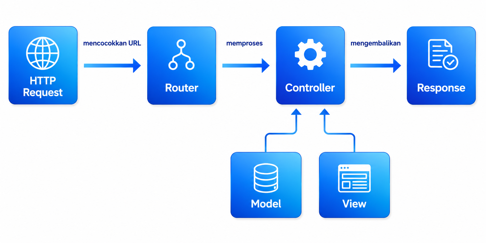

# BAB 3 — Routing & Controller

---

## 3.1 Tujuan Pembelajaran

Setelah menyelesaikan BAB 3 ini, teman-teman diharapkan mampu:

- Mendefinisikan route untuk berbagai method HTTP (GET, POST, PUT, DELETE)
- Mengirim data dinamis melalui route parameters
- Memberi nama pada route untuk kemudahan referensi
- Mengelompokkan route berdasarkan prefix atau middleware
- Membuat Controller dan menghubungkannya ke route
- Menggunakan Resource Controller untuk operasi CRUD
- Memahami objek Request dan Response

---

## 3.2 Pendahuluan

Pada BAB 2, kita telah belajar membuat project Laravel dan mendefinisikan route sederhana. Route adalah mekanisme yang menghubungkan URL yang diminta pengguna dengan logika yang harus dijalankan oleh aplikasi. Bayangkan route sebagai **papan petunjuk arah** — ketika pengguna mengunjungi suatu alamat, route akan memberi tahu Laravel harus ke mana dan apa yang harus dilakukan.

Pada BAB 3 ini, kita akan mempelajari routing secara lebih mendalam, mulai dari route sederhana hingga penggunaan Controller untuk memisahkan logika aplikasi dari definisi route.

---



## 3.3 Routing di Laravel

Semua route untuk keperluan web didefinisikan di file `routes/web.php`. Laravel secara otomatis akan memuat file ini ketika aplikasi berjalan.

### 3.3.1 Anatomi Route

Secara umum, sebuah route ditulis dengan format:

```php
Route::method('/url', callback);
```

| Bagian | Fungsi |
|--------|--------|
| `Route::` | Facade Laravel untuk mendefinisikan route |
| `method` | HTTP method: `get`, `post`, `put`, `patch`, `delete` |
| `/url` | URL pattern yang akan dicocokkan dengan request |
| `callback` | Fungsi atau method controller yang akan dijalankan |

### 3.3.2 Basic Routing

**Route GET** — digunakan untuk menampilkan halaman atau mengambil data:

```php
Route::get('/', function () {
    return view('welcome');
});

Route::get('/about', function () {
    return 'Halaman About';
});

Route::get('/contact', function () {
    return view('contact');
});
```

**Route POST** — digunakan saat mengirim data ke server (seperti form login, registrasi, atau form input lainnya):

```php
Route::post('/simpan', function () {
    return 'Data berhasil disimpan';
});
```

**Route PUT / PATCH** — digunakan untuk memperbarui data yang sudah ada:

```php
Route::put('/update', function () {
    return 'Data berhasil diperbarui';
});

Route::patch('/edit', function () {
    return 'Data berhasil diedit';
});
```

**Route DELETE** — digunakan untuk menghapus data:

```php
Route::delete('/hapus', function () {
    return 'Data berhasil dihapus';
});
```

**Route Multimethod** — jika suatu route perlu diakses dengan beberapa method sekaligus:

```php
// Hanya GET dan POST
Route::match(['get', 'post'], '/login', function () {
    return 'Halaman login';
});

// Semua method HTTP
Route::any('/test', function () {
    return 'Bisa diakses dengan method apapun';
});
```

### 3.3.3 Route Parameters

Terkadang kita perlu mengambil data dinamis dari URL. Misalnya, kita ingin menampilkan profil user berdasarkan ID-nya. Laravel menyediakan **route parameters** untuk keperluan ini.

**Required Parameter** — parameter yang harus ada di URL:

```php
Route::get('/user/{id}', function ($id) {
    return "User ID: " . $id;
});

Route::get('/post/{slug}', function ($slug) {
    return "Post: " . $slug;
});

// Bisa juga multiple parameters
Route::get('/post/{category}/{slug}', function ($category, $slug) {
    return "Kategori: $category, Post: $slug";
});
```

**Optional Parameter** — parameter yang boleh ada atau tidak. Tandai dengan `?` dan berikan nilai default:

```php
Route::get('/user/{name?}', function ($name = 'Guest') {
    return "Halo, $name";
});
```

- Akses `/user` → Output: "Halo, Guest"
- Akses `/user/Andi` → Output: "Halo, Andi"

**Regex Constraint** — kita bisa membatasi format parameter menggunakan regular expression:

```php
Route::get('/user/{id}', function ($id) {
    return "User ID: $id";
})->where('id', '[0-9]+');  // Hanya menerima angka

Route::get('/post/{slug}', function ($slug) {
    return "Post: $slug";
})->where('slug', '[a-z-]+');  // Hanya huruf kecil dan tanda strip
```

**Global Constraint** — jika kita ingin menerapkan constraint yang sama untuk semua route, daftarkan di `AppServiceProvider`:

```php
// app/Providers/AppServiceProvider.php
use Illuminate\Support\Facades\Route;

public function boot(): void
{
    Route::pattern('id', '[0-9]+');
}
```

Setelah itu, semua parameter bernama `{id}` di route manapun akan otomatis hanya menerima angka.

### 3.3.4 Named Routes

Memberi nama pada route memudahkan kita merujuk route tersebut dari view, controller, atau bagian lain tanpa perlu menulis URL secara hardcode.

```php
Route::get('/profile', function () {
    return 'Halaman Profile';
})->name('profile');

Route::get('/user/{id}', function ($id) {
    //
})->name('user.show');
```

**Menggunakan Named Route:**

```php
// Dari controller
$url = route('profile');
return redirect()->route('profile');

// Dari Blade (view)
<a href="{{ route('profile') }}">Profile</a>
<a href="{{ route('user.show', ['id' => 1]) }}">Lihat User 1</a>
```

**Keuntungan Named Route:** Jika suatu saat URL berubah, kita tidak perlu mengubah semua link di seluruh aplikasi. Cukup ubah URL di definisi route, dan semua referensi tetap menggunakan nama route yang sama:

```php
// URL berubah, tapi nama route tetap
Route::get('/profil-saya', function () {
    //
})->name('profile');

// Di view tetap: route('profile'), tidak perlu diubah
```

### 3.3.5 Route Groups

Ketika aplikasi semakin besar, kita akan memiliki banyak route. Route groups membantu kita mengelompokkan route yang memiliki kesamaan, seperti prefix URL, middleware, atau nama route.

**Prefix Group** — menambahkan awalan URL yang sama:

```php
Route::prefix('admin')->group(function () {
    Route::get('/dashboard', function () {
        return 'Admin Dashboard';
    });  // URL: /admin/dashboard

    Route::get('/users', function () {
        return 'Daftar User';
    });  // URL: /admin/users

    Route::get('/settings', function () {
        return 'Pengaturan';
    });  // URL: /admin/settings
});
```

**Route Name Prefix** — menambahkan awalan nama route:

```php
Route::name('admin.')->group(function () {
    Route::get('/admin/dashboard', function () {
        //
    })->name('dashboard');  // route('admin.dashboard')
});
```

**Middleware Group** — menerapkan middleware yang sama untuk sekelompok route:

```php
Route::middleware(['auth'])->group(function () {
    Route::get('/dashboard', function () {
        return 'Dashboard';
    });

    Route::get('/profile', function () {
        return 'Profile';
    });
});
```

---

## 3.4 Controller

Sejauh ini, kita menulis logika aplikasi langsung di dalam file `routes/web.php`. Namun, untuk aplikasi yang lebih besar, pendekatan ini akan membuat file route menjadi sulit dibaca dan dipelihara. **Controller** hadir sebagai solusi — Controller memisahkan logika aplikasi dari definisi route.

### 3.4.1 Membuat Controller

Gunakan Artisan CLI untuk membuat Controller:

```bash
php artisan make:controller UserController
```

File akan dibuat di `app/Http/Controllers/UserController.php`:

```php
<?php

namespace App\Http\Controllers;

use Illuminate\Http\Request;

class UserController extends Controller
{
    public function index()
    {
        return 'Daftar User';
    }

    public function show($id)
    {
        return "User dengan ID: $id";
    }
}
```

### 3.4.2 Menghubungkan Controller ke Route

Setelah Controller dibuat, kita bisa menghubungkannya ke route menggunakan sintaks array:

```php
use App\Http\Controllers\UserController;

Route::get('/users', [UserController::class, 'index']);
Route::get('/users/{id}', [UserController::class, 'show']);
```

### 3.4.3 Single Action Controller

Jika suatu Controller hanya memiliki satu method (untuk satu tugas spesifik), kita bisa menggunakan opsi `--invokable`:

```bash
php artisan make:controller ProfileController --invokable
```

```php
class ProfileController extends Controller
{
    public function __invoke()
    {
        return 'Halaman Profile';
    }
}
```

Route untuk invokable controller:

```php
Route::get('/profile', ProfileController::class);
```

### 3.4.4 Resource Controller

Seringkali kita membuat fitur CRUD (Create, Read, Update, Delete) untuk suatu entitas. Resource Controller menyediakan method-method standar untuk operasi tersebut.

Buat Resource Controller:

```bash
php artisan make:controller PostController --resource
```

**Method yang Dihasilkan:**

| Method | HTTP | URL | Fungsi |
|--------|------|-----|--------|
| `index()` | `GET` | `/posts` | Menampilkan daftar data |
| `create()` | `GET` | `/posts/create` | Menampilkan form tambah data |
| `store()` | `POST` | `/posts` | Menyimpan data baru |
| `show($id)` | `GET` | `/posts/{post}` | Menampilkan detail data |
| `edit($id)` | `GET` | `/posts/{post}/edit` | Menampilkan form edit data |
| `update($id)` | `PUT/PATCH` | `/posts/{post}` | Memperbarui data |
| `destroy($id)` | `DELETE` | `/posts/{post}` | Menghapus data |

**Mendaftarkan Resource Route — hanya satu baris:**

```php
Route::resource('posts', PostController::class);
```

Satu baris di atas setara dengan **7 route sekaligus**! Ini adalah contoh bagaimana Laravel membantu kita menulis kode yang lebih ringkas dan konsisten.

**Membatasi Method:**

```php
// Hanya menyediakan index dan show
Route::resource('posts', PostController::class)->only(['index', 'show']);

// Menyediakan semua kecuali create dan edit
Route::resource('posts', PostController::class)->except(['create', 'edit']);
```

**API Resource — khusus untuk API, tanpa method create/edit:**

```php
Route::apiResource('posts', PostController::class);
// Menyediakan: index, store, show, update, destroy
```

---

## 3.5 Request & Response

### 3.5.1 Objek Request

Laravel secara otomatis mengirimkan objek `Illuminate\Http\Request` ke setiap method controller. Objek ini berisi informasi tentang request yang masuk.

```php
use Illuminate\Http\Request;

class UserController extends Controller
{
    public function store(Request $request)
    {
        // Mengambil input tertentu
        $name = $request->input('name');
        $email = $request->input('email');

        // Mengambil semua input
        $allData = $request->all();

        // Mengecek apakah ada input tertentu
        if ($request->has('name')) {
            //
        }

        // Mengambil hanya beberapa field tertentu
        $data = $request->only(['name', 'email']);

        // Mengambil semua kecuali beberapa field
        $data = $request->except(['password']);

        // Mengambil input dengan nilai default
        $role = $request->input('role', 'user');

        // Mendapatkan method HTTP yang digunakan
        $method = $request->method();

        // Mendapatkan path URL
        $path = $request->path();

        // Mendapatkan full URL
        $url = $request->fullUrl();
    }
}
```

### 3.5.2 Redirect Response

Redirect digunakan untuk mengarahkan pengguna ke halaman lain setelah suatu aksi:

```php
// Redirect ke URL tertentu
return redirect('/dashboard');

// Redirect ke named route
return redirect()->route('profile');

// Redirect dengan flash message
return redirect('/dashboard')->with('success', 'Data berhasil disimpan');

// Redirect kembali ke halaman sebelumnya
return back();

// Redirect ke route dengan parameter
return redirect()->route('user.show', ['id' => 1]);
```

### 3.5.3 Response JSON

Untuk aplikasi modern atau API, kita sering mengembalikan data dalam format JSON:

```php
return response()->json([
    'success' => true,
    'message' => 'Data berhasil disimpan',
    'data' => $user
]);

// Dengan status code HTTP
return response()->json(['error' => 'Not found'], 404);
```

### 3.5.4 Response dengan Header

```php
return response('Halo')
    ->header('Content-Type', 'text/plain')
    ->header('X-Custom-Header', 'value');
```

---

## 3.6 Praktikum: Route & Controller

Pada praktikum ini, kita akan menggunakan project Laravel yang sudah dibuat pada BAB 2. Jika belum memiliki project, buat terlebih dahulu dengan perintah:

```bash
composer create-project laravel/laravel belajar-laravel
cd belajar-laravel
php artisan serve
```

### 3.6.1 Route Dasar

Buka file `routes/web.php` dan tambahkan beberapa route berikut:

```php
Route::get('/halo', function () {
    return 'Halo dari route!';
});

Route::get('/user/{nama}', function ($nama) {
    return "Halo, $nama!";
});

Route::get('/admin', function () {
    return redirect('/dashboard');
});
```

### 3.6.2 Membuat Controller

Buat Controller baru menggunakan Artisan:

```bash
php artisan make:controller ArtikelController
```

Buka file `app/Http/Controllers/ArtikelController.php` dan isi dengan method-method berikut:

```php
<?php

namespace App\Http\Controllers;

use Illuminate\Http\Request;

class ArtikelController extends Controller
{
    public function index()
    {
        return 'Daftar Artikel';
    }

    public function show($id)
    {
        return "Artikel dengan ID: $id";
    }

    public function kategori($kategori)
    {
        $daftar = [
            'teknologi' => 'Artikel tentang teknologi',
            'olahraga' => 'Artikel tentang olahraga',
            'pendidikan' => 'Artikel tentang pendidikan',
        ];

        if (isset($daftar[$kategori])) {
            return $daftar[$kategori];
        }

        return "Kategori $kategori tidak ditemukan";
    }
}
```

### 3.6.3 Menghubungkan Controller ke Route

Di `routes/web.php`, tambahkan:

```php
use App\Http\Controllers\ArtikelController;

Route::get('/artikel', [ArtikelController::class, 'index']);
Route::get('/artikel/{id}', [ArtikelController::class, 'show']);
Route::get('/artikel/kategori/{kategori}', [ArtikelController::class, 'kategori']);
```

### 3.6.4 Menggunakan Named Route

Ubah route artikel menjadi named route:

```php
Route::get('/artikel', [ArtikelController::class, 'index'])->name('artikel.index');
Route::get('/artikel/{id}', [ArtikelController::class, 'show'])->name('artikel.show');
```

### 3.6.5 Uji Coba

Jalankan server (`php artisan serve`), lalu akses URL berikut di browser:

| URL | Hasil yang Diharapkan |
|-----|----------------------|
| `http://localhost:8000/halo` | "Halo dari route!" |
| `http://localhost:8000/user/Budi` | "Halo, Budi!" |
| `http://localhost:8000/artikel` | "Daftar Artikel" |
| `http://localhost:8000/artikel/3` | "Artikel dengan ID: 3" |
| `http://localhost:8000/artikel/kategori/teknologi` | "Artikel tentang teknologi" |
| `http://localhost:8000/artikel/kategori/musik` | "Kategori musik tidak ditemukan" |

---

## 3.7 Rangkuman

| Konsep | Intinya |
|--------|---------|
| Route | Menghubungkan URL dengan callback atau controller |
| Route parameter | `{id}`, `{slug?}` — data dinamis yang diambil dari URL |
| Named route | `->name('profile')` — memudahkan referensi route dari view atau controller |
| Route group | `prefix()`, `name()`, `middleware()` — mengelompokkan route yang memiliki kesamaan |
| Controller | Memisahkan logika aplikasi dari definisi route ke file terpisah |
| Resource controller | Menyediakan 7 method CRUD standar dalam satu class |
| Request | Objek yang membawa data dari pengguna (input, header, method) |
| Response | Cara aplikasi merespon — bisa berupa redirect, JSON, atau teks |

---

## 3.8 Referensi

- [Laravel Routing](https://laravel.com/docs/13.x/routing)
- [Laravel Controllers](https://laravel.com/docs/13.x/controllers)
- [Laravel Request](https://laravel.com/docs/13.x/requests)
- [Laravel Responses](https://laravel.com/docs/13.x/responses)

---

**Lanjut ke:** [BAB 4 — Blade Templating](../BAB-04-Blade-Templating/README.md)

**Kembali ke:** [BAB 2 — Pengantar Laravel & MVC](../BAB-02-Pengantar-Laravel-dan-MVC/README.md)
