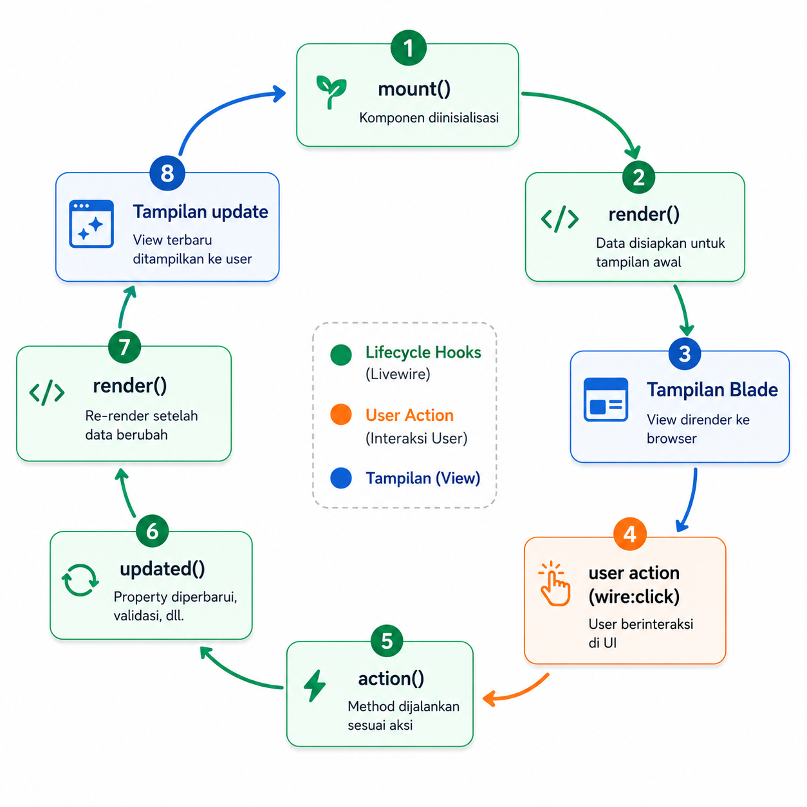

# BAB 10 — Livewire

---

## 10.1 Tujuan Pembelajaran

Setelah menyelesaikan BAB 10 ini, teman-teman diharapkan mampu:

- Menjelaskan konsep Livewire dan perbedaannya dengan Blade biasa
- Menginstal Livewire di project Laravel
- Membuat komponen Livewire
- Menggunakan data binding dan action
- Membuat form interaktif tanpa reload
- Membuat tabel dengan pencarian realtime

---

## 10.2 Pendahuluan

Sejauh ini, setiap kali kita submit form atau klik link, halaman web akan **reload** (request baru ke server). Ini adalah cara kerja web tradisional yang sudah kita pelajari di BAB 1–9.

**Livewire** adalah framework full-stack untuk Laravel yang memungkinkan kita membuat halaman web **interaktif tanpa reload**. Dengan Livewire, kita bisa:

- Submit form tanpa refresh halaman
- Update tabel secara realtime saat mengetik di search box
- Menampilkan notifikasi tanpa reload

Yang menarik: **kita tidak perlu menulis JavaScript**. Semua logika ditulis dalam PHP, dan Livewire yang mengurus komunikasi AJAX di belakang layar.

---

## 10.3 Instalasi

```bash
composer require livewire/livewire
```

Livewire akan terintegrasi secara otomatis dengan Laravel. Kita bisa langsung membuat komponen.

---

## 10.4 Komponen Pertama

### 10.4.1 Membuat Komponen

```bash
php artisan make:livewire counter
```

Perintah ini membuat dua file:

- `app/Livewire/Counter.php` — logika komponen
- `resources/views/livewire/counter.blade.php` — template komponen

### 10.4.2 Logika Komponen

`app/Livewire/Counter.php`:

```php
<?php

namespace App\Livewire;

use Livewire\Component;

class Counter extends Component
{
    public int $count = 0;

    public function increment(): void
    {
        $this->count++;
    }

    public function decrement(): void
    {
        $this->count--;
    }

    public function render()
    {
        return view('livewire.counter');
    }
}
```

### 10.4.3 Template Komponen

`resources/views/livewire/counter.blade.php`:

```blade
<div>
    <h1 class="text-2xl font-bold mb-4">Counter: {{ $count }}</h1>

    <button wire:click="increment" class="bg-blue-600 text-white px-4 py-2 rounded">
        + Tambah
    </button>

    <button wire:click="decrement" class="bg-red-600 text-white px-4 py-2 rounded">
        - Kurang
    </button>
</div>
```

### 10.4.4 Menggunakan Komponen di Halaman

```blade
@extends('layouts.app')

@section('content')
    <livewire:counter />
@endsection
```

Atau jika ingin dengan namespace:

```blade
<livewire:counter />
```

---



*Gambar 10.1: Livewire Lifecycle*

## 10.5 Data Binding

Livewire mendukung **two-way data binding** — ketika pengguna mengisi input, properti di komponen otomatis terupdate, dan sebaliknya.

```blade
<div>
    <input type="text" wire:model="name" placeholder="Masukkan nama">

    <p>Halo, {{ $name }}!</p>
</div>
```

```php
class Greeting extends Component
{
    public string $name = '';

    public function render()
    {
        return view('livewire.greeting');
    }
}
```

Tanpa menekan tombol apapun, teks "Halo, ..." akan berubah secara realtime saat teman-teman mengetik.

---

## 10.6 Form dengan Livewire

### 10.6.1 Komponen Form

```bash
php artisan make:livewire article-form
```

`app/Livewire/ArticleForm.php`:

```php
<?php

namespace App\Livewire;

use App\Models\Article;
use Livewire\Component;
use Livewire\WithFileUploads;

class ArticleForm extends Component
{
    use WithFileUploads;

    public string $title = '';
    public string $body = '';
    public string $category = '';
    public bool $published = false;
    public $image = null;

    protected $rules = [
        'title' => ['required', 'max:255'],
        'body' => ['required'],
        'category' => ['required', 'in:Teknologi,Olahraga,Pendidikan,Hiburan'],
        'published' => ['boolean'],
        'image' => ['nullable', 'image', 'max:1024'],
    ];

    public function save(): void
    {
        $this->validate();

        $data = [
            'title' => $this->title,
            'slug' => str()->slug($this->title),
            'body' => $this->body,
            'category' => $this->category,
            'published' => $this->published,
            'user_id' => auth()->id(),
        ];

        if ($this->image) {
            $data['image'] = $this->image->store('articles', 'public');
        }

        Article::create($data);

        session()->flash('success', 'Artikel berhasil dibuat');

        $this->reset();
    }

    public function render()
    {
        return view('livewire.article-form');
    }
}
```

### 10.6.2 Template

`resources/views/livewire/article-form.blade.php`:

```blade
<div>
    <form wire:submit="save">
        <div class="mb-4">
            <label class="block font-semibold mb-1">Judul</label>
            <input type="text" wire:model="title"
                   class="w-full border rounded px-3 py-2">
            @error('title') <p class="text-red-500 text-sm">{{ $message }}</p> @enderror
        </div>

        <div class="mb-4">
            <label class="block font-semibold mb-1">Kategori</label>
            <select wire:model="category" class="w-full border rounded px-3 py-2">
                <option value="">Pilih</option>
                @foreach(['Teknologi', 'Olahraga', 'Pendidikan', 'Hiburan'] as $cat)
                    <option value="{{ $cat }}">{{ $cat }}</option>
                @endforeach
            </select>
            @error('category') <p class="text-red-500 text-sm">{{ $message }}</p> @enderror
        </div>

        <div class="mb-4">
            <label class="block font-semibold mb-1">Konten</label>
            <textarea wire:model="body" rows="8"
                      class="w-full border rounded px-3 py-2"></textarea>
            @error('body') <p class="text-red-500 text-sm">{{ $message }}</p> @enderror
        </div>

        <div class="mb-4">
            <label class="block font-semibold mb-1">Gambar</label>
            <input type="file" wire:model="image"
                   class="w-full border rounded px-3 py-2">
            @error('image') <p class="text-red-500 text-sm">{{ $message }}</p> @enderror
        </div>

        <div class="mb-4">
            <label class="flex items-center gap-2">
                <input type="checkbox" wire:model="published">
                Publikasikan
            </label>
        </div>

        <button type="submit" class="bg-blue-600 text-white px-6 py-2 rounded"
                wire:loading.attr="disabled">
            Simpan
        </button>
    </form>

    @if(session('success'))
        <div class="bg-green-100 text-green-800 p-4 rounded mt-4">
            {{ session('success') }}
        </div>
    @endif
</div>
```

**Perbedaan dengan Blade biasa:**

| Fitur | Blade Biasa | Livewire |
|-------|-------------|----------|
| Submit form | `method="POST"` + `@csrf` | `wire:submit="save"` |
| Binding input | `old('title')` | `wire:model="title"` |
| Validasi | `@error('title')` | `@error('title')` (sama) |
| Flash message | `session('success')` | `session()->flash(...)` |
| Reload | Ya | Tidak |

---

## 10.7 Tabel dengan Pencarian Realtime

### 10.7.1 Komponen

```bash
php artisan make:livewire article-table
```

`app/Livewire/ArticleTable.php`:

```php
<?php

namespace App\Livewire;

use App\Models\Article;
use Livewire\Component;
use Livewire\WithPagination;

class ArticleTable extends Component
{
    use WithPagination;

    public string $search = '';
    public string $category = '';

    protected $queryString = ['search', 'category'];

    public function updatingSearch(): void
    {
        $this->resetPage();
    }

    public function updatingCategory(): void
    {
        $this->resetPage();
    }

    public function render()
    {
        $articles = Article::with('author')
            ->when($this->search, function ($query) {
                $query->where(function ($q) {
                    $q->where('title', 'like', '%' . $this->search . '%')
                      ->orWhere('body', 'like', '%' . $this->search . '%');
                });
            })
            ->when($this->category, function ($query) {
                $query->where('category', $this->category);
            })
            ->latest()
            ->paginate(10);

        $categories = Article::distinct()->pluck('category');

        return view('livewire.article-table', compact('articles', 'categories'));
    }
}
```

### 10.7.2 Template

`resources/views/livewire/article-table.blade.php`:

```blade
<div>
    <div class="flex gap-4 mb-6">
        <input type="text" wire:model.live="search" placeholder="Cari artikel..."
               class="border rounded px-3 py-2 flex-1">

        <select wire:model.live="category" class="border rounded px-3 py-2">
            <option value="">Semua Kategori</option>
            @foreach($categories as $cat)
                <option value="{{ $cat }}">{{ $cat }}</option>
            @endforeach
        </select>
    </div>

    <div class="space-y-4">
        @forelse($articles as $article)
            <div class="bg-white rounded-lg shadow p-6">
                <h2 class="text-xl font-semibold">{{ $article->title }}</h2>
                <p class="text-gray-600 mt-2">{{ $article->excerpt ?? Str::limit($article->body, 150) }}</p>
                <div class="text-sm text-gray-400 mt-2">
                    {{ $article->category }} &middot; {{ $article->created_at->format('d M Y') }}
                </div>
            </div>
        @empty
            <p class="text-gray-500">Tidak ada artikel yang ditemukan.</p>
        @endforelse
    </div>

    <div class="mt-6">
        {{ $articles->links() }}
    </div>
</div>
```

**Fitur:**
- `wire:model.live` — update hasil saat mengetik (real-time)
- `$queryString` — search keyword tetap di URL saat pindah halaman
- `updatingSearch()` — reset ke halaman 1 saat search berubah
- `when()` — query scope bersih

---

## 10.8 Praktikum: Search Artikel Realtime

### 10.8.1 Persiapan

Gunakan project dari BAB 9 (yang sudah ada auth + upload + storage). Install Livewire:

```bash
composer require livewire/livewire
```

### 10.8.2 Buat Komponen

```bash
php artisan make:livewire article-search
```

### 10.8.3 Halaman yang Menggunakan Komponen

Buat route dan view untuk halaman search Livewire:

`routes/web.php`:

```php
Route::get('/cari', function () {
    return view('articles.livewire-search');
})->name('articles.search');
```

`resources/views/articles/livewire-search.blade.php`:

```blade
@extends('layouts.app')

@section('title', 'Cari Artikel')

@section('content')
    <h1 class="text-3xl font-bold mb-6">Cari Artikel</h1>

    <livewire:article-search />
@endsection
```

### 10.8.4 Uji Coba

1. Jalankan server: `php artisan serve`
2. Buka `http://localhost:8000/cari`
3. Ketik judul artikel di search box
4. Tabel akan terfilter secara realtime tanpa reload
5. Pilih kategori — filter semakin spesifik
6. Klik halaman pagination — search keyword tetap terjaga

---

## 10.9 Rangkuman

| Konsep | Intinya |
|--------|---------|
| **Livewire** | Framework full-stack Laravel untuk interaktivitas tanpa JavaScript |
| **Komponen** | Unit UI + logika dalam satu class |
| **`wire:model`** | Two-way data binding |
| **`wire:click`** | Action saat tombol diklik |
| **`wire:submit`** | Handle form submit tanpa reload |
| **`WithPagination`** | Trait untuk pagination di Livewire |
| **`$queryString`** | Menjaga query params saat navigasi |
| **`wire:loading`** | Menampilkan indikator loading |

---

## 10.10 Referensi

- [Livewire Documentation](https://livewire.laravel.com/)
- [Livewire Components](https://livewire.laravel.com/docs/components)
- [Livewire Forms](https://livewire.laravel.com/docs/forms)
- [Livewire Pagination](https://livewire.laravel.com/docs/pagination)

---

**Kembali ke:** [BAB 9 — Upload File & Storage](../BAB-09-Upload-File-dan-Storage/README.md)
